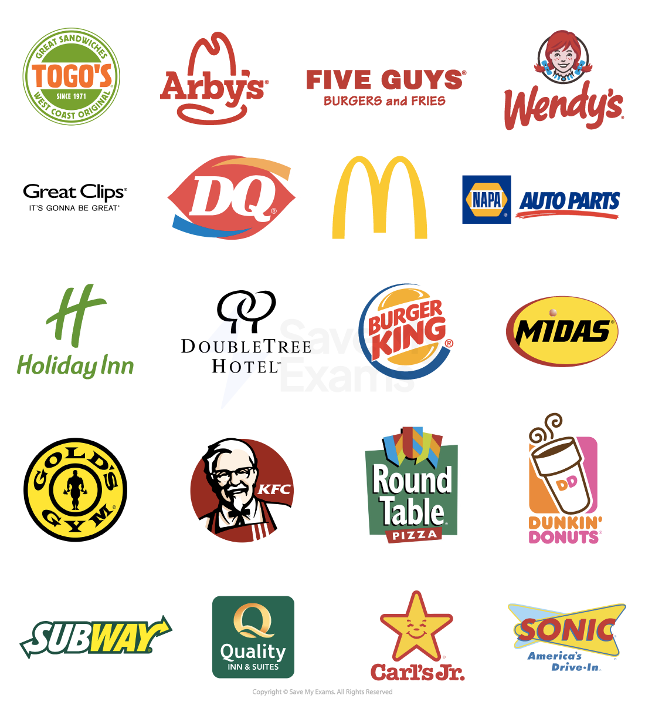

# Other Forms of Business Organisation

## Franchises

> **Spec point** — `spcpt_6DwcmpbH9TwzMv4Y` · Franchisor, franchisee; advantages + disadvantages; examples

## Franchises

- Franchising is a business format in which an** individual (franchisee)** buys the rights to operate a business model, use its branding and software tools and receive support from a **larger company (franchisor).**  The franchisee will pay both an initial lump sum plus ongoing royalty fees
- The franchisee is usually the owner of a private limited company

  - The business is operated under the **franchisor's established system** and training, marketing support and ongoing assistance are provided
  - Examples of well-known franchises include Domino's Pizza, KFC and Burger King

#### A selection of fast food franchises

*Some of the many well-known brands sold as franchise opportunities*

- A franchise is **not a form of business ownership**; it is an alternative to starting a brand new business from scratch

  - In most cases, franchisors require businesses to operate as private limited companies as this form of ownership is considered to be more stable than sole traders or partnerships

#### Advantages and disadvantages of owning a franchise

| **Advantages** | **Disadvantages** |
|---|---|
| - A **recognised brand name** which is promoted centrally by the franchisor    - E.g. Dominos sponsored 'The Simpsons' for many years - Product **training, **such as how to consistently make good pizzas, is provided to ensure the quality and consistency of the brand - **Equipment and supplies** are provided by the franchisor so that the product will be the same regardless of where it was purchased - Franchisees buy an **exclusive area** or market to sell to    - The franchisor will not create any more franchises in that area, limiting competition - **Advice**, training, use of **software** systems and problem solving are ongoing and the franchisor may also provide services such as loans and insurance | - A **fixed sum** must be paid at the start of the franchise for the right to use the business name and resources - Regular ***royalties*** must also be paid which vary according to the level of sales, often around 5 - 10 % of sales turnover - The franchisor may sell materials or equipment to the franchisee at** inflated prices** - If the franchisee does not produce the good/service to the required standard set by the franchisor the **right to run the franchise can be removed** from them - Franchisees have little say about **how the business is run** and lack freedom to introduce new products or change selling prices |

## Social Enterprises

> **Spec point** — `spcpt_PDNxvtWtc4Wy9Dx5` · Definition, objectives, +'s & -'s

## Social Enterprises

- A **social enterprise** is a business that has the primary purpose of** creating social or environmental impacts,** in addition to generating profits
- Social enterprises can take different forms

  - **Cooperatives** have a social mission. They are owned and controlled by **workers or customers and their members** have the right to elect ***directors*** and share profits
  - **Charities** raise money, provide help and raise awareness of **social, ethical, environmental or developmental issues** #### Objectives of social enterprises

| **Social** | **Environmental** | **Ethical** | **Financial** |
|---|---|---|---|
| - Provide jobs and support for disadvantaged groups in society, such as the disabled or homeless | - Protect the natural world, animals and their habitats, and reduce the impacts of pollution or overdevelopment | - Operate the business in a responsible way by treating ***stakeholders*** including employees and suppliers fairly | - Make a profit to invest back into the social enterprise to expand the social work that it performs |

> **Case Study**
> - Butterfly Books is a social enterprise that publishes children’s educational books in the UK
> 
> 
> 
> - Their aim is to 'work to educate, inspire and entertain children, aiming to change future generations by reducing gender bias in job roles'
> - A recent book entitled 'My Mummy is an Engineer' challenges gender stereotypes

#### Advantages and disadvantages of social enterprises

| **Advantages** | **Disadvantages** |
|---|---|
| - Social enterprises often have a** good reputation** which can attract highly-qualified employees and encourage **customer loyalty** - For-profit **rivals may be encouraged to improve their business practices** to better compete with social enterprises - Deserving causes receive much-needed **financial support** | - Social enterprises may face **media scrutiny** so must ensure they behave responsibly at all times - **Profits (surpluses) available for reinvestment **are limited as they are shared with members or good causes - **Decision-making is often slow** as many ***stakeholders*** need to be consulted |

## Multinationals

> **Spec point** — `spcpt_hS664mC9xNsZDqVZ` · Definition, +'s & -'s, impact on stakeholders

## Multinationals

- **A multinational company (MNC)** is a business that is registered in one country but has manufacturing operations/outlets in different countries

  - E.g. Starbucks headquarters are in Washington, USA but they have 32,000 stores in 80 countries
- Factors such as ***globalisation*** and ***deregulation*** have contributed to the growth of MNC’s
- MNC’s choose locations based on factors such as **cost advantages** and **access to markets **

  - E.g. Nike originates from the USA but 50% of their manufacturing takes place in China, Vietnam and Indonesia due to the **lower production costs** in these countries

> **Exam Hint**
> Explain questions are worth three marks and require a clear point with a two-step development.
> 
> - A good way to structure answers to these questions is X (the point) leads to Y and results in Z.
> - Explain questions do not need you to use a business context.
