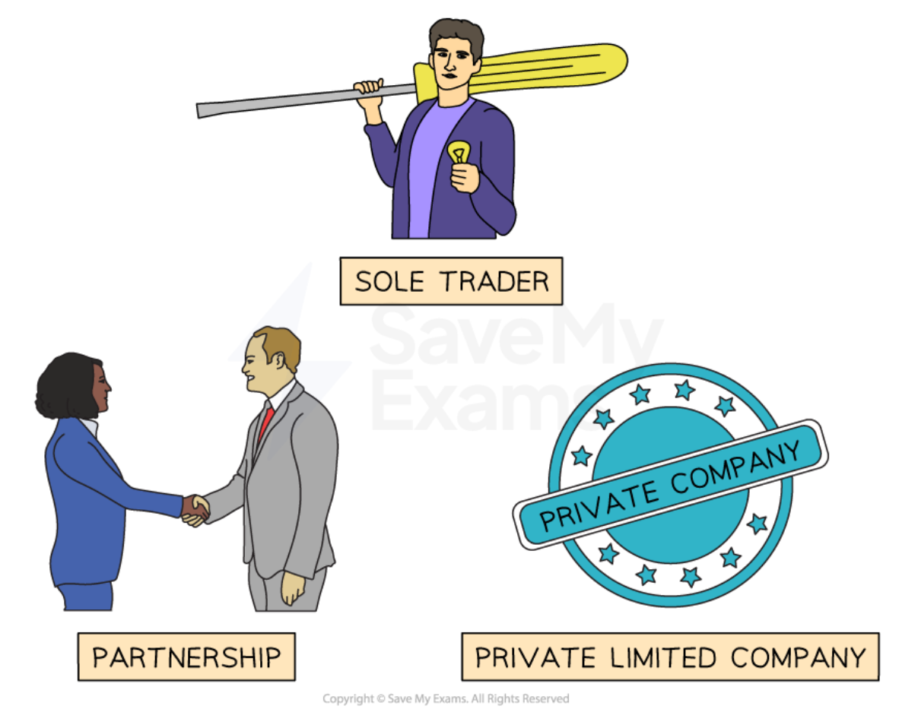

# Sole Traders & Partnerships

## Sole traders

> **Spec point** — `spcpt_D5NCrx8J3X599Drr` · The main types of business ownership:
• sole trader
Definition, features, +'s and -'s"

## Sole traders

- When an ***entrepreneur*** starts a business they need to consider what form of **ownership** they want for their business
- The main forms of ownership for **start-up businesses** are

  - Sole trader
  - Partnership
  - Private limited company (Ltd)

### The main forms of ownership for start-up businesses

*Start-ups can choose between operating as a sole trader, a partnership or private limited company*

- A **sole trader **is a business with a single owner who makes all the decisions and gets to keep all of the profit
- Operating as a **sole** **trader **is the simplest way to **start trading immediately**

  - Sole trader businesses are often **very small **with one owner who runs the business on their own (although they may employ people to work in the business)
  - They are concentrated in the ***tertiary sector***, offering services such as tutoring, home improvements or taxi driving
- However sole traders have **unlimited liability** which means that they are **personally responsible for all business debts**

  - If the business fails any money owed must be paid by the sole trader to avoid ***bankruptcy***

#### Advantages and disadvantages of setting up as a sole trader

| **Advantages** | **Disadvantages** |
|---|---|
| - Easy and inexpensive to set up - The **owner has complete control** over the business and can make all decisions - All ***profit*** belongs to the owner - Simple ***tax*** arrangements - Can provide a **flexible**, personal service that meets customer needs | - The owner is **personally responsible for debts** the business incurs - Limited **access to finance** as lenders consider them risky - Limited **skillset** of the owner/entrepreneur may limit business growth - Long hours, **hard work** and lots of **responsibility** for the owner - No **business continuity. **The business often dies with the owner |

## Partnerships

> **Spec point** — `spcpt_cPGGzBgKB33xmXSf` · The main types of business ownership:
• partnerships
Definition, features, +'s and -'s"

## Partnerships

- A **partnership** involves **two or more people** joining together to own a business

  - They are relatively **easy to set up** with relatively few legal formalities
  - Partners may choose to draw up a **deed of partnership** which states the formal **rights of each partner **including
  
    - The amount of ***capital ***contributed by each partner
    - How profits or ***losses*** are shared amongst partners
    - The procedures for ***dissolving*** the partnership and taking on new partners
    - The level of control each partner has
  - Examples of business that commonly operate as partnerships include lawyers, accountants and doctors

**Advantages and disadvantages of setting up as a partnership**

| **Advantages** | **Disadvantages** |
|---|---|
| - Easy and inexpensive to set up and run as there are **few legal formalities** - Shared responsibilities and **decision-making** - More skills and knowledge means **partners can** **specialise** in their area of expertise - Increased access to **finance** and capital | - Partners have ***unlimited liability*** for debts incurred by the business    - In some countries it is possible to set up as a limited liability partnership which removes this risk - Partners' decisions are ***legally binding*** on all owners - There is **potential for disputes** between partners - **Profits are often shared equally** regardless of a partner's contribution |

> **Exam Hint**
> You may be asked to recommend the most appropriate business ownership for a given business enterprise. Consider the level of risk involved, the amount of capital that is needed, the amount of work involved in running the business effectively as well as the personal aims of the business owner(s).
