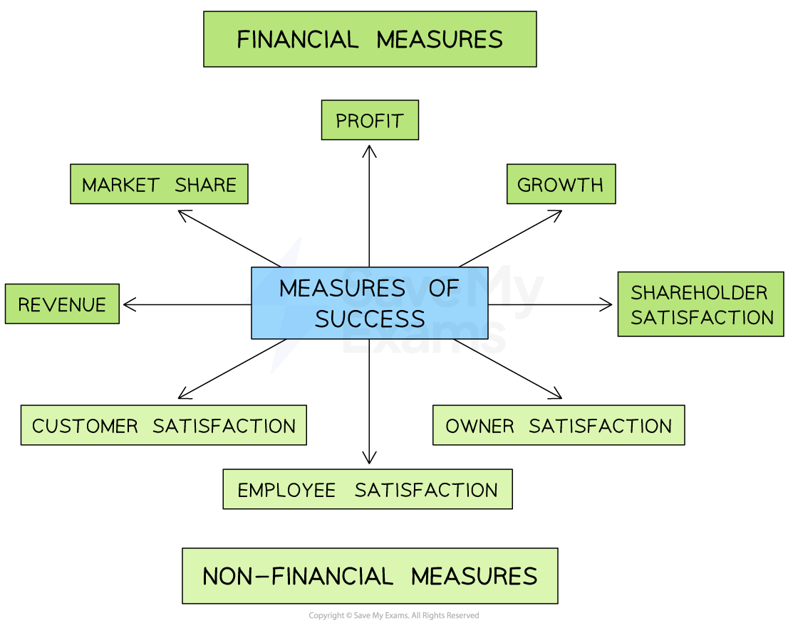

# Measuring Business Success

## Ways to measure business success

> **Spec point** — `spcpt_2P5kNR5WjPpXYSzd` · Financial vs Non financial

## Ways to measure business success

- A successful business is considered to be one that **achieves its objectives**

  - Business success can be seen in both financial and non-financial measures

#### Financial and non-financial measures of success

*Business success can be something as simple as making a profit and achieving customer satisfaction*

## Financial Measures of Success

> **Spec point** — `spcpt_WNgrX8NP7pz5mwdb` · Revenue, market share, profit

## Financial measures of success

- **Financial measures** are often the ***key performance indicators*** of the business

#### Financial measures of success

| **Financial measure** | **Explanation** |
|---|---|
| **Revenue** | - Income received from selling goods and services is compared over time and against competitors    - An increase in revenue suggests that a business is **growing** and its **decision-making is effective** |
| **Market share** | - Sales of the company are measured as the percentage of total sales in an industry    - Growth in market share over time can help to improve a businesses **market position** and increase its **competitiveness** |
| **Profitability** | - The proportion of sales converted to profit is compared over time and against competitors    - A high profit margin means that the business can **cover its costs**, **reinvest profits** to grow and **reward investors** |
| **Business growth** | - The opening of **new outlets** or **production facilities** or an increase in the **size of the workforce** suggests business growth    - Growing businesses can take advantage of ***economies of scale*** and are likely to become better-known |
| **Shareholder satisfaction** | - Shareholders are most likely to be satisfied when share prices and dividends are increasing - A rising share price occurs when a business is **increasing profits** or is considered to have **potential to grow** - Businesses that generate healthy profits may choose to increase ***dividends*** for shareholders |

> **Exam Hint**
> You may need to carry out calculations to compare the success of a business over a given period of time
> 
> Percentage change is one way to do this
> 
> To calculate percentage change, use the formula
> 
> $\frac{\mathrm{New} \mathrm{amount}-\mathrm{Original} \mathrm{amount}}{\mathrm{Original} \mathrm{amount}}\times100$

## Non-financial measures of success

> **Spec point** — `spcpt_qkSFJcrS64jmfZ24` · Customer, Employee, shareholder satisfaction

## Non-financial measures of success

- Businesses also measure their success on how well they have achieved **non-financial objectives**
- These objectives are often particularly important to public sector organisations, charities and other non-profit organisations

| **Non-financial measure** | **Explanation** | **Example** |
|---|---|---|
| **Customer satisfaction** | - Positive** reviews and recommendations **from customers indicate that a business is meeting this objective - The number of **returning customers** is an indication of customer satisfaction | - **Last Ottoman Cafe & Restaurant** in Istanbul is rated as one of the city's  top five restaurants on **Tripadvisor** |
| **Employee satisfaction** | - Low levels of **staff turnover**, high **labour** ***productivity*** and large numbers of **applications for job vacancies** indicate that a business is meeting this objective | - In 2023, financial services business **Groupe Hexagone** was rated by employees as one of France's best places to work |
| **Owner satisfaction** | - Business owners often have personal objectives they want the business to achieve - If a business is providing a **good service**, allows an owner to earn a **satisfactory income,** or achieves **recognition,** these personal objectives may be met | - **Save My Exams**' founder, Jamie wanted to create a platform filled with reliable, high-quality resources so that students could revise effectively whilst building confidence |
