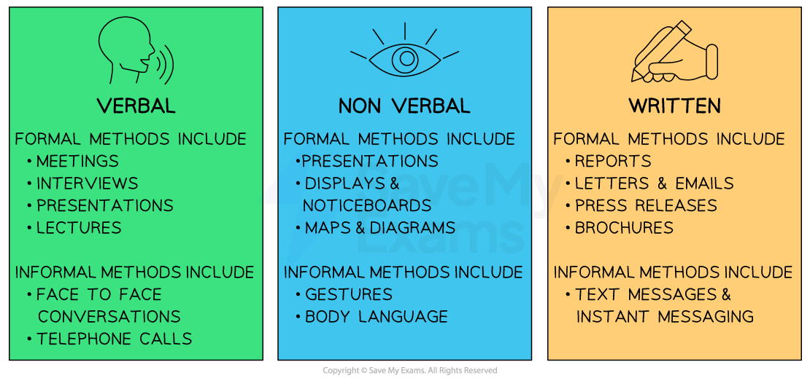

# How Communication Takes Place in Business

## Methods of communication

> **Spec point** — `spcpt_3Zcr2vxQrSrhVdzg` · Verbal, written, non-verbal the different communication methods used, including information technology (IT) and the benefits and limitations of each method.

## Methods of communication

- Communication is the process by which** information is transferred** from one person/group (**sender)** to another (**receiver**)
- **Internal communication** refers to information or messages sent between people **inside a business**

  - E.g. Google **uses its own internal social network, called Google+, **to share news, updates, and insights with employees across different departments and locations

- **External communication** refers to information or messages sent to **people or organisations outside the business**

  - E.g. Aldi, the German retailer,** communicates 'special buy' promotional offers to customers via a weekly newsletter** they can collect in store
- There are 3 main **methods of communication**

  - **Verbal **communication through listening
  - **Non-verbal** communication through ***observation*** and ***inference***
  - **Written** communication through reading

#### Methods of communication

*Many businesses use various methods of communication at the same time, as different situations and tasks require either verbal, non-verbal or written communication*

#### Benefits and limitations of different methods of communication

| **Method** | **Benefits** | **Limitations** |
|---|---|---|
| **Verbal** | - Information is transferred **quickly l**eading to higher efficiency - **Immediate feedback **results in **two-way communication** - The message is **enforced **by **seeing **the speaker, for example body language could make the message easily understood | - It may be **difficult to assess if the message had been fully understood **by everyone, for example in a large meeting - Verbal communication is **inappropriate **for storing **accurate **and **permanent **information for some messages    - E.g. a verbal warning |
| **Non-verbal** | - Presenting information in an **appealing **and **attractive **way **encourages **people to look at it - They can be used to make a written message **clearer **by adding a picture or a chart to illustrate the point being made | - **Feedback is limited **with this method so  written or verbal feedback would also be required to check understanding of the message - Complex charts and graphs might be **difficult **for some people to understand |
| **Written** | - There is **hard evidence **of the message which can be referred to and help solve **disputes **in the **future **over the content of the message - It is needed when **detailed **information is transferred from the sender to the receiver - The written message can be **copied **and sent to **many people** | - **Direct **feedback is not always possible, unless electronic communication is used - The **language **used might be **difficult **to **understand or the message may be too long **causing disinterest - There is no opportunity for **body language **to be used to **enforce **the message |

## The use of IT in communication

> **Spec point** — `spcpt_qRdKkRnt94C5V6VM` · Video-conferencing, email etc

## The use of IT in communication

- **Digital communication** involves sending and receiving information** electronically**

  - Businesses have access to a **range of technologies** which can help **improve communications** flows **using information technology (IT)**
- Examples of the use of IT include ***video conferencing***email, **instant messaging and chat applications**

#### Benefits and drawbacks of using IT in communication

| **Method** | **Benefits** | **Drawback** |
|---|---|---|
| **Video conferencing** | - Video calls allow people in **different locations** to connect - Reduction in travel costs as fewer employees may need to travel to various locations for meetings - Meetings can be set up relatively quickly | - **Unreliable internet connections** or audio/video problems can hinder effective communication - Calls between** different time zones** can be difficult to organise for international firms - The **equipment can be expensive** |
| **Email** | - The message can be printed if a **hard copy** is needed - Written messages can be **sent instantly** to others, and** files can be shared** as attachments - **Cheap and easy **method of communication | - The receiver needs an **internet connection **to receive the message itself - Spam mail is a big problem for businesses, **meaning messages may be blocked or filtered,** preventing the receiver from reading it - **Email attachments can contain viruses,** which can be costly to the business |
| **Instant messaging & chat applications** | - Instant messaging (WhatsApp, Slack) enables **fast and real-time communication,** making it ideal for brief exchanges or urgent matters | - Text-based communication **lacks non-verbal cues**, increasing the chances of **misunderstandings or miscommunication** |

> **Exam Hint**
> In the exam, you may be asked to evaluate the use of  communication methods using the case study information provided, as well as your own knowledge of business. Make sure that you know the benefits and limitations of verbal, non-verbal and written communication, as well as the use of IT in communication
