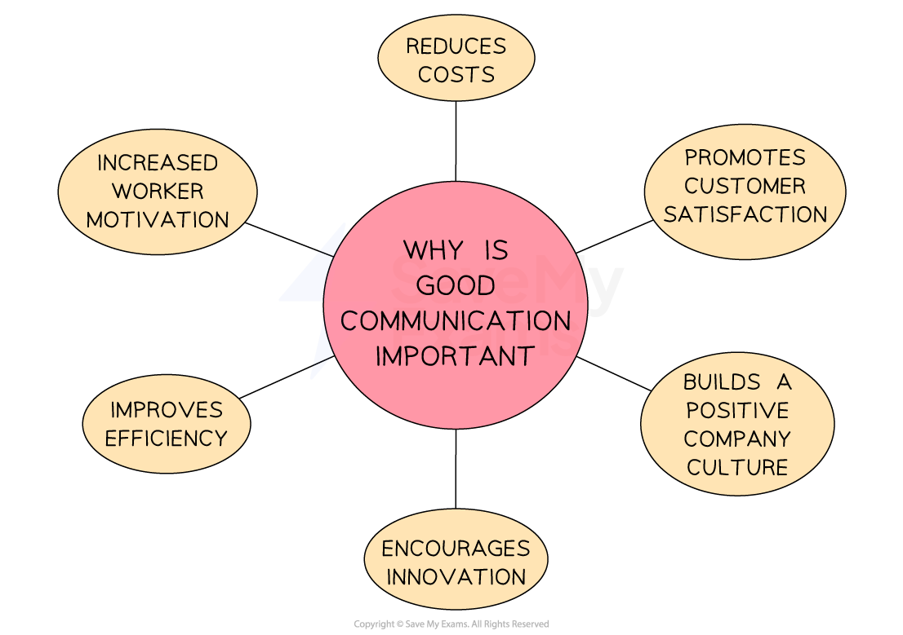

# The Importance of Good Communication

## Benefits of effective communication

> **Spec point** — `spcpt_nSKSSmFKFYBFQx42` · Importance of good communication

## Benefits of effective communication

- **Effective communication** means that the information or message being sent is received, understood and acted upon in the way intended
- **Effective communication should be**

  - Clear and unambiguous
  - Appropriate to the context and to the sender
  - Sent to the correct receiver in an accessible format
  - Timely and contain only the required amount of detail
- Effective communication is** important to any business** as it affects many key ***stakeholders*** including **employees, managers, suppliers and customers**
- Overall, effective communication helps a business meet it's objectives by making it e**asier to control and coordinate business activity **

  - As **poor communication** leads to higher costs, demotivated workers and a lack of cooperation, it is essential businesses  **establish effective communication channels**

#### The importance of good communication

*Effective communication prevents problems from arising and builds a positive culture*

### Increased worker motivation

- Improved employee involvement in decision-making can significantly boost motivation

  - When workers feel their voices are heard, they are more likely to be engaged and committed
  - It enables feedback among employees, creating a collaborative environment
  - E.g. UK bus company **Stagecoach** introduced *Blink*, an instant messaging and a reward system, which improved communication across the company - employee satisfaction rose by 32% and staff turnover decreased by 26%

### Improves efficiency

- Clear and complete communication supports better decision-making, as decisions are based on more accurate information
- Employees who understand their roles and tasks thoroughly can work more efficiently and productively

  - E.g. **TED**, known for its brief and impactful talks, limits meetings to just 18 minutes as research has shown that longer meetings reduce attention and productivity

### Encourages innovation

- Open communication encourages employees to ask questions, share ideas, and seek help when needed

  - This openness promotes creativity and can lead to innovative solutions within the business
  - E.g. at **3M**, employees are encouraged to spend 15% of their time collaborating with colleagues. This policy fosters a culture of idea-sharing and innovation

### Builds a positive company culture

- Good communication helps individuals understand their roles and responsibilities
- It also encourages teamwork and cooperation, contributing to a supportive workplace atmosphere

  - E.g.  **Zappos **keeps employees informed with timely updates, demonstrating transparency. This honest communication fosters a positive culture, as employees value openness from management.

### Reduces costs

- Effective communication minimises errors, which in turn reduces costs

  - Communication tools such as email or messaging platforms are often low-cost and easy to implement
  - E.g.  **Starbucks **views employees as brand ambassadors and emphasises communication between staff and management. This approach reduces turnover and boosts product quality, helping to lower operational costs

### Promotes customer satisfaction

- Maintaining regular and meaningful communication with customers helps build strong relationships, which can lead to increased sales and brand loyalty

  - E.g.  **Lidl Ireland **supports Women’s Gaelic Football as part of its PR strategy
  - This initiative demonstrates a commitment to Irish culture, helping the company connect with and retain customers in Ireland

## Problems of ineffective communication

> **Spec point** — `spcpt_kk3k94DVCjSCNK4H` · problems of ineffective communication and how they can be removed

## Problems of ineffective communication

- **Ineffective communication** occurs if communication is **not received or understood properly**

  - This may reduce business efficiency and increase mistakes or wastage
- Ineffective communication may also **confuse customers** or stop them receiving a message

  - This can negatively impact a business’ **sales and profitability**
- Many businesses invest heavily in trying to **improve communication in and outside of the business** to experience all of the benefits that good communication provides

  - E.g. more motivated employees

#### The effects of poor communication

| **Less motivated employees** | **Increasing costs** |
|---|---|
| - If workers **feel less informed** about their role or tasks, they may feel **less motivated**    - This can cause a decrease in ***productivity***and lack of morale   - In the longer term, ***labour absenteeism*** and ***labour turnover*** may increase | - Delayed projects, increasing defects and a lack of co-operation amongst staff are all examples of factors that can cause **rising costs for a business**    - Ineffective communication can have a significant impact on costs, **lowering profits** and effecting overall business performance |
| Inefficiency | **Inaccuracy** |
| - If messages are delayed or not sent to the right receiver, **decision making and processes will slow down**    - This can lead to a rise in costs and potentially **missed opportunities for the business**        - E.g. a business may be too late to secure a deal with a new supplier due to poor communication | - **Inaccurate information** can lead to mistakes being made such as products of a poorer quality or a compromise to customer safety    - E.g. miscommunications between colleagues may lead to some safety checks for a new toy being missed or rushed |

> **Exam Hint**
> In your exam you may need to explain one reason why poor communication causes problems for business. These questions are worth 3 marks. The table above provides a good structure for your response.
> 
> **Example**
> 
> Poor communication leads to inefficiency in a business. If messages are delayed, or not sent to the correct receiver, decision-making can be slowed down. This might mean a business misses opportunities such as securing a deal with a new supplier.
