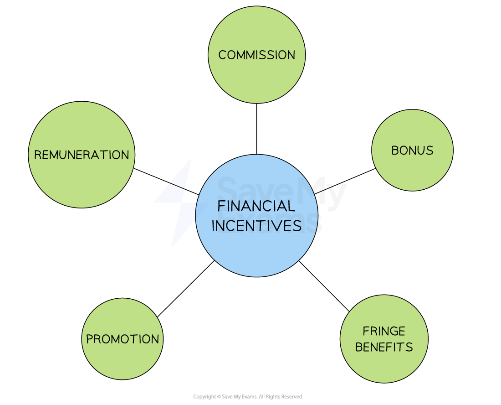

# How Businesses Motivate Employees

## Financial incentives

> **Spec point** — `spcpt_RsQq98nxVvQF9svJ` · Remuneration, bonuses, commission, promotion, fringe benefits

## Financial incentives

- Financial incentives are **rewards or payments** given to employees in return for their labour or improved performance
- The different theories of human motivation offer varying perspectives on the **role of money in motivating staff**

  - **Herzberg's Two Factor Theory** says that money is not generally a motivator, but the lack of it leads to dissatisfaction
  - **Maslow's Hierarchy of Needs** argues that people move through levels of needs that motivate them; their lower-order needs are closely linked to financial rewards, while their higher-order needs are rarely linked to pay
  
    - **Physiological** and **safety **needs can be partially met by providing adequate pay
    - **Love and Belonging** needs are often met by encouraging aspects such as teamwork
- Businesses commonly use a **mixture of financial and non-financial methods** to motivate workers

  - This helps to meet the **individual needs of different workers** they employ and helps **avoid wasting financial rewards** on those for whom it would be unlikely to improve their performance

#### Examples of financial incentives

*Financial incentives motivate some employees, depending upon the importance that they place on monetary items/money as a reward*

| **Incentive type** | **Explanation** |
|---|---|
| **Remuneration** | - **Basic wages **or** salary** that a worker receives for their labour - Employees who work on an hourly rate are paid wages and accrue benefits such as annual leave according to the hours they work - Salaries are paid to full-time staff and usually accompanied by benefits such as a fixed number of days of annual leave |
| **Commission** | - A percentage of **sales revenue **is paid to workers who sell products or services - Commonly used in sales roles to motivate staff to sell more and ***upsell*** |
| **Bonus** | - An additional payment given to staff for achieving specific goals, completing projects on time or **exceeding performance expectations** - The opportunity to **earn more money** may motivate staff to work harder and achieve better results |
| **Promotion** | - Promotion usually demands a **higher level of responsibility** from an employee in the job role    - **Higher pay **is usually offered to reflect the increased responsibility - A clear **promotion pathway** can act as a motivator to improve productivity and staff performance |
| **Fringe benefits** | - These are **additional benefits** usually offered to salaried employees    - Fringe befits could include the use of a company car, private healthcare or gym membership - Employees can be **motivated to work hard** in order to keep their job and the associated fringe benefits |

## Non-financial incentives

> **Spec point** — `spcpt_N5mydzDN7GW7FJmV` · Job rotation, job enrichment, autonomy

## Non-financial incentives

- Non-financial incentives are **rewards **that are **not directly related to money**
- These incentives may be ***intangible*** and include **methods that lead to** recognition, praise or job satisfaction

#### Types of non-financial incentives

| **Incentive type** | **Explanation** |
|---|---|
| **Autonomy** | - Involves giving staff the **authority and resources to make decisions** and take action without first receiving management approval    - Increases staff sense of **ownership and responsibility,** leading to improved productivity |
| **Job enrichment** | - Involves adding more **challenging or meaningful tasks** to a job - Staff feel more motivated and engaged, leading to improved productivity |
| **Job rotation** | - Involves moving staff between** broadly similar but varied roles** in the business - Exposes staff to **new challenges and experiences, **which can increase motivation, understanding and skill |
| Flexible working | - Providing opportunities to work **part-time**, carry out roles **remotely **or allowing for **flexibility in start and finish times** can help employees balance their work and home life - Staff may be more **loyal **and more **committed **to achieving business goals |

> **Exam Hint**
> Make sure that you understand the difference between job rotation and job enrichment. Job rotation means that workers complete further tasks at the same level, whereas job enrichment involves taking on more challenging or varied tasks.
