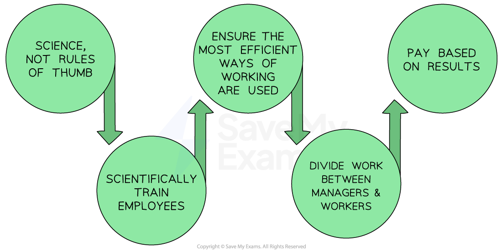
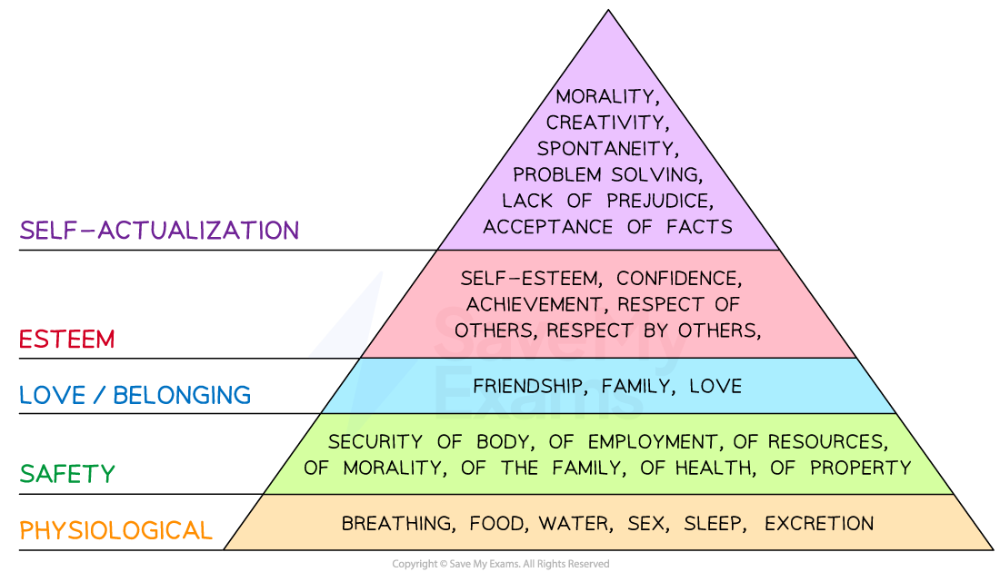
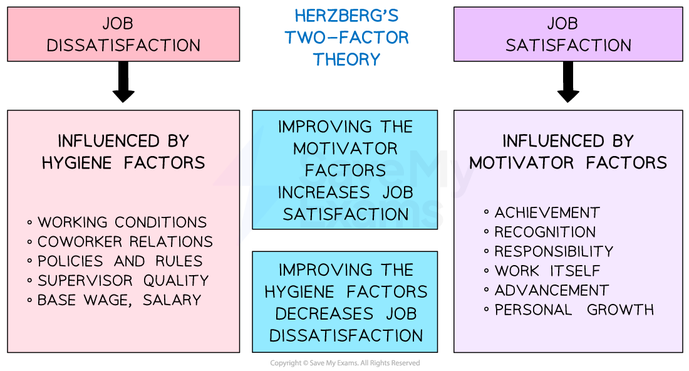

# Motivation Theories

## An introduction to motivational theories

> **Spec point** — `spcpt_Yqt7VNz99mYmRcby`

## An introduction to motivational theories

- Motivation theories present different views on the **role of money in motivating staff** and how **non-financial factors** may drive workers to improve their effort and output

#### The main theories of motivation

| **Taylor's Scientific Management** | **Maslow's hierarchy of needs** | **Herzberg's Two Factor theory** |
|---|---|---|
| - Workers are motivated mainly by **pay** - They need **tightly-defined tasks** and **close supervision** | - People move through **levels of needs** that motivate them - Once a need is met, it no longer serves to motivate | - **Money is not a motivator** but a lack of money leads to dissatisfaction - Workers are motivated by factors such as the **opportunity to develop their skills** |

## Taylor's theory of motivation

> **Spec point** — `spcpt_dTrRG568G4bG544T` · motivational theories of Herzberg, Maslow and Taylor.

## Taylor's theory of motivation

- Frederick Taylor developed his **Scientific Management **theory in the early 20th century
- It focuses on **breaking down complex tasks** into simpler ones, standardising work processes and providing workers with **clear instructions and training** to achieve maximum efficiency
- Many **manufacturing businesses** use Taylor's principles to structure their staff benefits

  - ***Piece rate*** pay systems link output to financial rewards
  - **Production lines** involving human labour are often set up based on these principles

#### Taylor's theory of motivation

*Taylor's method starts with a scientific analysis of what is involved in a job and then breaks it down into parts for which employees can be trained *

**1. Study and analyse the work process**

- Each step of the work process is carefully analysed
- **Complex tasks** are broken down into simpler ones

**2. Standardise the work process**

- The most efficient and **effective way to perform each task** is identified
- **Detailed procedures and instructions **are written, which workers follow consistently

**3. Select and train workers**

- Workers are carefully selected based on their **skills and abilities**
- Training supports them to perform their tasks efficiently and effectively

  - Training includes both **technical skills** and the **proper attitudes/behaviours** required to be successful (e.g. patience in a repetitive task)

**4. Provide incentives for performance**

- **Financial incentives** are used to motivate workers

  - Examples include **bonuses **or** piece-rate pay**

#### Evaluation of Taylor's motivation theory

| **How businesses use Taylor's approach** | **Advantages** | **Disadvantages** |
|---|---|---|
| - Workers are trained to **perform only one task,** which they become very skilled at - Workers are usually paid for the **completed work (piece rate pay)** e.g. \$0.16 per T-shirt completed by garment workers in Bangladesh | - **Increased efficiency** lowers costs - **Standard procedures **that everyone follows reduce inconsistencies - **Specialisation of labour** leads to greater efficiency and productivity - **Clear hierarchy** and lines of authority lead to efficient decision-making - **Better training **and development improves employee performance and job satisfaction | - **Overemphasis on efficiency** reduces worker satisfaction and creativity - **Workers may disengage** from work if they work in a machine-like system - **Limited application **to roles that require high levels of creativity, problem-solving or interpersonal skills - **Potential for exploitation** of workers, e.g. many 'sweat shop' labourers get paid using this method |

## Maslow's theory of motivation

> **Spec point** — `spcpt_QFZZJKrmCtFbXvWy` · motivational theories of Herzberg, Maslow and Taylor.

## Maslow's theory of motivation

- Maslow's Hierarchy of Human Needs outlines** five tiers of human needs **that must be met for individuals to reach their full potential
- Once a tier of needs has been met, it is **unlikely to continue to motivate **

  - For example, once safety needs are met through satisfactory pay, employees will **look for the next set of needs** - love & belonging needs - to be met

#### Maslow's hierarchy of needs

*Maslow's Hierarchy of Needs explains human motivation based on the pursuit of different levels of needs being fulfilled *

### Physiological needs

- Businesses can **provide necessities** for their employees e.g **comfortable work environment,** access to clean water and food, and adequate rest breaks

### Safety needs

- Businesses can provide **job security**, fair pay, benefits, and **safe working conditions** for their employees

### Love and belonging needs

- Businesses can encourage teamwork and generate a **sense of community** and belonging within the workplace

### Esteem needs

- Businesses can provide** recognition** for employees' accomplishments, and provide a positive work culture that **values individual contributions**

### Self-actualisation needs

- Businesses can help employees achieve this need by offering opportunities for them to **pursue their passions** and interests

  - For example, Barclays Bank supports elite sportspeople by allowing them time off work to continue their training (the focus was on getting the job done, not having to be present at work at a certain time)

#### Advantages and disadvantages to business of applying Maslow's hierarchy

| **Advantages** | **Disadvantages** |
|---|---|
| - Meeting employees' needs establishes a satisfying work environment    - This can lead **to increased productivity** and** lower staff turnover rates** - Offering **incentives that match **their specific needs and desires can improve staff loyalty - Employees who feel valued and supported by their employers are more likely to **perform at a higher level** | - Businesses need to tailor their approach to meet the individual needs of their employees, as **one size does not fit all** - Meeting many individual needs can be **expensive**,** **especially when offering costly perks such as a company car - **Determining the best way to motivate **requires significant effort from management to connect individually with workers |

## Herzberg's theory of motivation

> **Spec point** — `spcpt_6hXTPr7mDdpx2xZ5` · motivational theories of Herzberg, Maslow and Taylor.

## Herzberg's theory of motivation

- **Herzberg's Two-factor theory** suggests that two influencers determine employee motivation and job satisfaction: hygiene factors and motivators

  - **Hygiene factors** do not necessarily lead to job satisfaction, but their absence can cause dissatisfaction, which decreases motivation, e.g poor teamwork in the workplace
  - **Motivators** are elements that lead to job satisfaction and motivation, e.g. increased responsibility

#### Herzberg's Two-factor theory

*An explanation of how the lack of hygiene factors causes dissatisfaction while addressing the motivators increases satisfaction. Increased satisfaction leads to increased productivity and profitability*

### Using hygiene factors to reduce dissatisfaction

#### Pay fair wages and salaries

- If an employee is not paid a fair wage for their work, they may become dissatisfied and demotivated

#### Offer excellent working conditions

- If the workplace is dirty, unsafe or uncomfortable, employees may become dissatisfied and demotivated
- Google has a reputation for providing amazing workplaces, which include gourmet restaurants, laundry services and dog care

#### Offer employment contracts which provide job security

- If employees feel that their job is not secure, they may become anxious and demotivated and contribute less to the business's goals

### Using motivating factors to increase satisfaction

#### Build a recognition and rewards culture

- When employees are recognised and rewarded for their hard work, they are motivated to continue performing well
- Examples include salesperson of the month award and regular staff social events

#### Offer opportunities for growth and development

- When employees are given opportunities to learn new skills and advance in their careers, they are motivated to continue working for the company
- Examples may include personalised growth plans, which help workers achieve professional goals or sabbaticals, which allow workers to periodically pursue a valued interest

#### Provide challenging work which requires problem-solving

- When employees are given challenging work that allows them to use their skills and abilities, they are motivated to continue performing well
- Examples may include ***job rotation*** or job enlargement through ***delegation***

> **Exam Hint**
> Motivation is a popular exam topic and can be used to build analysis on a variety of topics. Always consider how decreased motivation can lead to increased business costs, which will reduce its profitability. Using principles gained from these three motivational theories can help wise managers to increase motivation, raise productivity and decrease business costs.
