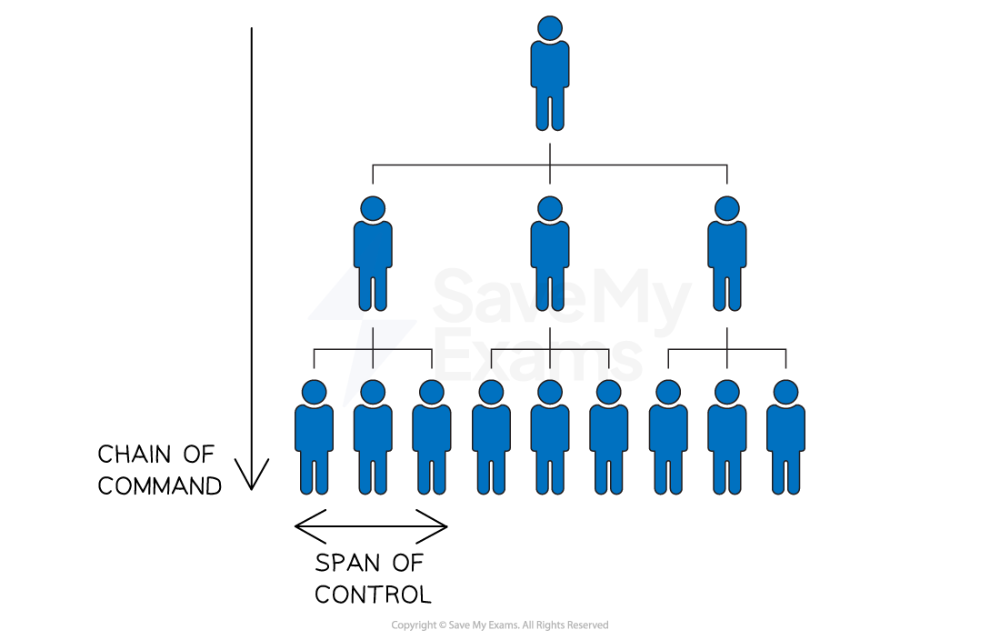

# Organisational Charts

## Introduction to organisational structure

> **Spec point** — `spcpt_hDdWCkKc2YRDnX6V` · Organisation structure and employees

## Introduction to organisational structure

- An organisational structure** outlines the reporting relationships, roles, and responsibilities of employees**
- Businesses need to choose a suitable structure to enable them to **effectively implement** **ideas** and **achieve their objectives**

  - They should consider how the structure may affect the **management and effectiveness of operations** and **communication**
  - A well-designed organisational structure helps to **provide clarity, efficiency **and **accountability**
  - It can be visually represented using an **organisation chart**

#### Example organisation chart

*This organisation chart shows a traditional hierarchy where workers are answerable to the supervisor or manager who has authority over them in the structure  *

### 1. Hierarchy

- A hierarchy refers to the **levels of authority** within an organisation

  - It describes the ranking of positions from top to bottom
  - The **higher the position** in the hierarchy, **the more authority** and power it holds
  - The hierarchy usually includes top-level management, middle-level management, and lower-level employees

### 2. Chain of Command

- The chain of command is the **formal line of authority** that flows downward from top management to lower-level employees

  - It defines who reports to whom and who is responsible for making decisions
  - The chain of command helps to establish a **clear communication channel** and helps to maintain accountability within the organisation

### 3. Span of Control

- The span of control refers to the number of employees that a **manager or supervisor directly manages**
- It is based on the principle that a manager can only effectively manage a limited number of employees

  - A **narrower span of control** means that there are more layers of management
  - A **wider span of control** means that there are fewer layers of management

## Flat and hierarchical organisational structures

> **Spec point** — `spcpt_zKwmtwnhnqM3rZfm` · Organisational charts for different types of business:
• hierarchical and flat

## Flat and hierarchical organisational structures

- The chain of command and span of control are closely linked

  - A long chain of command usually results in a narrow span of control
  
    - This is known as a **hierarchical** organisational structure
  - A short chain of command usually results in a wide span of control
  
    - This is known as a **flat** organisational structure

**Characteristics of hierarchical and flat structures**

| **Hierarchical organisational structure** | **Flat organisational structure** |
|---|---|
| - **Multiple levels of management ** - A **long** chain of command and narrow span of control - Common in large organisations with complex operations    - E.g. government agencies and universities | - Few levels of management - A **short** chain of command and wide span of control - Common in small organisations or start-ups    - E.g. tech start-ups and small businesses |
|  |  |
| **Advantages** | **Advantages** |
| - Provides a **clear structure** of authority and defined roles and responsibilities - **Promotes specialisation** and expertise within each department or function | - Promotes a **culture of collaboration** and open communication - Decision-making can be **faster and more efficient** |
| **Disadvantages** | **Disadvantages** |
| - Can create **communication barriers** between upper and lower levels of the hierarchy - **Decision-making can be slow** as information must pass through multiple layers of management | - Employee **roles and management **may not be clearly defined - May require employees to take on **multiple roles** and responsibilities, **leading to burnout** and stress |

- Some businesses may choose to **remove layers from their hierarchy,** which shortens the chain of command

  - This is known as **delayering**

> **Exam Hint**
> Remember the following distinctions:
> 
> - The longer the chain of command, the more ‘hierarchical’ the organisational structure and the ‘narrower’ the span of control
> - The shorter the chain of command, the 'wider' the span of control
> 
> In exam questions you may be asked to define a specific key term in this section or explain a type of organisational structure

## Centralised and decentralised organisational structures

> **Spec point** — `spcpt_fD4W9WsvjmGS3Ggn` · Organisational charts for different types of business:
• centralised and decentralised.

## Centralised and decentralised organisational structures

- A **centralised** organisation structure is where **authority for decision-making** rests with **senior management** at the centre of a business
- A **decentralised** structure is where authority for decision-making is ***delegated*** further down the hierarchy towards functional or middle managers
- In reality, few businesses are wholly centralised or decentralised

  - In most businesses, ***strategic*** decisions are made by senior leaders, whilst ***operational*** decisions are delegated to functional areas and middle managers

#### Evaluation of centralised and decentralised organisational structures

|   | **Advantages** | **Disadvantages** |
|---|---|---|
| **Centralised structure** | - Effective **co-ordination and control** of business operations from the centre - Fast and decisive** decision-making** can increase ***competitiveness*** - **Consistency** across the whole organisation | - Middle managers' **lack of autonomy** can impact their motivation - **Highly** ***bureaucratic***, slowing communication of decisions - Ignores **insights of lower-level staff **who are likely to be closer to customers |
| **Decentralised structure** | - Better able to respond to **local market conditions **and meet customer needs - Staff able to **contribute to decision-making **may be more fulfilled and **loyal** - Prepares junior management for **career development** | - ***Diseconomies of scale***** **such as the duplication of staff roles may emerge - May be difficult to tightly **control *****budgets*** - During **times of crisis,** leadership may not be clear |

> **Exam Hint**
> This topic is often tested in multiple choice and 'state' or 'define' questions. Make sure you practice the definitions of key terms as well as relevant examples.
