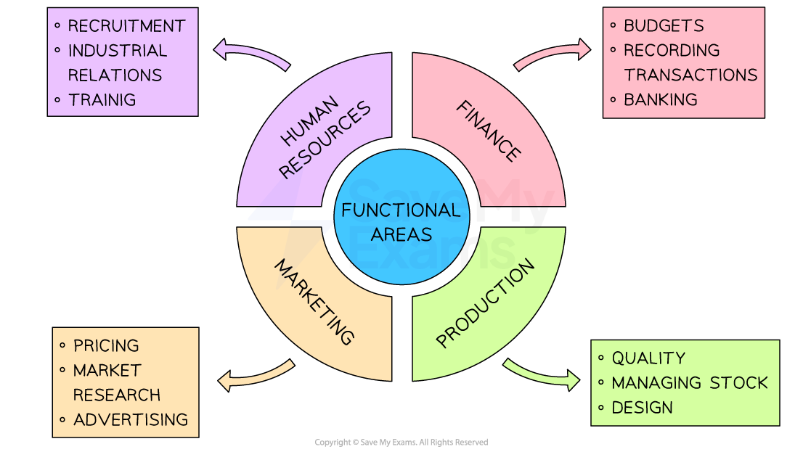

# The Functional Areas of Business

## Functional areas and their roles in business

> **Spec point** — `spcpt_cXM25wBjyMrNZ9Qq` · The different functional areas within a business: 
• human resources – workforce planning, recruitment and selection, training, health and safety, staff welfare, employment issues, industrial relations, disciplinary and grievance procedure, dismissal, unfair dismissal and redundancy 
• finance – wages/salaries, cash-flow forecasting, budgets and accounting 
• marketing – market research, product planning, pricing, sales promotion, advertising, customer service, public relations, packaging and distribution 
• production – manufacturing the product, designing new products, quality control and stock control.

## Functional areas and their roles in business

- Departments are functional areas within a business, and usually every employee is assigned to a specific department

  - A functional area is a group of workers with similar skills and expertise who carries out a **specific organisational role**
  - Businesses often split their work in this way to improve efficiency with **specialists** capable of working at a high standard on their allocated tasks
  - These business functions are sometimes ***outsourced*** to **specialist service providers**
  
    - This can **reduce costs** and ensure access to **advice from specialists** who may be expensive to employ directly

#### Functional areas

*The four main functional areas carry out key specialist tasks in a business*

### Human Resources

- The HR function is responsible for managing the workforce within an organisation and ensuring employee welfare, including

  - Recruitment and selection
  - Training and development
  - Maintaining healthy industrial relations
  - Ensuring compliance with health and safety regulations

### Finance

- The Finance department is tasked with managing the organisation’s money, including

  - Recording all incoming and outgoing financial transactions
  - Collecting debts owed to the business
  - Ensuring that bills and salaries are paid on time
  - Setting and maintaining budgets
  - Conducting financial forecasting
  - Managing banking operations
  - Preparing the annual financial report

### Marketing

- Marketing focuses on understanding the needs and wants of both existing and potential customers, including

  - Researching the market to plan products that meet consumer demand
  - Organising their distribution
  - Persuading customers to purchase a company’s goods or services
  - Determining pricing tactics that attract and retain customers

### Production

- The production function is centred on creating the product or delivering the service that the business offers to customers, including

  - Ensuring the quality of output
  - Sourcing and purchasing raw materials and components
  - Managing the design and testing of new products
  - Inventory management
- Functional areas need to **work together** effectively to achieve business aims and objectives

#### Examples of functional areas working together

| **Finance** sets budgets so that the **marketing **function knows how much they have to spend on promotional activity | **Human resources** recruits staff to work within the **finance **function and organises induction training for new staff so they may settle swiftly into their roles | **Marketing** carries out research to find out the needs of customers, which informs the **production** function that makes the products to meet requirements | **Production** reports output and wastage data to the **finance** function, which calculates costs of manufacture and determines profit margins |
|---|---|---|---|

> **Exam Hint**
> You do not have to have a detailed knowledge of each of the functional areas - but you should understand the broad purpose and key roles of those covered in the notes above. Examiners have commented on few candidates understanding of the Human Resources function in particular!
