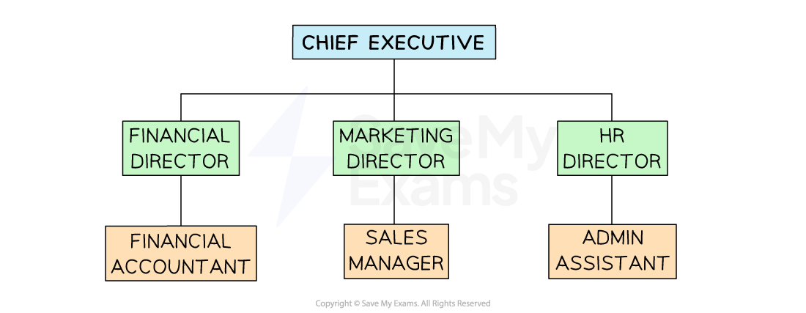

# The Roles & Responsibilities of Employees

## Roles and responsibilities

> **Spec point** — `spcpt_kYkTJ4fY9b5QsFfG` · Roles and responsibilities of employees in terms of compliance and accountability:
• span of control
• chain of command

## Roles and responsibilities

- The **organisational structure** of a business determines the roles, responsibilities and relationships between individuals in an organisation

#### Business roles

*Larger firms are usually arranged into functional departments such as finance and marketing, which are led by directors who carry the final responsibility for the work of everyone in the department *

### The role of directors

- Larger businesses often have a **board of directors** who make key ***strategic***** business decisions** such as

  - Implementing new corporate policies
  - Investment of retained profit and share capital
  - Growth objectives
- The board normally consists of a senior employee from each department, officers (such as treasurer or secretary) and the owner or chief executive officer (CEO) of a business

### The role of managers

- **Managers** have** many responsibilities **in the business and help it to **operate effectively on a day-to-day basis**
- Types of managers include senior and ***functional managers***, ***line managers*** and ***supervisors***

#### Roles and responsibilities of managers

| **Role** | **Responsibilities** |
|---|---|
| **Senior manager** | - Plan to achieve the business’ **overall goals** - Set** long-term plans** and targets for the business - Contribute to ***strategic*** decisions |
| **Functional manager** | - Work to **achieve the short and long-term targets** set by the directors and senior managers - **Responsible for running a function** within the business, e.g. marketing or finance - Make ***operational*** decisions - Use employees and other resources in the best possible ways |
| **Supervisor/team leader** | - Help managers achieve their targets by **reporting any problems and passing on instructions** - Take** simple decisions** such as allocating jobs among different employees |

### The role of operational and support staff

- Operational staff complete tasks to which they are directed by their manager(s)

  - E.g. In a **department store** operational staff include customer service representatives, sales assistants and security staff
- Support staff assist with the non-core operations of a business

  - E.g. In a **bank **support staff may include cleaners, IT technicians and human resources assistants

## Delegation

> **Spec point** — `spcpt_cwtpgnzFFr39hy3x` · Roles and responsibilities of employees in terms of compliance and accountability:
• delegation.

## Delegation

- Delegation is a process where responsibility for specific **tasks is given to *****subordinates*** by managers

  - Delegation usually involves **transferring** **authority** from manager to subordinate
  - E.g. the Human Resources Director of a large company** delegates authority** for recruitment and training to the Recruitment and Training Manager
- Delegation is **particularly important in businesses with a flat organisational structure**, where managers have wide spans of control

#### The advantages of delegation

| **Advantages for managers** | **Advantages for workers** |
|---|---|
| - Allows managers to **concentrate on important tasks**    - Managers do not have the time to do complete every task themselves | - Delegation allows workers to **feel empowered in decision making**    - This can **motivate **as staff are trusted to perform a job well |
| - Helps managers to **measure the performance of their staff** as they can judge how well subordinates carry out these tasks | - Provides **a form of training** as workers learn on the job thus increasing job opportunities to progress within the organisation |
| - Can help to **reduce errors** if managers delegate    - Workers may be skilled in certain areas and have sufficient time to complete the task to a higher standard | - Makes employees **work more interesting and rewarding**    - This could reduce absenteeism and labour turnover |

- Despite its advantages, some managers are** reluctant to delegate** as they** lose some control over decision-making**

  - Managers may need support to be able to balance trust and control to delegate appropriate tasks
  - ***Autocratic*** leaders may not be willing to give authority to others
  - Some managers may feel **threatened **by highly skilled subordinates seeking promotion

> **Exam Hint**
> In the exam you could be asked to analyse delegation as a way to motivate workers. Remember, whilst some may see having more authority as a non-financial incentive, some workers may be anxious about taking on extra responsibility or lack the appropriate skills.
