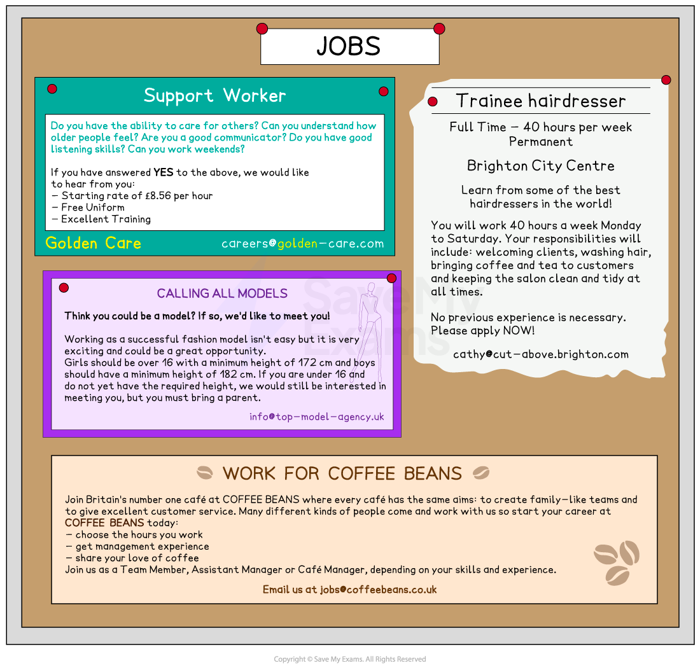

# Internal & External Recruitment

## Advertising Vacancies

> **Spec point** — `spcpt_b2R3TY5fXWF5tVFh` · Internal and external recruitment: 
• job advertisement

## Advertising vacancies

### Internal and external recruitment

- **Internal recruitment** is the appointment of a suitable candidate who already works for the business
- **External recruitment **is where a new employee is appointed from outside the business
- Businesses often use a **combination of internal and external recruitment methods**, depending on the **nature of the job** and the **availability of suitable candidates**

  - The method chosen will also depend on the **organisation's goals**, the **level of the position** being filled and the **industry** in which it operates

### Advertising the vacancy

- After producing the **job description **and** person specification** when a vacancy arises, the business can **advertise **the role internally, externally, or a combination of both

  - In order to advertise the vacancy, the business must produce a ***job advertisement*** that includes
  
    - Brief details of the job and characteristics of desired applicants
    - How to apply for the job

#### Examples of job advertisements

*Job advertisements are designed to attract interest and encourage candidates to apply for roles*

#### Advertising vacancies internally and externally

| **Advertising internally** | **Advertising externally** |
|---|---|
| - If the business is seeking an **internal candidate** business newsletters, staff noticeboards or internal email can be used to display job advertisements - **Line managers** may be asked to** recommend suitable candidates** following ***appraisals***    - E.g. A new project management role within the organisation may be advertised in the weekly staff newsletter - Recruiting internally may mean **workers do not need *****induction*** **training **and** **are **highly productive relatively quickly** - A **further vacancy **is created when a worker moves into their new role | - **External candidates** can be targeted with advertisements in newspapers, industry magazines, specialist recruitment websites, agencies and government-run agencies - **Existing employees** may be asked to **nominate people they know** for roles - sometimes they receive a reward of their nominee is successfully recruited - Businesses with a strong social media presence can use these platforms to advertise cost-effectively e.g. TikTok - **New skills, experiences and ideas** are introduced to the business - Some methods such as advertising in the ***mass media*** are **expensive** and it can be **difficult to target** the desired audience |

- If a business needs to recruit quickly or if it is struggling to find the right employee it may use a **recruitment agency** to carry out the advertising and recruitment process on their behalf

  - New employees may be found **quickly** through a recruitment agency which has potential candidates already enrolled
  - It can be **expensive** as businesses have to pay a fee for these services

## Shortlisting & Interviewing Candidates

> **Spec point** — `spcpt_bPSCTVdHpWCVwmTx` · Internal and external recruitment: 
• shortlisting 
• interviewing.

## Shortlisting and interviewing candidates

- When** recruiting for the role, **the business will select candidates whose qualifications, skills, personal qualities and experience **best match the job description and person specification**
- The process of selecting prospective candidates for interview is called **shortlisting, **which is then followed by a ***job interview***

| **Shortlisting** | **Interviews** |
|---|---|
| - A **shortlist** is a collection or list of the most well suited candidates for the role    - A careful comparison with the **job description** and **person specification** is made - It is a **list of the candidates whose applications meet the role criteria **and for whom the business would like to find out some more information about them at interview - Shortlists are essential for sorting through** large volumes of applications** - Candidates on the shortlist are** asked to interview** or to complete **assessment activities** | - Interviews usually include a face to face, telephone or online **discussion between a manager and the candidate **about their **suitability** for the role - A **set of relevant questions** is used for all candidates to ensure that the interview is conducted in a fair and consistent manner - Interview questions may focus on    - **Skills and experiences** relevant to the job   - **Successes and failures** - and how these were overcome   - Personal** interests and experiences** - The interview process should lead to a** suitable candidate being appointed** |

> **Exam Hint**
> Shortlists and interviews are not alternatives - a business shortlists before it goes to the effort of interviewing candidates. Without a shortlist there would, in some cases, be too many candidates to meet in person. This would be costly and time-consuming.
