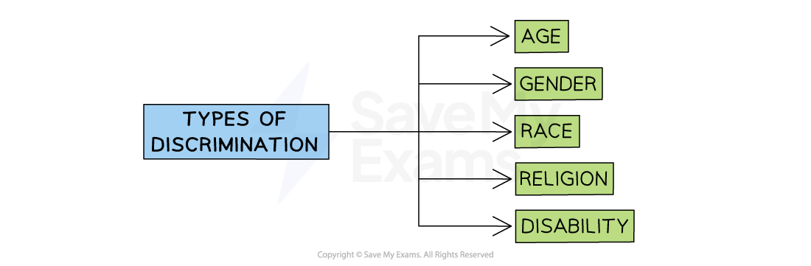

# Legal Controls over Employment

## An introduction to legal controls over employment

> **Spec point** — `spcpt_MqYpVNstShv77DpX` · Legal controls over employment and their effects

## An introduction to legal controls over employment

- Legal controls are the **laws and regulations **passed by governments that require businesses to **conduct their behaviour in a particular manner**
- Many countries have **passed laws **and introduced **regulations **that affect the relationship between employers and employees and relate to aspects including

  - Pay
  - Hours and conditions of work
  - Safety
  - Discrimination
  - Rights to paid and unpaid absence e.g. holiday
  - Dismissal
- The main aim of **employment law** is to protect and** prevent exploitation of workers**

## Equal opportunities

> **Spec point** — `spcpt_txnj3wTHVG86HXN9` · Legal controls over employment and their effects:
equal opportunities – gender, race, disability, religion, sexual preference, age

## Equal opportunities

- Equal opportunities means that **all individuals should be treated equitably**, regardless of protected characteristics such as gender, race, religion and disability
- Many countries have introduced laws preventing discrimination in the workplace

  - E.g.** France's **discrimination laws identify a range of **protected characteristics** that cannot be discriminated against including sexual orientation, gender identity, age, pregnancy, trade union activities and physical appearance
- Businesses must **comply with equal opportunities legislation** to prevent ***discrimination*** from occurring in the workplace
- **Discrimination** at work is when the employer makes decisions that are **based on ‘unfair’ reasons**

  - In most countries many of these forms of **discrimination are illegal**
  - Workers who have suffered discrimination can take** legal action** against an employer

#### The main forms of discrimination

*If an employee has suffered discrimination at work they can take legal action against their employer*

### Benefits of complying with employment laws

- A business which **follows and encourages an equal opportunities policy** can help

  - Improve its reputation
  - Keep employees happy and motivated
  - Prevent serious or legal issues arising, such as bullying, harassment and discrimination
  - Better serve a diverse range of customers
  - Improve ideas and problem-solving
  - Attract and keep good staff

> **Exam Hint**
> You do not need to know specific examples of legislation from different countries for the exam. The extracts in the exam paper will clearly define what laws are in place in a given country e.g. equal opportunities legislation. Make sure that you understand the purpose of the legislation, in other words, what are the legal controls tying to do. Remember, the main aim is to prevent the exploitation of workers!

## Minimum wage laws

> **Spec point** — `spcpt_2nKqgdQTsKhDTRGr` · Legal controls over employment and their effects: 
• minimum wage laws.

## Minimum wage laws

- A minimum wage is the** lowest wage permitted** by law
- Some countries may have a very complicated minimum wage system

  - **India** has hundreds of minimum wage rates for different types of industries, geographical regions and skill levels

- Other countries set a **minimum hourly, weekly or monthly wage level** for all citizens

  - In 2022 **Belgium**’s minimum wage rate was €1,691 (US\$ 2,000) per month
  - In **Estonia** the minimum wage in 2023 was €4.30 (US\$ 5.09) per hour
  - Countries including **Ireland** and the **UK **set different minimum wage rates according to age

- There remain **some countries without minimum wage** laws

  - In **Finland** there is no minimum wage but all employers must pay minimum rates agreed in collective bargaining agreements
  - The **United Arab Emirates** has no minimum wage requirements
- The **implementation of a minimum wage** can have many consequences for **both employers and employees**

  - The main effect for the business is the likelihood of **an increase in costs**

#### Impacts of implementing a minimum wage

| **Employers** | **Employees** |
|---|---|
| - **Wages are a large cost to a business** so the implementation of a NMW will increase ***variable costs ***as all workers will need to be paid the minimum legal limit    - The business may increase prices to compensate for the higher costs - Encourages employers to **invest more in training unskilled workers** as they are now paying them a higher wage - Some employers will **not be able to afford these wage rates** - May cause some skilled workers who are receiving slightly more than the NMW to **negotiate higher pay**    - This would also increase business costs | - **Reduces exploitation of workers **    - Without a NMW businesses may pay their workers very poorly - Acts as an** incentive to enter the workforce** due to the attractiveness of higher pay - Low-paid workers will earn more and will **have higher living standards** - Workers who are paid at or above the minimum wage are more likely to be **motivated and productive** and **take less time off **work - Some **job losses** may occur when a NMW is introduced as businesses move to cheaper ***capital intensive*** processes |
