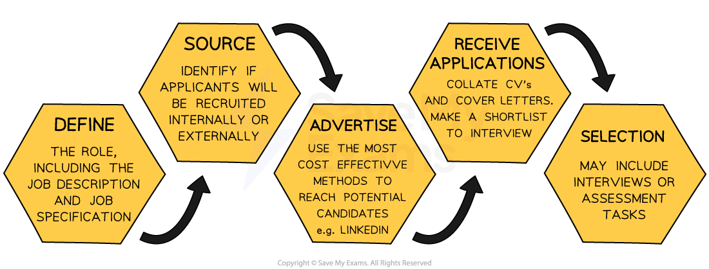
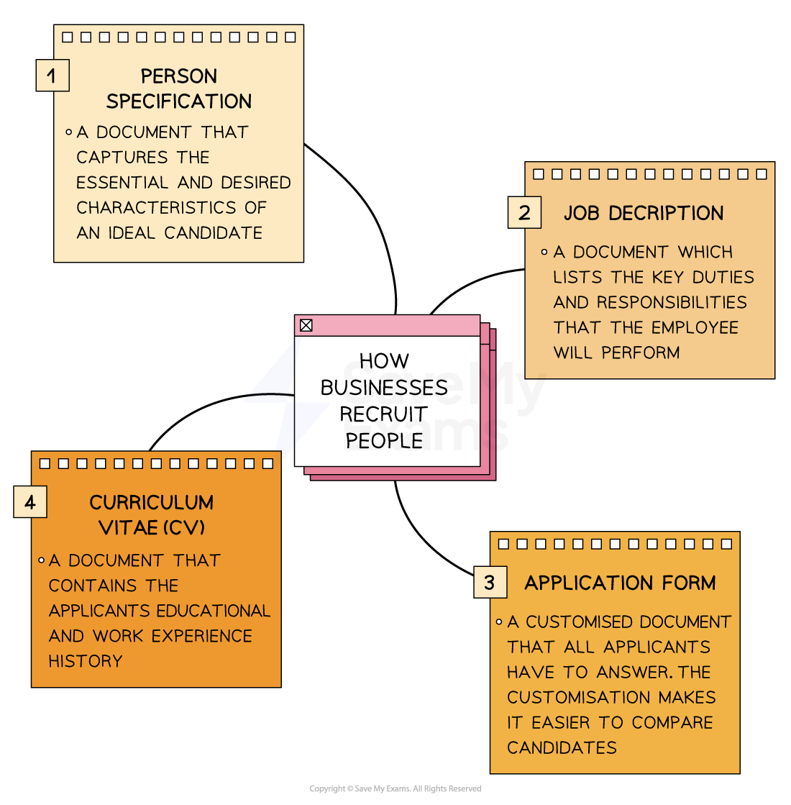

# Recruitment Documents

## An introduction to recruitment

> **Spec point** — `spcpt_G6fHTvm46qhbfzJw` · Recruitment and selection process

## An introduction to recruitment

- **Recruitment **is the process of attracting and identifying potential job candidates who are suitable for a particular role

  - Recruitment activities include **job advertising, job fairs, social media outreach and referrals** from current employees
  - The goal of recruitment is to **create a pool of qualified candidates** who can be considered for the role
- **Selection **is the process of choosing the best candidate

  - Selection activities often involve **reviewing CVs** and **conducting interviews** or assessment tasks
  - The goal of selection is to hire the **most suitable candidate** for the job

#### Stages in the recruitment process

*The process of employing a worker, from identifying the vacancy to selecting the right candidate for the role*

- The specific details of the recruitment process **may vary slightly between businesses** due to different factors, including

  - The **urgency** of the role needing to be filled
  - The **budget** involved in advertising the vacancy
  - The **nature of the role and the skills required,** e.g. some roles require very specific skill assessments
  - **Preferences of management,** e.g. preference of using CV's rather than application forms
  - The** time available **for the process to occur, e.g. Google's recruitment process, usually takes 6–8 weeks

## Comparing recruitment documents

> **Spec point** — `spcpt_ybj9cF7NQnfYMSB4` · Recruitment documents: 
• job description 
• person specification 
• application form 
• curriculum vitae (CV)/résumé.

## Comparing recruitment documents

- The recruitment process must first** identify the job roles that are needed** and **define the characteristics of the ideal candidates **to fill vacancies
- Businesses use a range of **documents** in the recruitment process

*The job description, person specification and application form is written by the employer. The CV is written by the prospective employee*

- The recruitment documents are used throughout the process and **play a very important part** in helping the business choose the **right candidate for the role**

  - **Without detailed recruitment documentation**, prospective candidates may lack the appropriate skills or qualifications needed for the role, or be misinformed about what the role consists of

### Job description and person specification

- **Before a business** starts to look for new employees, it writes a **person specification** and a **job description** to determine the job role and ideal candidate to fill that role

#### Comparison of the person specification and job description

| **Person specification** | **Job description** |
|---|---|
| - Details the essential and desirable characteristics of the **person** suitable for the job, including    - Qualifications   - Experience   - Skills such as the ability to drive or IT capabilities   - Personal characteristics and attributes | - Details the features of the **job,** including    - Duties   - Hours and location of the job   - Managerial or supervisory responsibilities   - Pay and conditions |

### Application forms and CVs

- Once a job is advertised, the business **accepts applications **from candidates via **application form **or **Curriculum Vitae** (CV)

#### Comparing application forms and CVs

| **Application Form** | **Curriculum Vitae (CV)** |
|---|---|
| - **Application forms** contain a series of standardised questions to which all candidates must respond    - Name and contact details   - Qualifications   - Work experience   - Positions of responsibility   - Interests   - A personal statement where the candidate explains why they would be suitable for the advertised role   - The names and addresses of referees - Many application forms are now **completed online**  ** ** | - A **curriculum vitae** is compiled by the applicant and may be standardised to apply for varied roles - CVs usually include **similar information **to that collected in an application form - Although it should be well laid-out and clear, there is **no single acceptable format** for CVs - An accompanying** letter of application** outlines    - Why the applicant wants the job   - Why they would be suitable for the advertised role |
| **Benefits** | **Benefits** |
| - All applicants provide identical information in the same format so they are **easy to compare** | - **More applicants may apply** because it is easier for candidates to prepare and adapt a standard CV |
| **Drawbacks** | **Drawbacks** |
| - **Limited information **can be expressed by candidates so key desirable attributes may not be identified | - Comparing different formats and content of CVs can **take more time** and lengthen the recruitment process |

> **Exam Hint**
> You do not need to have an in-depth understanding of recruitment documentation for the exam, however you do need to know what they are and the differences between them
