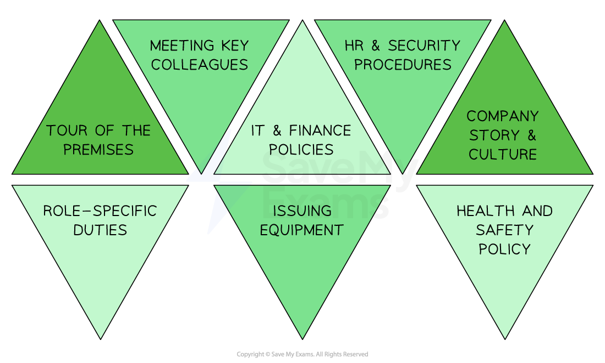

# The Importance of Training

## Why training is important

> **Spec point** — `spcpt_B2RpTwBPSVgwMwJz` · Include compliance with laws e.g. health & safety; competitiveness

## Why training is important

- Both new and existing staff need to be trained and developed appropriately

  - Training is the teaching of **new skills**
  - Development is the **improvement** of **existing skills**
- A **well-trained workforce** is beneficial to a business for several reasons

#### The importance of well-trained employees

| **Productive staff** | **Valued staff** | **Loyal and flexible staff** |
|---|---|---|
| - Employees **work enthusiastically** at the things they’re good at - E.g. employees trained in managing quality are more likely to think about how to improve product standards | - Well-trained employees are likely to be **satisfied** - They recognise that their employer is **spending money and investing time **in their development - This is **attractive to job applicants** | - **Labour retention** should increase as employees feel they are becoming better at their job and want to keep developing  - Skilled and confident staff are likely to be capable of taking on **new workplace challenges** |

- Some training is required to **meet legal requirements**

  - **Food safety** regulations require workers to be trained in the safe handling of ingredients
  - Businesses must ensure that some workers have **first-aid** training
  - Employees working with **hazardous chemicals** must receive appropriate training

> **Exam Hint**
> You may be asked to explain a benefit of training to a business. Remember to make a clear point and develop it thoroughly using the X → Y  → Z structure: X leads to Y and the outcome is Z.

## Induction Training

> **Spec point** — `spcpt_tJd9SnSkfTJQDPZG` · Importance of training to a business and workers:
• different types of training and the main purpose
•  induction incl benefits and limitations

## Induction training

- **Induction training** is usually delivered as soon as possible after new workers join a business
- It introduces employees to the organisation, its culture, policies, procedures and their job roles and responsibilities

  - E.g. Induction training for new employee at **Marks & Spencer** covers customer service procedures, product knowledge, store policies and safety procedures

#### Common elements of induction training

*Induction training usually includes a tour of the premises, meeting key colleagues and instruction on key business policies   *

- Some aspects of induction training need to be **revisited** by employees regularly

  - **Health and safety training** needs to be carried our regularly, especially when new regulations come into effect
  - When business **policies change** employees need to understand the implications for them in their job role

#### Advantages and disadvantages of induction training

| **Advantages** | **Disadvantages** |
|---|---|
| - Helps new employees to **understand their job roles** and responsibilities - Improves employee confidence and motivation - **Reduces time** for new employees to become **productive** | - Can be time-consuming and **expensive to organise** - May not cover all aspects of the job role - May not be effective in all cases, **leading to employee dissatisfaction** and higher turnover rates |
