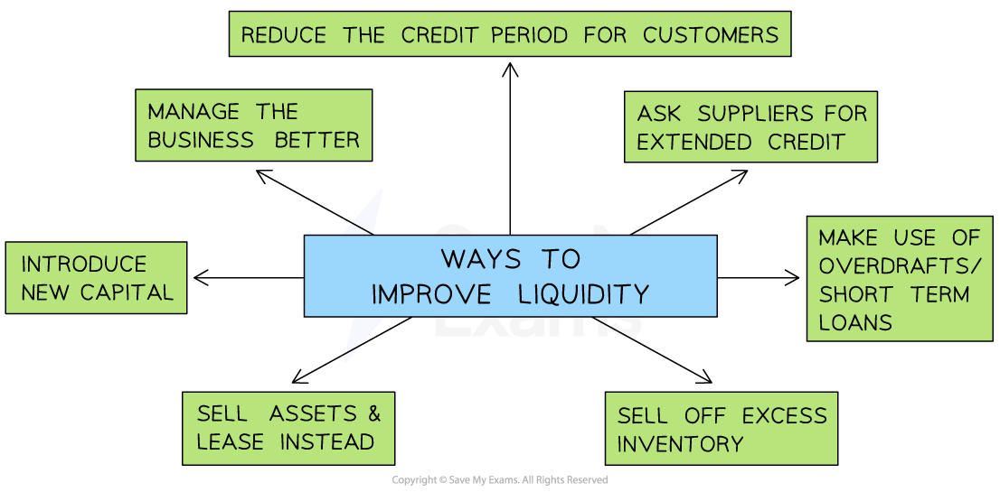

# Liquidity

## The importance of liquidity

> **Spec point** — `spcpt_W5vGPTWMX3xzkwJ9` · Calculating and analysing accounting ratios

## The importance of liquidity

- Liquidity is defined as the** ability of a business to pay back its short-term debts**, e.g. its suppliers
- A businesses that cannot pay its debts is considered **insolvent**

  - If a business cannot pay its **suppliers, **raw materials or components may not be delivered and **production will be delayed**
  - If it cannot repay an ***overdraft***, **banking facilities may be withdrawn,** and its ***credit rating*** will suffer
  - ***Creditors*** may force it to stop trading and sell its ***assets*** so that the debts owed to them are repaid
- Stakeholders interested in liquidity include

  - **Suppliers** want to be reassured that a business is likely to **be able to pay for them**
  - **Financial providers** such as banks want evidence that a business is likely to be able to repay ***loans*** or overdrafts
  - **Customers** want to be sure that a supplier will be able to produce and deliver goods it orders

## Liquidity ratios

> **Spec point** — `spcpt_S5KQP4HqjQwbTMHr` · Calculating and analysing accounting ratios: 
• current ratio 
• acid test ratio.

## Liquidity ratios

- The liquidity of a business can be measured using two ratios

  - Current ratio
  - Acid test ratio

### The current ratio

- The current ratio is a **quick way** to measure liquidity

  - The outcome is **expressed as a ratio**
  - All types of current asset are included in calculating this ratio
  - The result indicates how many **£s **(or other currency units) **of current assets are **available to **cover each £1 **(or other currency unit)** of short-term debt**
  - It is calculated using the formula

$\mathrm{Current} \mathrm{ratio}=\frac{\mathrm{Current} \mathrm{assets}}{\mathrm{Current} \mathrm{liabilities}}\,\,=?:1$

> **Worked Example**
> *Packer Sports Ltd* has current assets of \$15,545, current liabilities of \$5,060 and an inventory figure of \$8,250.
> 
> Calculate *Packer Sports Ltd.’s *current ratio.
> 
> [2]
> 
> **Step 1: Substitute the values into the equation**
> 
> `$ 15 comma 545 space divided by space $ 5 comma 060
> 
> equals space 3.07`       **[1 mark]**
> 
> **Step 2: Express the outcome as a ratio**
> 
> $=3.07:1$    **[1 mark]**
> 
> **In this example, Packer Sports Ltd has \$3.07 of current assets to cover each \$1 of short-term debt**

### The acid test ratio

- The acid test ratio is a **precise and realistic** way to measure liquidity, especially for **businesses that hold large amounts of inventory**

  - It is **expressed as a ratio**
  - It is also known as the **liquid capital ratio**
  - The** least liquid** form of current assets (inventory) is deducted so the acid test ratio provides a more **realistic** measure of the businesses ability to **meet short-term debts quickly**
  
    - It often **takes time to sell inventory **so it is excluded
  - The Acid Test is calculated using the formula $\mathrm{Acid} \mathrm{test} \mathrm{ratio}=\frac{\mathrm{Current} \mathrm{assets}-\mathrm{Inventory}}{\mathrm{Current} \mathrm{liabilities}}\,\,=?:1$

> **Worked Example**
> *Packer Sports Ltd *has current assets of \$15,545, current liabilities of \$5,060 and an inventory figure of \$8,250.
> 
> Calculate *Packer Sports Ltd’s* acid test ratio.
> 
> [3]
> 
> **Step 1: Subtract inventory from current assets **
> 
> `$ 15 comma 545 space minus space $ 8 comma 250
> 
> equals space $ 7 comma 295`    **[1 mark]**** **
> 
> **Step 1: Substitute the values into the equation**
> 
> `Acid space test space ratio space equals space fraction numerator space Current space assets space minus space Inventory over denominator Current space liabilities end fraction
> 
> equals space fraction numerator space $ 7 comma 295 over denominator $ 5 comma 060 end fraction
> 
> equals space 1.44`    **[1 mark]**
> 
> **Step 2: Express the outcome as a ratio**
> 
> $=1.44:1$    **[1 mark]**
> 
> > *In this example, Packer Sports Ltd has \$1.44 of the most liquid current assets to cover each \$1 of short-term debt*

## Analysing liquidity

> **Spec point** — `spcpt_DDKgQ7WB9zk66xqm` · Liquidity: 
• the concept and importance of liquidity 
• comparisons with previous years and/or with other business organisations.

## Analysing liquidity

### Comparing liquidity

#### Businesses compare and monitor liquidity over time

- A business may be able to identify a **pattern** of periods of good and poor liquidity

  - For some businesses poor liquidity can be seasonal
  
    - E.g. Low sales often follow major public holidays such as Christmas
  - Steps can be taken to improve the liquidity position at these times
  
    - E.g. Short-term finance such as ***overdrafts*** can be arranged

#### The impact on liquidity of spending decisions can be determined

- ***Budgets*** that ensure a healthy liquidity position can be set
- ***Capital expenditure*** could be delayed to avoid liquidity problems

#### Comparing liquidity between different businesses is problematic

- Some businesses can survive on very low ratios

  - Businesses that have a high level of ***inventory turnover*** and sell for cash can have very low liquidity ratios
  
    - In 2023 Tesco Plc, the UK's largest supermarket, had a current ratio was just 0.71:1
  - Businesses that sell small volumes of expensive products, often on credit, require much higher liquidity ratios
  
    - In 2023 LVMH Group, owner of brands including Louis Vuitton and Acqua di Parma, had a current ration of 4.34:1

### Improving liquidity

- A business will often need to take **quick, decisive steps** to improve their liquidity

#### Ways to improve liquidity

*Liquidity can be improved in a number of ways *

#### Methods to improve liquidity

| **Method** | **Explanation** |
|---|---|
| **Manage the business better** | - Use ***cash flow forecasts*** to identify potential cash flow issues before they arise and take appropriate action - **Budget** effectively and consider adopting ***zero budgeting*** to carefully control spending - Set clear **financial objectives** and look for ways to **reduce costs** and **increase income** wherever possible |
| **Reduce the credit period offered to customers** | - Collecting money owed from customers more quickly will **increase the level of current assets **in the business - **Customers may move to competing businesses** that offer better ***credit terms*** |
| **Ask suppliers for an extended repayment period, e.g an extension from 60 to 90 days** | - Current liabilities **will not be reduced** - The business can use cash it would have paid to suppliers for other purposes - Suppliers may be **unwilling** to extend credit terms |
| **Make use of *****overdraft**** ***facilities or short-term loans** | - Current liabilities will** increase** - The business can spend **more money than it has in its bank account** - Banks may be reluctant to lend to businesses with cash-flow problems |
| **Sell off excess inventory** | - Less liquid current assets will be reduced and **converted into more liquid forms of current asset **(e.g. cash) - Storage and security **costs may also be reduced** - Inventory may need to be **sold at a low price** to attract sales |
| **Sell assets and lease fixed assets instead **(e.g. ***sale & leaseback***) | - Both **current assets and current liabilities will increase** - The business will continue to **have the use of assets** but must make regular payments to the leasing company |
| **Introduce new capital and reduce ***drawings ***out of the business** | - Current assets will be **increased**  - New capital may be **introduced by the owner **or from **additional investors**    - This may result in the ***dilution of control*** of the business |

> **Exam Hint**
> In the exam, you could be asked to compare two ways to improve liquidity and make a recommendation. You may consider factors such as how quickly cash is needed, how much cash is needed, and how the methods may affect the business's ability to continue to operate effectively.
> 
> For example, selling assets may raise a large amount of finance, but it is unlikely to be a quick solution, and the business may be unable to operate effectively without key equipment or buildings.
