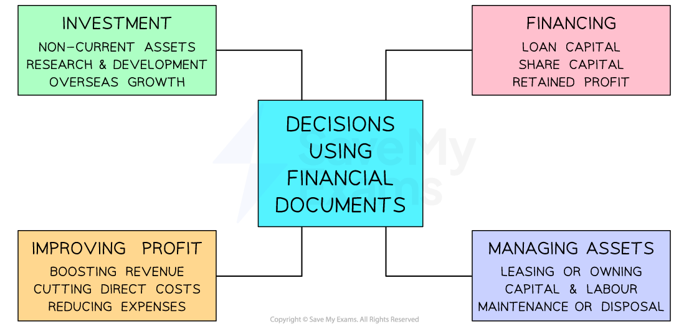

# Using Financial Documents

## How financial documents are used

> **Spec point** — `spcpt_Z3HK4vQ3Ryyg9vtq` · The use of financial documents: 
• assess the performance of the business 
• inform decision making.

## How financial documents are used

- ***Stakeholders*** use financial documents to **assess business performance** and **inform decision-making**

#### How stakeholders use financial documents

| **Stakeholder** | **Use of financial documents** |
|---|---|
| **Managers** | - Financial documents help managers **track performance **and identify **areas for improvement** - This helps them make **informed decisions** to achieve business objectives |
| **Employees** | - Employees use financial accounts to assess the **stability** of their employer - This helps them determine their ***job security*** or support **salary negotiations** |
| **Owners** | - Owners and shareholders can assess the ***profitability*** and **growth potential** of a business - This helps them determine its ability to provide them with **returns on their investment** |
| **Suppliers** | - Suppliers will want to assess the financial **stability** of key customers - Financial documents can show whether customers can **pay what they owe on time** |
| **Banks and other lenders** | - Financial statements can help to determine whether a business is ***creditworthy*** - Lenders can assess the risk of lending money to the business and set appropriate ***credit terms*** |

- Owners and managers use the ***quantitative*** data in financial documents to make a range of **informed decisions**

### Decisions using financial documents

*Managers and owners use financial documents to inform decisions about investments, financing, improving profit and managing assets*

#### Investments

- The statement of comprehensive income can show whether a business can afford to purchase new ***non-current assets*** such as machinery, property or vehicles
- The impact of spending on research and development or overseas growth on costs and revenues can be determined

#### Financing

- The impact on the statement of financial position of taking out loans or other credit can be determined
- The statement of financial position also identifies the value of share capital and retained profit

#### Improving profit

- Ratio analysis can identify the impact of different types of cost on the businesses ability to generate profit
- The impact of increased prices on sales revenue can be identified in the statement of comprehensive income

#### Managing assets

- The impact of ***leasing*** assets rather than owning them can be seen in both key financial documents
- Investment in non-current assets can be compared to investment in human resources to determine whether ***capital-intensive*** or ***labour-intensive*** production is most suitable
- Deciding whether to continue to maintain equipment or dispose of it can be determined by considering costs and revenues in the financial documents

> **Exam Hint**
> In the exam you may be asked to explain how a stakeholder uses a particular financial statement, such as a cash flow forecast or a statement of financial position. A good way to structure your 3-mark response is to consider, first, what the particular document shows. This can then be used to develop a strong response.
> 
> **Example**
> 
> Managers use cash flow forecasts to understand the predicted cash inflows and cash outflows over a period of time [1]. This allows them to plan for cash shortfalls [1] by making arrangements for short-term finance, such as overdrafts, to ensure they are able to meet their financial obligations [1].
