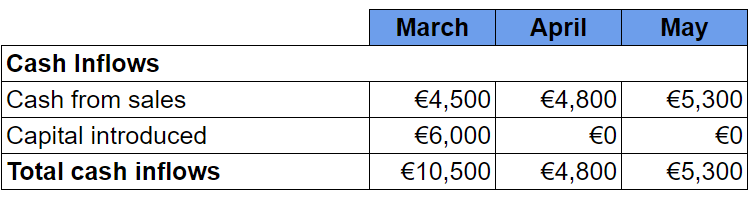
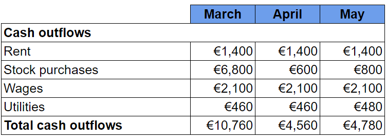
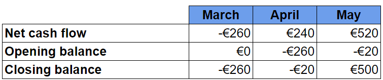
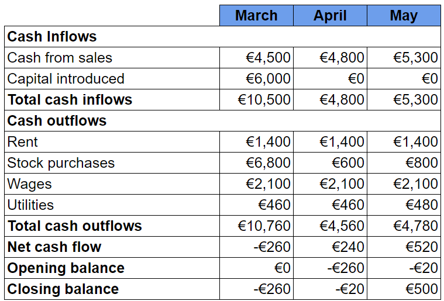

# Calculating Cash Flow Forecasts

## Introduction to cash flow forecasts

> **Spec point** — `spcpt_FCgHP976d9y82CHz` · Calculation and interpretation of cash-flow forecasts: 
• cash inflows 
• cash outflows 
• net cash flow 
• opening and closing balances.

## Introduction to cash flow forecasts

- A **cash flow forecast** is a **prediction** of the anticipated **cash inflows and cash outflows**, usually for a **six to twelve month** period
- A ***business plan*** should include a **cash flow forecast**

  - Business **owners** can identify its financial needs
  - Lenders such as **banks** can determine whether loans are capable of being repaid

#### The uses and limitations of cash flow forecasts

| **Uses** | **Limitations** |
|---|---|
| - Cash flow forecasts can **support an application** for a loan and are an integral part of business **decision making**  - They can help identify where the business may experience **cash shortfalls or cash surpluses** so that plans can be made to manage these periods (e.g. arranging an ***overdraft***)  - Cash flow forecasts** aid planning **and help a business avoid costly mistakes | - Forecasts are usually based on **estimates** and in reality inflows and outflows may differ significantly from the estimates  - Cash flow forecasts **require appropriate skills, insight, research and time** to prepare and update adequately  - **External factors** that can impact inflows and outflows may not be reflected in the cash flow forecast |

## Constructing a cash flow forecast

> **Spec point** — `spcpt_PrCTJDnHy34pCjT2` · Calculation and interpretation of cash-flow forecasts: 
• cash inflows 
• cash outflows 
• net cash flow 
• opening and closing balances.

## Constructing a cash flow forecast

- A business must first **gather information** about **all cash inflows and cash outflows** it expects to encounter over the period
- The following steps should then be taken to **construct the cash flow forecast**

#### Step 1 - Calculate total cash inflows

- In this instance, the business expects to receive cash inflows from sales in March, April and May
- Owners' capital of €6,000 will be introduced in March
- The total for each month is calculated by adding cash from sales to capital introduced

#### Step 2 - Calculate total cash outflows

- In this instance, the business expects to pay rent of €1,400 in March, April and May
- It will purchase a significant amount of stock in March with smaller amounts in April and May
- Wages are expected to be €2,100 in each month
- Utilities of €460 will be paid in March and April, increasing to €480 in May
- Total cash outflows each month is calculated by adding these together

#### Step 3 - Calculate net cash flows

- The **net cash flow** is calculated by subtracting total cash outflows from total cash inflows

- In March the net cash flow is €10,500 - €10,760 = €(260)

  - Net cash flow is negative as cash outflows are greater than cash inflows
- In April the net cash flow is €4,800 - €4,560 = €240
- In May the net cash flow is €5,300 - €4,780 = €520

  - In both months, net cash flow is positive as cash inflows are greater than cash outflows

#### Step 4 - Calculate Opening and Closing Balances

- The **opening balance** is the previous month’s closing balance carried forward
- The** closing balance** is calculated by adding the net cash flow to the opening balance

- In March the opening balance of €0 is added to the net cash flow of €(260) to leave a closing balance of €(260)
- In April the closing balance from March is carried forward to become its opening balance of €(260)
- This opening balance is added to April's net cash flow of €240 to leave a closing balance of €(20)
- In May the closing balance from April is carried forward to become its opening balance of €(20)
- This opening balance is added to May's net cash flow of €520 to leave a closing balance of €500

#### The complete cash flow forecast

### Analysis of the cash flow forecast example

- Overall, this cash flow forecast **supports an application for the business to borrow £6,000** in January to cover the initial low inflows, significant outflows and **negative net cash flow**
- Healthy sales mean that from April, **inflows are greater than outflows** and the business **has a positive net cash flow**

> **Worked Example**
> Here is a simple three-month cash flow forecast for a small seaside café
> 
> |   | **March** | **April ** | **May** |
> |---|---|---|---|
> | **Cash Inflows** |   |   |   |
> | **Sales** | 46,000 | 54,000 | 61,000 |
> | **Cash Outflows** |   |   |   |
> | **Inventory** | 13,000 | 13,000 | 13,000 |
> | **Wages** | 28,000 | 28,000 |   |
> | **Miscellaneous** | 3,500 | 4,000 | 4,000 |
> | **Total Cash Outflows** |   | 45,000 | 48,000 |
> | **Net cash flow** | 1,500 | 9,000 |   |
> | **Opening balance** | 4,000 | 5,500 | 14,500 |
> | **Closing balance** |   | 14,500 | 30,500 |
> 
> Complete the cash flow forecast to show
> 
> a. Total cash outflows for March
> 
> b. Closing balance for March
> 
> c. Wages for May
> 
> d. Net cash flow for May        [4 marks]
> 
> **Step 1: Add all of March's cash outflows to calculate the total**
> 
> $\mathrm{Total} \mathrm{Outflows} \mathrm{for} \mathrm{March}=13,000+28,000+3,500\,\,=44,500$**    ****[1 mark]**
> 
> **Step 2: Add the opening balance to the net cash flow to calculate March's closing balance**
> 
> $\mathrm{Opening} \mathrm{Balance}+\mathrm{Net} \mathrm{Cash} \mathrm{Flow}=\mathrm{Closing} \mathrm{Balance}\,\,=4,000+1,500\,\,=5,500\,$      **  ****[1 mark]**
> 
> **Step 3: Subtract inventory and miscellaneous outflows from total cash outflows to calculate wages**
> 
> $\mathrm{Wages} \mathrm{for} \mathrm{May}=48,000-13,000-4,000\,\,=31,000$             **[1 mark]**
> 
> **Step 4: Subtract total cash outflows from total cash inflows to calculate net cash flow**
> 
> $\mathrm{Total} \mathrm{Cash} \mathrm{Inflows}-\mathrm{Total} \mathrm{Cash} \mathrm{Outflows}=\mathrm{Net} \mathrm{Cash} \mathrm{Flow}\,\,=61,000-48,000\,\,=13,000$      **[1 mark]**

> **Exam Hint**
> When calculating opening and closing balances, work through each month in turn.
> 
> Always double-check your calculations in cash flow forecasts as one mistake will have a knock-on effect elsewhere and, in some cases, lead you to make inaccurate judgements.
