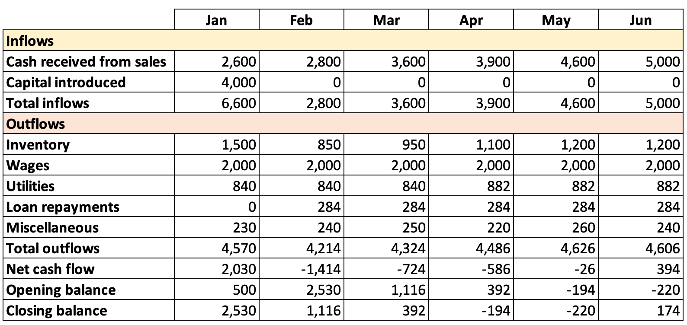

# Interpreting Cash Flow Forecasts

## Identifying cash flow Problems

> **Spec point** — `spcpt_4sjznsw7dtVpF3Z5` · Calculation and interpretation of cash-flow forecasts: 
• cash inflows 
• cash outflows 
• net cash flow 
• opening and closing balances.

## Identifying cash flow problems

- Drawing up a cash flow forecast helps a business to identify cash flow problems

  - Identify periods of **cash shortfalls**
  - Recognise where there is a significant **excess of cash**

#### Example of a start-up six-month cash flow forecast (£s)

- Overall, this cash flow forecast **supports an application for the business to borrow £4,000** in January to cover the initial low inflows, significant outflows and **negative net cash flow**
- **During April and May, the closing balance is negative**
- As sales increase from June, **inflows are greater than outflows,** and the business **has a positive cash flow**

#### January

- The cash flow forecast assumes that the bank approves a £4,000 loan in January (capital introduced)
- The opening balance of £500 has been introduced by the owner
- The business is expected to achieve sales of £2,600
- Total inflows are therefore expected to be £6,600 (£2,600 + £4,000)
- Total outflows are expected to be £4,570
- The **Net Cash Flow** is expected to be £2,030 (£6,600 - £4,570)
- January’s closing balance is expected to be £2,530 (£2,030 + £500)

#### February

- The closing balance from January becomes the opening balance for February
- Sales of £2,800 are expected to be the total inflows
- Total outflows are expected to be £4,214
- The Net Cash Flow is expected to be -£1,414 (£2,800 - £4,214)
- The closing balance is expected to be £1,116 (-£1,414 + £2,530)

#### June

- The closing balance from May becomes the opening balance for June
- Sales of £5,000 are the total inflows
- Total outflows are expected to be £4,606
- The Net Cash Flow turns positive and is expected to be £394 (£5,000-£4,606)
- The closing balance is expected to be £174 (£-220 + £394)

## Strategies to improve cash flow

> **Spec point** — `spcpt_N5sqyCz5C7SmTp42`

## Strategies to improve cash flow

- The cash flow forecast example above identifies a **cash flow problem** in April and May where the **closing balance is negative**
- It has a range of ways to solve this issue to prevent ***insolvency***

  - The most suitable method may be to arrange a flexible, short-term ***overdraft*** facility with its bank

#### Ways to solve cash flow problems

| **Method** | **Explanation** |
|---|---|
| **Reduce the credit period offered to customers** | - Collecting money owed from customers more quickly will **increase the level of current assets **in the business    - However, **customers may move to competing businesses** that offer better ***credit terms*** |
| **Ask suppliers for an extended repayment period e.g an extension from 60 to 90 days** | - Current liabilities **will not be reduced** - The business can use cash it would have paid to suppliers for other purposes - Suppliers may be **unwilling** to extend credit terms |
| **Make use of** ***overdraft**** ***facilities or short-term loans** | - ***Current liabilities*** will** increase** - The business can spend **more money than it has in its bank account** - Banks may be reluctant to lend to businesses with cash-flow problems |
| **Sell off excess stock** | - Less ***liquid*** current assets will be reduced and **converted into more liquid forms of current asset **(e.g. cash) - Storage and security **costs may also be reduced** - Stock may need to be **sold at a low price** to attract sales |
| **Sell assets and lease fixed assets instead** (e.g. ***sale & leaseback*** | - Both **current assets and current liabilities will increase** - The business will continue to **have the use of assets** but must make regular payments to the leasing company |
| **Introduce new capital and reduce ***drawings ***from the business** | - Current assets will be **increased** - New capital may be **introduced by the owner **or from **additional investors** - This may result in the ***dilution of control*** of the business |

- A business can also have **too much cash**

  - If it **holds large amounts of cash,** it may **miss out** on the benefits of investing it in fixed assets or savings
  - This may represent a significant ***opportunity cost**** *especially when interest rates are high

> **Exam Hint**
> You will not have to construct a cash flow forecast in the exam, though you may have to enter missing figures into a forecast. Make sure you revise calculations for net cash flow, opening balance and closing balance as the formulas are not provided for you.
