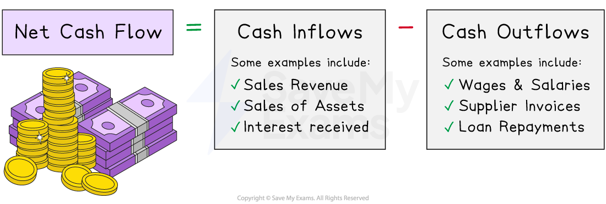

# The Importance of Cash

## The purpose of cash

> **Spec point** — `spcpt_7wM7Rg5rmBzCb3Vn` · The importance of cash to a business: 
• to pay suppliers, overheads and employees 
• to prevent business failure (insolvency)

## The purpose of cash

- **Cash is the 'lifeblood' of a business **as without it a business will likely become ***insolvent*** relatively quickly

  - It is the most ***liquid*** form of ***current asset*** in the form of notes and coins on a businesses premises as well as money deposited in the bank
- Cash performs a variety of functions in a business

  - It is used to **cover regular *****operating expenses*** such as workers' pay, supplier invoices and overheads such as rent and utility bills
  - It can also be used to** meet unexpected expenses** such as the replacement of broken equipment

- A new business may have to **pay cash on purchase for all of its supplies** until its suppliers trust them enough to provide ***trade credit***

  - A supplier may then give the business 30 or 60 days to pay what they owe
  
    - Stock is received from a supplier
    - The business **sells its products **and receives cash in the form of ***sales revenue***
    - At the end of the credit period, the supplier is paid

## Comparing cash and profit

> **Spec point** — `spcpt_Zr4DZjHVNZHm3QJF` · the difference between cash and profit.

## Comparing cash and profit

- **Profit **and **cash** are different **financial terminologies**

  - Profit is calculated at a specific point in time
  - While a business may ultimately make a profit, they **may lack cash at times** because some customers may not actually have paid them yet

- **Profit** is the **difference between revenue generated and total business costs** during a specific period of time

  - Profit can be an important indicator of a company's **financial health** and long-term **sustainability** as it helps to assess the effectiveness of a company's operations
- **Cash** is measured by taking into account the full range of **money flowing in and out of a business**

  - This includes revenue from sales, operating expenses, investments, loans, and any other cash-related transactions
- Cash-poor businesses will struggle to pay suppliers, meet rent payments or struggle to pay workers

  - A profitable business is likely to **fail **if it does not have **sufficient cash**
  
    - E.g.** **Lifestyle retailer Joules announced plans** **to ***liquidate ***in December 2022 as a result of cash-flow difficulties, despite making a profit of £2.6 million during the previous year

## Cash inflows and outflows

> **Spec point** — `spcpt_ggyfcp9hBFMN6Wc7` · Calculation and interpretation of cash-flow forecasts:
• cash inflows
• cash outflows

## Cash inflows and outflows

- **Cash inflows** are sums of **money introduced** to the business

  - Examples include money earned from sales, monies received such as loans or owners' capital and ***interest*** from investments

#### Calculation of net cash flow

*Net cash flow is calculated by subtracting cash outflows from cash inflows during a given period of time*

- **Cash outflows** are sums of **money leaving** the business

  - Examples include payments to suppliers, wages and salaries, loan repayments and advertising expenses
- The **difference** between cash inflows and cash outflows during a period of time is known as the **net cash flow**

> **Exam Hint**
> Remember, cash is not the same as revenue. Revenue is one form of cash inflow that is earned at the point of sale but may not flow into a business at that time. If a business sells products on credit, it earns revenue on the day it is sold but the customer will not pay for, perhaps, 30 days. When they do pay, the business receives cash.
