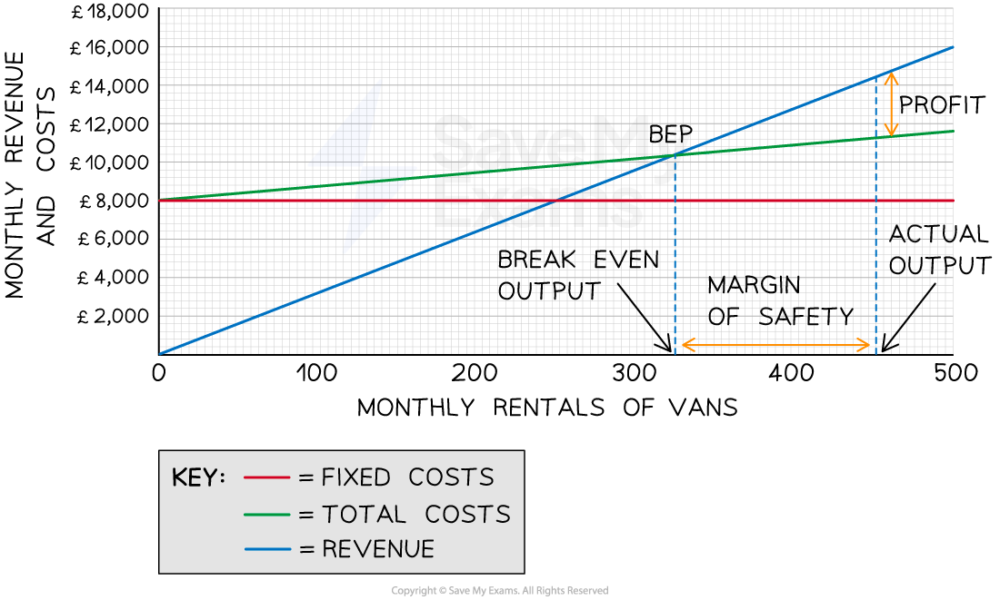

# Break-even Charts

## Elements of break-even charts

> **Spec point** — `spcpt_2xDwfwRr3Hq39kmz` · Interpretation of break-even charts:

## Elements of break-even charts

- A break-even chart is a **visual representation** of the break-even point in a graph
- Three lines are plotted on a graph with an x-axis labelled units and a y axis labelled costs/revenues

  - Fixed costs
  - Total costs
  - Revenue
- The **break-even point** is the output level at which the **revenue and total costs line cross**
- The break-even chart can also be used to identify the following

  - Profit or loss at different levels of output
  
    - **Profit** is achieved when revenue is greater than total costs
    - A **loss** occurs when total costs are greater than revenue
  - The **margin of safety, **which** **is the difference between the actual level of output and the break-even point

## Interpreting break-even charts

> **Spec point** — `spcpt_rzYKzfNKyjZbkFNh` · Interpretation of break-even charts:

## Interpreting break-even charts

- The elements can be identified in the break-even chart below

  - The selling price is £32 per unit
  - Variable costs are £7.60 per unit
  - Fixed costs are £8,000

#### Break-even chart with key elements

*The break-even chart shows the break-even point, profit at a given level of output and the margin of safety  *

- **Fixed costs** do not change as output increases

  - Fixed costs are £8,000 and these do not change whether the business produces 0 units or 500 units
  - It is therefore represented by a **horizontal line** at £8,000 for all levels of output
- **Total costs** are made up of fixed and variable costs

#### Fixed, variable and total costs at different levels of output

| **Units** | **0** | **100** | **200** | **300** | **400** | **500** |
|---|---|---|---|---|---|---|
| **Variable costs (£)** | 0 | 760 | 1,520 | 2,280 | 3,040 | 3,800 |
| **Fixed costs (£)** | 8,000 | 8,000 | 8,000 | 8,000 | 8,000 | 8,000 |
| **Total costs (£)** | 8,000 | 8,760 | 9,520 | 10,280 | 11,040 | 11,800 |

- At 0 units of output, total costs are made up exclusively of fixed costs
- At 500 units, the total costs are £11,800

`Total space Variable space Costs space equals space Units space cross times space Variable space Cost space per space Unit

equals space 500 space cross times space £ 7.60

equals space £ 3 comma 800

Total space Costs space equals space Fixed space Costs space plus space Total space Variable space Costs

equals space £ 8 comma 000 space plus space £ 3 comma 800

equals space £ 11 comma 800`

- In the chart, the total costs line **slopes upwards **because total variable costs increase as output increases
- **Revenue** is the quantity sold x selling price

#### Revenue at different levels of output

| **Units** | **0** | **100** | **200** | **300** | **400** | **500** |
|---|---|---|---|---|---|---|
| **Revenue (£)** | 0 | 3,200 | 6,400 | 9,600 | 12,800 | 16,000 |

- The revenue line also **slopes upwards**

  - At 0 units of output, the revenue is £0
  - At 500 units the total revenue equates to £16,000
  - Revenue increases with output
  - The line will **slope more steeply than the total costs **and will **cross the total costs line **at some point
- The point at which the total costs and the revenue lines cross is the **break-even point**

  - The break-even level of output is 328 units
- **The margin of safety can be identified as the difference on the x-axis between the actual level of output (in this case, 450 units) and the break-even point**

  - The margin of safety is 450 - 328 = 122 units
- The **profit **made at a specific level of output can be identified as the **space between the revenue and total costs lines**

  - In this instance, the profit made at 450 units of output is £14,400 - £11,420 = £2,980

> **Exam Hint**
> You will not be required to draw a break-even chart in the exam but you could be asked to manipulate a diagram that has been provided
> 
> You could be asked to
> 
> - Illustrate a change to the selling price, variable costs or fixed costs on the diagram
> - Mark the break-even point or margin of safety
> - Identify the amount of profit (or loss) made at a given level of output
> - Label elements such as axis names or cost/revenue curves

## The impact of changes in revenue and costs

> **Spec point** — `spcpt_8dtPrNn8DS2ZxyVP` · Interpretation of break-even charts:
• the impact of changes in revenue and costs

## The impact of changes in revenue and costs

- Changing in the selling price, variable cost per unit or total fixed costs affects** the break-even point **and** level of profit** **or loss**

#### How the break-even point and level of profit is affected by changes in variables

| **Increased selling price** | **Decreased selling price** |
|---|---|
| - An increase in the selling price **reduces** the break-even point    - An increase in the selling price increases revenue at each level of output, from R1 to R2 - The break-even point falls from BEP1 to BEP2 - Profit on each unit of output greater than the break-even point is increased | - A decrease in the selling price **increases** the break-even point    - A decrease in the selling price reduces revenue at each level of output, from R1 to R2 - The break-even point rises from BEP1 to BEP2 - Profit on each unit of output greater than the break-even point is decreased |
| **Increased variable costs** | **Decreased variable costs** |
| - An increase in variable costs** increases** the break-even point    - An increase in variable costs increases total costs at each level of output, from TC1 to TC2 - The break-even point increases from BEP1 to BEP2 - Profit on each unit of output greater than the break-even point is decreased | - A decrease in variable costs **decreases** the break-even point    - A decrease in variable costs decreases total costs at each level of output, from TC1 to TC2 - The break-even point falls from BEP1 to BEP2 - Profit on each unit of output greater than the break-even point is increased |
| **Increased fixed costs** | **Decreased fixed costs** |
| - An increase in fixed costs** increases **the break-even point    - An increase in fixed costs increases total costs at each level of output, from TC1 to TC2 - The break-even point increases from BEP1 to BEP2 - Profit on each unit of output greater than the break-even point is decreased | - A decrease in fixed costs **decreases **the break-even point    - A decrease in fixed costs reduces total costs at each level of output, from TC1 to TC2 - The break-even point falls from BEP1 to BEP2 - Profit on each unit of output greater than the break-even point is increased |

## Limitations of break-even charts

> **Spec point** — `spcpt_kcXX3K8zG6WF4Ts4` · Interpretation of break-even charts:
• limitations of break-even charts.

## Limitations of break-even charts

- Whilst they provide an **accessible** **way to understand costs, revenues and break-even** there are some **limitations** of using break-even charts to support decision making

### 1. Costs do not always increase in direct proportion to units sold

- Businesses may be able to negotiate **bulk-buying discounts** that reduce variable costs per unit at high levels of output
- Fixed costs could increase significantly at higher levels of output as **more staff or equipment **may be required

### 2. Revenue does not always increase in direct proportion to units sold

- Buyers may demand **discounts** for placing large orders, which will reduce the selling price per unit

### 3. Cost data is often estimated

- If break-even charts are used for **forecasting,** future cost estimates are used
- The reliability of these estimates depends on the **skills and experience** of buyers and financial planners

### 4. Some output may remain unsold

- The model assumes that all units produced are sold
- In reality, businesses keep some stock as a **buffer** to meet demand at a later date
- Unsold stock may be** sold at a lower price** to reduce storage costs or raise cash
