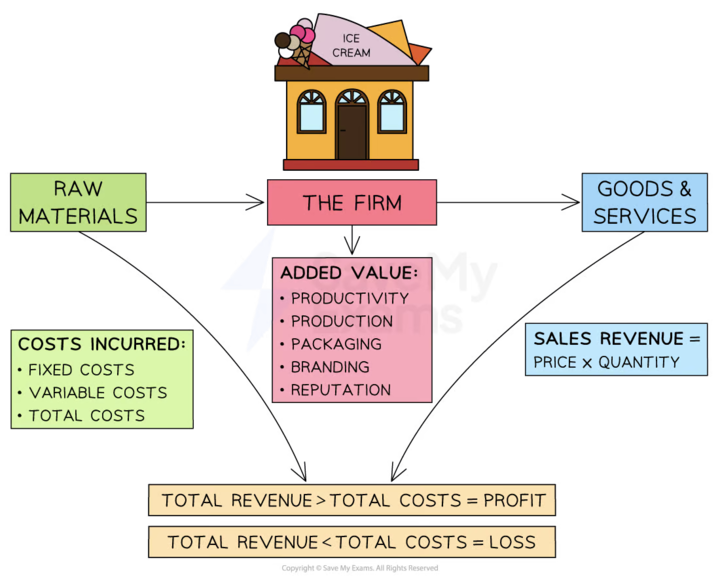

# Revenue, Costs & Profit

## Revenue

> **Spec point** — `spcpt_7C9XrbH6sydrT2Fr` · The concept and calculation of:
• revenue

## Revenue

- Revenue is the **value of the units** sold by a business over a period of time

  - E.g the revenue earned by Apple Music from sales of music downloads
- Revenue is calculated using the formula

$\mathrm{Revenue}=\mathrm{Quantity} \mathrm{sold}x\mathrm{Selling} \mathrm{price}$

- Revenue **usually increases** as the ***sales volume***** increases**

  - It should not be defined as 'money earned' as businesses can receive earnings from investments such as savings

> **Worked Example**
> Fotherhill Organics Limited sold 39,264 packs of its specialist compost to mail-order customers in 2022. The price per pack was £8.75. In addition, it sold 4,280 tonnes to gardening businesses for £123.95 per tonne.
> 
> **Calculate **Fotherhill Organics revenue for 2022.
> 
> [3]
> 
> **Step 1: Calculate the revenue from sales to mail-order customers**
> 
> 39,264 x £8.75        =        £343,560       **[1 mark]**
> 
> **Step 2: Calculate the revenue from sales to gardening businesses**
> 
> 4,280 x £123.95       =        £530,506    **[1 mark]**
> 
> **Step 3: Add the two revenue figures together**
> 
> £343,560 + £530,506            =       £874,066          **[1 mark]**

> **Exam Hint**
> You may be required to calculate the average selling price using the revenue figure
> 
> In these instances you need to divide the sales revenue by the number of items sold

## Fixed, variable and total costs

> **Spec point** — `spcpt_TRTtmV96qPzH4YxS` · The concept and calculation of:
• fixed and variable costs
• total costs

## Fixed, variable and total costs

- In preparing goods/services for sale, businesses** incur a range of costs**

  - Some examples of these these costs include **purchasing raw materials**, paying staff salaries and wages, and **paying utility bills** such as electricity
- These costs can be broken into different categories

  - **Fixed costs (FC) **are costs that do not change as the level of output changes
  
    - These have to be paid whether the output is zero or 5000
    - E.g. building rent, management salaries, insurance, bank loan repayments etc.
  - **Variable costs (VC) **are costs that vary directly with the output
  
    - These increase as output increases & vice versa
    - E.g. raw material costs, wages of workers directly involved in the production
  - **Total costs (TC) **are the sum of the fixed + variable costs

**Different types of cost**

| **Type of cost** | **Diagram** | **Explanation** |
|---|---|---|
| **Fixed Cost (FC)** |  | - The firm has to pay its ***fixed costs*** which do not change, irrespective if the output is 0 or 100,000 units - The fixed costs for this firm are \$4,000 |
| **Variable cost (VC)** |  | - The variable costs initially **rise proportionally with output**, as shown in the diagram - At some point, the firm will benefit from a ***purchasing economy of scale*** and the rise will no longer be proportional |
| **Total cost (TC)** |  | - The **total cost** is the sum of the variable and fixed costs - The total costs **cannot be 0** as all firms have some level of fixed costs |

> **Worked Example**
> Fotherhill Organics Limited sold 43,539 packs of its specialist compost to mail-order customers in 2022. The cost to make and deliver each pack was £3.40. In addition, it incurred total fixed costs of £430,000
> 
> Calculate Fotherhill Organics total costs for 2022.
> 
> [2]
> 
> **Step 1: Calculate the total variable costs of compost**
> 
> `equals 43 comma 539 space cross times space £ 3.40
> 
> equals space £ 148 comma 033`       **[1 mark]**
> 
> **Step 2: Add total variable costs to total fixed costs**
> 
> `equals space £ 148 comma 033 space plus space £ 430 comma 000
> 
> equals space £ 578 comma 033`**    ** **[1 mark]**

## Profit and loss

> **Spec point** — `spcpt_pMHCRzvGvSqQ7RYT` · The concept and calculation of:
• profit and loss.

## Profit and loss

- **Profit **is a **surplus** that remains after business costs have been subtracted

  - If **costs exceed revenue** the business makes a **loss**
- Most businesses have the **main objective of making a profit**

  - Profits help new businesses to survive and break-even
  - It is a **reward** for risks taken by entrepreneurs and investors
  - Established businesses can use profit to **fund long-term growth **
- The most simple **formula** for calculating profit is:

$\mathrm{Profit}=\mathrm{Revenue}-\mathrm{Total} \mathrm{Costs}$

#### How profit is made

*By adding value firms are in the position to make a profit*

- Profit **can be increased using the following strategies**

  - Increasing revenue
  - Reducing costs
  - A combination of increasing revenue and reducing costs

> **Worked Example**
> In 2022 Fotherhill Organics Limited achieved revenue of £874,066 from sales of its specialist compost. In addition, it incurred total costs of £578,033
> 
> Calculate Fotherhill Organics profit for 2022 [1]
> 
> **Step 1: Subtract total costs from revenue**
> 
> `equals £ 874 comma 066 space minus space £ 578 comma 033
> 
> equals space £ 296 comma 033`**    ** **[1 mark]**

> **Exam Hint**
> When you answer calculation questions remember
> 
> - Take care that your figures are easily recognisable - in some cases the number 4 and the number 9 could be confused by the examiner
> - Check the number of decimal places or significant figures required - if you only give  your answer to one decimal place rather than two you will lose a mark, even if your answer is correct
> - Place your final solution on the dotted line at the bottom of the answer box
