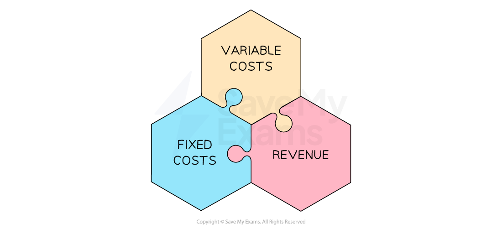

# The Concept of Break-even

## The break-even point

> **Spec point** — `spcpt_85ZS4kNyxppKxYQf` · The concept of break-even and calculation of break-even (from formula or diagram): 
• break-even level of output.

## The break-even point

- The **break even point** is the** number of units **a business must sell to reach **the point where revenue is equal to total costs **
- At the break even point **neither a loss nor a profit is made**

  - It helps businesses understand the **minimum level of sales or output they need to achieve in order to cover all costs**
  - This helps business managers to make **informed decisions about pricing and production volumes**

#### The elements of break-even analysis

*Variable costs, fixed costs and sales revenue are all used in calculating the break-even point  *

- **Fixed costs** are costs that do not change regardless of the level of production or sales

  - E.g. rent, salaries and insurance
- **Variable costs** are costs that vary with the level of production or sales

  - E.g. raw materials, direct labour costs, packaging and shipping costs
- **Revenue** is the money earned from selling products/service and is calculated using the formula

$\mathrm{Revenue}=\mathrm{Quantity} \mathrm{sold}\times\mathrm{Selling} \mathrm{price}$

- In order to calculate the break even point the** contribution per unit** is needed

  - **Contribution** is the difference between the selling price per unit and the variable costs per unit
  - It is calculated using the formula

$\mathrm{Contribution}=\mathrm{Selling} \mathrm{price} \mathrm{per} \mathrm{unit}-\mathrm{Variable} \mathrm{cost} \mathrm{per} \mathrm{unit}$

> **Exam Hint**
> In some cases you may need to work out what the selling price is in order to calculate contribution
> 
> The selling price per unit is calculated using the formula
> 
> $\mathrm{Selling} \mathrm{Price} \mathrm{per} \mathrm{unit}=\mathrm{Revenue}\div\mathrm{Number} \mathrm{of} \mathrm{Units}$
