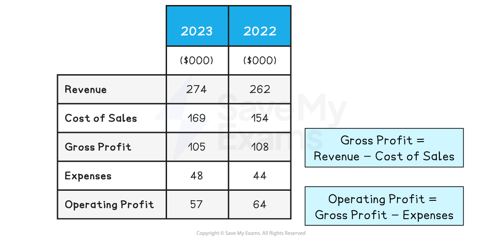

# Statement of Comprehensive Income

## Introduction to the statement of comprehensive income

> **Spec point** — `spcpt_PvkVRbsvGX9DXFCx` · The purpose of statements of comprehensive income: 
• main features – sales, cost of sales, gross profit, expenses, operating profit

## Introduction to the statement of comprehensive income

- A **statement of comprehensive** **income **records the income and costs of a business incurred over a period of time (usually one year)

  - It is also known as a **profit-and-loss account** or **income statement**
  - It is one of the key **financial statements** provided in the ***annual report***

### Structure of the statement of comprehensive income

- ***Toys & Trikes Ltd'***s statement of comprehensive income*** ***shows revenue, costs and profit for both 2022 and 2023

  - This enables its financial managers to make a year-on-year comparison of performance

#### Statement of comprehensive income for Toys & Trikes Ltd

*The statement of comprehensive income details revenue, costs and expenses over a trading year*

## Calculations in the statement of comprehensive income

> **Spec point** — `spcpt_nJhmFvhdKMDJH399` · sales, cost of sales, gross profit, expenses, operating profit

## Calculations in the statement of comprehensive income

- **Two types of profit **are calculated in the income statement

### Gross profit

- Gross profit is made when revenue is greater than the cost of sales
- Calculated by **Revenue - Cost of Sales**

  - **Revenue **is money generated through selling goods and services
  
    - Calculated by **Quantity sold x Selling price**
  - **Cost of Sales** is the** **cost of raw materials and labour used in producing or buying in the goods actually sold by the business during a time period
  
    - Calculated by **Variable Cost per unit x Quantity Sold**
- In 2023, *Toys & Trikes Ltd *earned revenue of \$274,000 and its cost of sales was \$169,000

  - Gross Profit was therefore \$274,000 - \$169,000 = \$105,000

### Operating Profit

- Operating profit is profit made by a business after all costs have been deducted from revenue
- Calculated by **Gross Profit - Expenses**

  - **Expenses** are costs that are not directly related to the production of goods or purchasing stock for sales
- In 2023, *Toys & Trikes Ltd *made a gross profit of \$105,000 and had expenses of \$48,000

  - Operating Profit was therefore \$105,000 - \$48,000 = \$57,000

> **Exam Hint**
> Take the time to learn how to calculate gross profit and operating profit. These formulas are **not provided** in the exam paper.

## Interpreting the statement of comprehensive income

> **Spec point** — `spcpt_rpbqTk3NQH8PKMj8` · the use of statements of comprehensive income in decision making (students will not be required to construct an income statement) 
• the nature of profit and its importance.

## Interpreting the statement of comprehensive income

### Comparing Toys & Trikes Ltd's performance over time

#### Revenue

- Revenue increased by \$8,000 between 2022 and 2023
- This may be due to **increased sales** volume,** higher prices** or a **combination** of the two

#### Cost of sales

- Cost of sales increased by \$15,000 between 2022 and 2023
- This may be due to **suppliers increasing prices**, buying **better quality supplies** or increased **wastage**

#### Gross profit

- Gross profit fell by \$3,000 between 2022 and 2023
- This is as a result of the increased cost of sales

#### Expenses

- Expenses increased by \$4,000 between 2022 and 2023
- This may be as a result of **increased salaries**, **higher utilities costs** or **rent increases**

#### Operating profit

- Operating profit fell by \$7,000 between 2022 and 2023
- This is as a result of both **higher cost of sales** and **increased expenses**

### Considerations when analysing and interpreting the statement of comprehensive income

- Finance managers **analyse** and **interpret this data **in order to make beneficial changes or set new strategic objectives

| **Business is making a profit** | **Business is making a loss** |
|---|---|
| - **Is the profit higher or lower than last year?**    - **If higher, what has the business done that could have led to this?**        - E.g. Finding a cheaper supplier of raw materials or increasing sales due to a new promotional campaign   - **If lower, why is profit falling? **        - Have costs increased, such as higher energy bills for the premises, or have sales fallen due to a new competitor entering the market? | - **Is this a short-term or long-term problem?**    - Lower profits may be a result of an external shock affecting all businesses, such as the 2020 Covid pandemic, in which many businesses had to close or reduce working hours   - **Some losses may be more long-term**        - E.g. E-commerce growth has led to many high-street stores closing down as the number of customers has dwindled |
| - **Is the profit higher or lower than that of competitors?**    - If lower, what can be done to become as profitable as other businesses?   - E.g. Does the business need to improve the quality of the products or increase the ***product portfolio***? | - **Are competitors making losses?**    - If they are, the business needs to consider whether the industry is changing to the point that it may become extinct   - Alternatively, it needs to ask tough questions about what can be done to evolve with changing market conditions |
