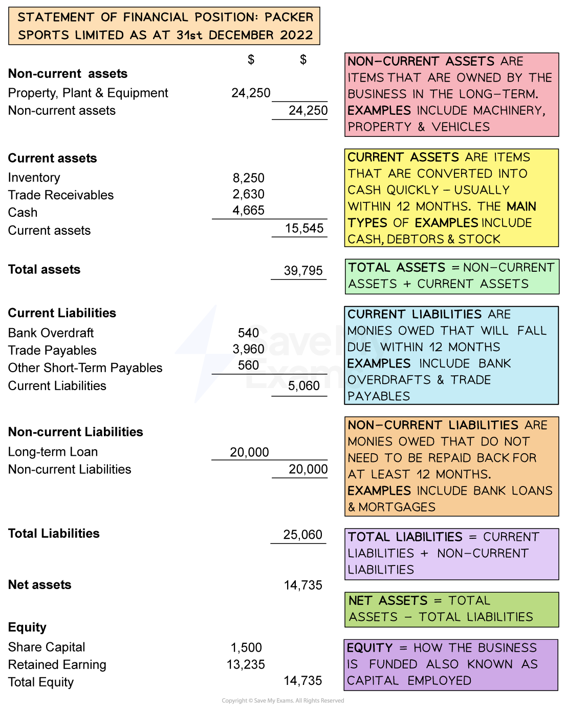

# Statement of Financial Position

## Introduction to the statement of financial position

> **Spec point** — `spcpt_fnZXyrnQPM2bjRRJ` · The purpose of statements of financial position

## Introduction to the statement of financial position

- The statement of financial position shows the **financial structure **of a business at a specific point in time

  - It is included as a key financial statement in the ***annual report***
- It identifies a businesses ***assets***** **and ***liabilities*** and specifies the **capital **(equity)** **used to fund the business operations
- It  is also known as the **balance sheet**

  - It is called the balance sheet as **net assets are equal to the total equity**

## Assets and liabilities

> **Spec point** — `spcpt_qGCjzPgpqw4yTcVs` · current and non-current assets, current and non-current liabilities, capital employed

## Assets and liabilities

### Assets

- **Assets** are items that are **owned by a business**
- **Two types of assets** appear in the statement of financial position

  - **Non-current assets** are items owned by the business in the long-term
  
    - Examples include ***tangible*** assets such as buildings, land, machinery and vehicles
    - Non-current assets may be ***intangible*** such as patents, goodwill or  brand value
  - **Current assets** include cash and items that can be turned into cash relatively quickly, usually within 12 months
  
    - The four types of current assets are cash in hand, cash in bank, ***trade receivables*** and ***inventory***

### Liabilities

- **Liabilities** are items that are **owed** by a business
- **Two types of liabilities** appear in the statement of financial position

  - **Current liabilities** are short-term financial obligations that a business must usually pay within one year, or as demanded by its ***creditors***
  
    - E.g. ***Trade payables*** and bank ***overdrafts***
  - **Non-current liabilities** are moneys owed by a business that are due to be repaid over a period longer than twelve months
  
    - E.g. Long term loans and mortgages

> **Exam Hint**
> A common error is to muddle assets and liabilities. You need to ensure that you can define each type and can give examples as these key terms are frequently tested in multiple choice, 'state' and 'define' questions.

## Interpreting a statement of financial position

> **Spec point** — `spcpt_wYQkgDhMKV7HQDmd` · interpret a statement of financial position 
(students will not be required to construct a statement of financial position).

## Interpreting a statement of financial position

- The statement of financial position generally follows the** structure** shown below

#### Statement of financial position for Packer Sports Ltd

*The statement of financial position is sometimes called the balance sheet *

### Interpreting the statement of financial position

- Several deductions can be made from the Statement about how a **business finances its activities, what it owns, and what it owes**

#### Financing its activities

- *Packer Sports Limited *is funded through share capital of \$1,500 and ***retained earnings*** of \$13,235

  - The business has long-term liabilities in the form of a loan for \$20,000
  
    - This is significantly greater than share capital so its ***gearing*** is high
    - **Future applications for loans may be declined** as the business is likely to be seen as a lending risk

#### What the business owns

- On the stated date, *Packer Sports Ltd *owned **assets** worth \$39,795 in total

  - Non-current assets of \$24,250 consisting of property, machinery (plant) and other equipment
  - Current assets worth \$15,545, comprised of inventory, trade receivables and cash
  
    - Inventory will be sold and converted to cash or trade receivables
  - When trade payables pay their ***invoices*** they will become cash

#### What the business owes

- On the stated date, the business had total** liabilities **of \$25,060

  - Its current liabilities were \$5,060, comprised of a bank overdraft, trade payables and other short-term loans
  - Its **long-term liabilities** were valued at \$20,000

> **Exam Hint**
> In your exam, you will not be required to construct a Statement of Financial Position. You do need to understand how they work and more importantly, how the information contained in them can be used to make decisions.
