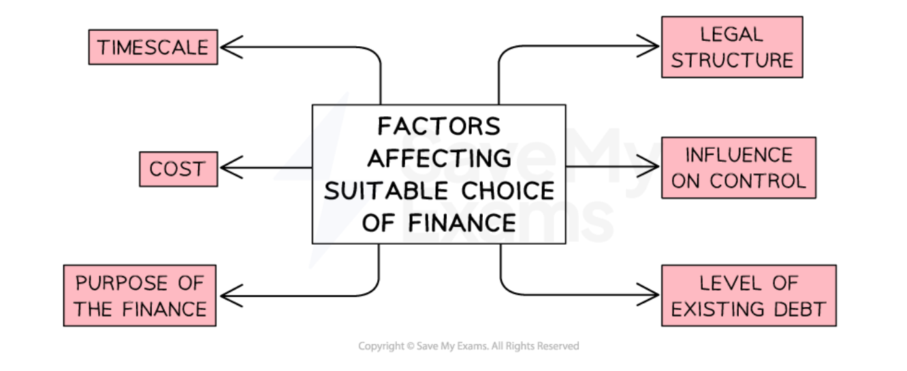
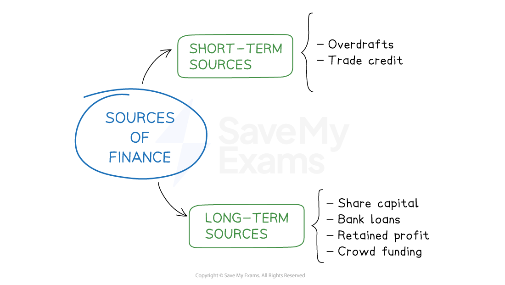

# External Sources of Finance

## Introduction to external sources of finance

> **Spec point** — `spcpt_ZzSYNpZXVpWh4X9r` · External sources of finance:

## Introduction to external sources of finance

- An **external source of finance** is money that is introduced into the business **from outside**

  - External finance is used when a business **cannot fulfil its needs with internal sources of finance**

#### The main sources of external finance

| **Overdrafts** | **Trade credit** | **Loans** |
|---|---|---|
| - A flexible arrangement with a bank to allow a business to spend more than it has in its account | - An agreement with a supplier to receive goods now and pay for them at a later date (typically after 30 days) | - A sum of money borrowed and repaid (with ***interest***) over a determined period of time |
| **Share capital** | **Venture capital** | **Crowdfunding** |
| - Money raised from the sale of ***shares*** | - Money received from investors that specialise in high-risk enterprises in return for a share of the business | - Raising modest investments from many people to fund a business project, typically using an online platform |

- The** implications** of the different types of external finance need to be carefully considered

  - ***Interest*** **and fees** to arrange finance can vary significantly between financial providers
  - The **percentage of company ownership** required in exchange for finance depends on how much **risk** investors are willing to take
  - The length of** time allowed to repay** borrowings or achieve investment targets also varies

## Overdrafts and trade credit

> **Spec point** — `spcpt_fMBcVkqXqsmRj24V` · External sources of finance:
• overdraft and trade payables

## Overdrafts and trade credit

- An **overdraft** is a **flexible** arrangement for a business current account holder to **spend more money than they have in their account**

  - A** limit **is agreed and **interest is charged** only when a business ‘goes overdrawn
  - Overdraft users are typically **charged interest at a daily rate**
  
    - Using an overdraft for a long period can therefore be **expensive compared to other methods**
  - An overdraft may be **‘called in’ **if the bank is concerned about a business's ability to repay what it owes
  - Some large businesses rely heavily on overdrafts to manage ***working capital***
- **Trade credit **is where a business has an agreement to **delay paying suppliers** for a typical period of 30 to 90 days

  - This helps to improve the **cash flow** position of the business
  - Trade credit is usually **interest-free**
  - Large businesses tend to be able to request **more** **generous trade credit terms **from suppliers than small businesses
  - Businesses using trade credit may **miss out on early payment discounts**

## Finance from loans

> **Spec point** — `spcpt_BSryDCX32QCz2Dm4` · External sources of finance:
• loan capital

## Finance from loans

- A sum of money is **borrowed** from a bank or other financial provider and repaid with a fixed ***interest rate*** over a specific period of time

  - The loan application must be **approved** before funds are transferred to the business
  
    - This may require a convincing ***business plan*** containing financial forecasts
    - Some financial providers demand ***collateral*** before a loan is granted
  - Long-term loans, known as **mortgages,** are used to fund the purchase of **property**
  
    - Repayment is typically over 25 or more years
    - Mortgages can have fixed or ***variable*** interest rates

## Finance from selling shares

> **Spec point** — `spcpt_6g2fF3HKPrNPmCTy` · External sources of finance:
• share capital, including stock market flotation (public limited companies)

## Finance from selling shares

- A private limited company can raise finance by **selling shares to friends, family or private investors** such as ***business angels***
- Public limited companies can raise large amounts of finance through the initial **sale of shares during** ***stock market flotation***** or through a** ***rights issue***
- **Debentures** are **long-term loan certificates** issued by limited companies to shareholders

  - Debentures must be repaid with a fixed rate of ***interest*** to lenders

## Venture capital

> **Spec point** — `spcpt_XcCtzsv9Vggfmw4G` · External sources of finance:
• venture capital.

## Venture capital

- **Venture capital** is sometimes available to businesses that are deemed **too risky for other investors or lenders** but are considered to have **long-term growth potential**
- It generally comes from **specialist businesses **and **banks** that look to maximise their ***return on investment***

  - Venture capitalists may invest **technological expertise, financial advice **and** management experience** in return for a ***share*** in the business
  - Their investment is usually made for a **fixed period **of time, typically four to six years

## Crowdfunding

> **Spec point** — `spcpt_RFJPrFxW47ks8grN` · External sources of finance:
• crowdfunding.

## Crowdfunding

- Crowdfunding allows businesses to access finance provided by a **large number of small investors** on online platforms such as **Kickstarter** and **Fundable**

  - Investments are **voluntary donations** that do not have to be repaid and do not attract a ***dividend***
  - The business **has to reach a target amount** before any funds are released
  
    - They receive no funding if the investment target is not met by a set date
  - Crowdfunders **do not own a share** of the business
  
    - They are often attracted by incentives such as a sample or early access to a product
  - **Flow Hive** is a beekeeping system that was successfully funded on **Indiegogo** in 2015
  
    - Its crowdfunding campaign raised \$12.2 million from 38,470 backers

> **Exam Hint**
> In recent years traditional lenders such as banks have been reluctant to lend to all but the least risky businesses
> 
> Peer to Peer lending, crowdfunding and sources such as business angels have been able to fill some of the gaps left by changes in the banking industry
> 
> Recognising that a business **may not be able to achieve its objectives **due to an inability to borrow can be a useful evaluative point

## An evaluation of external sources of finance

> **Spec point** — `spcpt_b78BMyCsm4SqyBwZ` · External sources of finance: 
• overdraft and trade payables 
• loan capital, share capital, including stock market flotation (public limited companies) 
• venture capital 
• crowdfunding.

## An evaluation of external sources of finance

- Businesses must investigate and select a **combination of sources of finance** that are most **appropriate for their particular needs**
- A range of factors affect the **suitability of sources** of finance chosen by a business

#### Factors affecting the choice of finance

*The choice of finance is affected by the timescale, cost and purpose of the finance, the legal structure of the business, willingness of owners to relinquish control and the level of existing debt*

### Timescale

- **Short-term** sources of finance will be needed to meet **unexpected costs** or to **pay bills and suppliers**

  - These are likely to be relatively **small amounts **and are rarely needed beyond a year
- **Longer-term** sources of finance will be needed to fund the purchase of non-current assets such as property and other types of capital equipment

  - These are likely to be **large sums** that may be required for a significant period of time

#### Short-term and long-term sources of finance

*Long-term and short-term sources of finance*

### Legal structure

- **Sole traders**, **partnerships** and small **private limited companies **usually have a more limited range of sources of finance as they are seen as being a **greater lending risk**

  - Interest rates on loans are likely to be higher as these businesses** tend to lend smaller amounts** than public limited companies and are not in a position to approach specialist lenders
- **Public limited companies** are able to access a wide selection of sources of finance and are able to provide ***collatoral***** **as security for lenders

### Cost

- **Interest payable on loans** can add a significant cost to the use of some sources of finance

  - **Variable interest rates** change during the borrowing term, which may make financial planning difficult
  - **Fixed interest rates** remain constant for the duration of the loan and for this reason, they are usually higher than variable rates
- **Selling shares** in public limited companies is an expensive process

  - ***Flotation*** is usually carried out by merchant banks, which charge a premium for their specialist services
  - Selling shares through a ***rights issue*** may reduce the amount of share capital raised as they are usually sold at a discount to existing shareholders

### Control

- Selling shares or raising ***venture capital*** can result in some **loss of control **for business owners

  - Smaller businesses may have to **accept the terms **of more powerful suppliers or business angels, as they have **little power to negotiate  **

### Purpose of the finance

- Certain sources of finance have narrowly focused uses

  - A** mortgage** is the most appropriate type of lending to purchase property
  - Overdrafts are flexible and are best used for short-term ***working capital*** requirements

### The level of existing debt

- ***Highly geared*** businesses already make use of significant amounts of debt

  - Lenders and investors may be reluctant to **provide further funds** **due to the level of risk **the business presents
- Businesses with a poor or no borrowing history may not meet ***credit score*** requirements and would be** excluded** from most types of credit

> **Exam Hint**
> A frequently-asked question is one that asks you to justify a suitable source of finance for a particular business. In your justification you will need to consider the context of the business as well as the factors listed above. Your justification must recommend which **one** source of finance would be most appropriate in **this particular scenario**.
