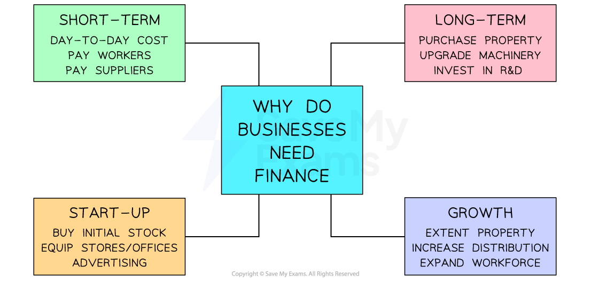

# The Need for Finance

## Why do businesses need finance?

> **Spec point** — `spcpt_tGSwJxbQgb9tr8yZ` · The need for finance

## Why do businesses need finance?

- Business finance is also known as **capital**
- It is required for a range of reasons

#### Reasons why business finance is needed

*Business finance is needed to meet short-term and long-term needs and can be used to set up or grow a business*

## Short-term finance needs

> **Spec point** — `spcpt_vQkMZcHj2rcqJyqP` · The need for finance:
• short-term needs

## Short-term finance needs

- Finance is needed by business to meet short-term and long-term ***liabilities*** and to fund day to day activities
- **Short-term** sources of finance are needed to **meet day to day costs** such as **paying bills, suppliers** and employee **wages**

  - They are likely to be relatively** small amounts** and are rarely needed beyond a year
- Where ***revenue*** from sales does not cover these expenses sources such as ***overdrafts*** or ***trade credit*** may be useful

## Long-term finance needs

> **Spec point** — `spcpt_ssYC5gbHMzwpVkb3` · The need for finance:
• long-term needs

## Long-term finance needs

- Longer-term sources of finance are needed to fund the **purchase of *****non-current assets*** such as buildings and other types of ***capital resources*** or to **acquire other businesses**

  - These are likely to be **large sums** that may be required for a significant period of time
- Where ***retained profit*** is not sufficient to meet these needs businesses may consider taking out long-term ***loans***, ***mortgages*** or raising ***share capital***

## Start-up finance

> **Spec point** — `spcpt_Znk2zN3mKbWjcs9K` · The need for finance:
• to start up or expand.

## Start-up finance

- Start-up finance is needed by a new business to pay for ***fixed assets*** and ***current assets*** such as stock before it can begin trading
- The amount of start-up finance a business needs is identified in the ***business plan***

  - Owners often invest their **own capital** into a new business
  - Some small new business owners obtain a **start-up loan** to cover initial costs

## Financing business expansion

> **Spec point** — `spcpt_6HRw4K6NrC8VTCzQ` · The need for finance:
• to start up or expand.

## Financing business expansion

- As a business grows more finance may be needed to purchase ***capital equipment***

  - It may require more **machinery, buildings, IT infrastructure** or **vehicles** which help the business to increase output
- If a business wants to grow by **developing new products** large amounts may need to be invested in ***research and development (R&D)***

  - E.g. **Apple**'s annual research and development expenses for 2023 were \$29.915 Billion, a 13.96% increase from 2022 to invest heavily in Artificial Intelligence (AI) and product ***innovation***

> **Exam Hint**
> You are likely to be asked to identify **suitable** sources of finance for a business
> 
> Consider carefully the reasons **why finance is needed** and only recommend sources that are **appropriate** to meet business needs
> 
> - Is it to meet **short- or long-term** business needs?
> - Is the business **a** **start-up or is it established** and looking to grow?
> 
> In each case it is likely that different sources of finance will be needed
