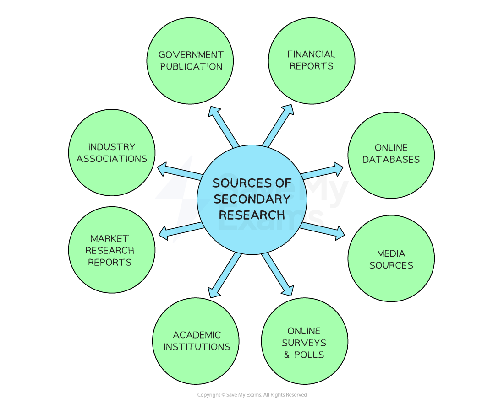

# Methods of Market Research

## Primary research

> **Spec point** — `spcpt_BnWPT3vTMfNsRRyb` · Methods of market research: 
primary research: 
• survey 
• questionnaire 
• focus group 
• observation 
• test marketing

## Primary research

- **Primary research** is the process of gathering information **directly from consumers** in the target market using field research methods such as surveys, interviews etc

  - This research gathers **information which is new** and does not already exist in any format
  - The most commonly used methods of primary market research include the use of surveys, interviews based on questionnaires, observation, focus groups and test marketing
- Businesses usually carry out primary research with a **sample** **of the target market** in which they are interested

  - A **sample** is a group of respondents that reflects the characteristics of the target market as a whole
  - The larger the sample size, the more likely it is that research results will reflect the views of the target market as a whole

- A business will often use **more than one method of primary research** in order to build up a **reliable understanding of the market**

  - The data can then be analysed and used to make **data-led judgements **such as how much to charge for a new product and where to sell it

#### Methods of primary research

| **Method** | **Explanation** |
|---|---|
| **Surveys** | - The most widely used method of gathering primary research - A ***questionnaire*** is used to ask a series of questions to a certain number of people **(respondents)** - The results from the ‘sample’ are used to to make **inferences,** in which the results of the sample are ***extrapolated*** to be true for the wider population - A wide range of respondents can be reached using **online survey tools** such as Survey Monkey |
| **Observation** | - This involves hiring someone to stand in an appropriate location and **study consumer behaviour** in a store or to perhaps judge the potential consumer traffic at a particular location    - Researchers may observe the impact of packaging on consumer choice, or the impact that the particular **placement of a product** in a store may have on consumer choice |
| **Interviews** | - Questions may be set up in a very similar way to a survey, however an interviewer asks the questions - This method** takes longer** but does allow the interviewee to ask **follow up questions** and gather information which can easily be missed when conducting surveys |
| **Test marketing** | - Free samples are provided for a limited period of time to the target market in order to **gauge their response to the product** |
| **Focus groups** | - Free range discussions led by a marketing specialist with the aim of** collecting detailed feedback** on all aspects of the ***marketing mix*** from the target market - Usually limited to a small group of 12-15 people who are **rewarded for their time** - The group typically meets for 90 minutes to 3 hours |

### Evaluating primary market research

- Primary market research should be able to answer many of the **specific questions** businesses have about their customers, competitors and market conditions
- However, it can be costly to conduct

  - Small businesses are likely to be limited on the type and scale of primary research they conduct

#### Advantages and disadvantages of primary market research

| **Advantages** | **Disadvantages** |
|---|---|
| - Information gathering is **focused on the needs of the business **and will not be available to its rivals | - The ***sample size***** may be too small** and unrepresentative of target customers leading to unreliable results |
| - Some primary research methods allow **in-depth information** to be gathered from respondents such as reasons for certain behaviour or choices | - ***Bias*** may mean that researchers can guide respondents to **answer questions in a particular way**    - Similarly respondents may be influenced by the responses of others or provide inaccurate information |
| - Primary market research is **up-to-date and **can be used to **ask specific questions** and so will be more relevant to business decisions | - A business** may need to hire a specialist market research agency **to help making the process **expensive and time-consuming** |

## Secondary research

> **Spec point** — `spcpt_7gNZwW9VZFgJB9Hx` · Methods of market research: 
secondary research: 
• internet 
• market reports 
• government reports.

## Secondary research

- **Secondary research **involves the collection, compilation, and analysis of data that **already exists**

#### Secondary research sources

*Businesses can consult a wide range of secondary sources to gather market research data*

- **Government publications**

  - National governments and ***trading blocs*** such as the EU publish reports and statistics on topics such as the economy, demographics, industry trends and consumer behaviour
- **Academic institutions**

  - Universities and research institutions conduct studies and publish research papers which provide valuable insights and data on specific industries, consumer behaviour and market trends
  
    - E.g. *Stanford University* is a globally significant research centre for engineering and medicine
- **Industry associations**

  - Trade associations and industry-specific organisations provide detailed information about specific sectors, including market size, growth rates and industry ***benchmarks***
  
    - E.g. The *International Organisation of Motor Vehicle Manufacturers* conducts and collates research on production and sales statistics
- **Specialist market research reports**

  - Companies specialising in market research produce and sell in-depth reports on various industries, markets and consumer trends
  
    - E.g. *Mintel* is one of the leading private companies supplying market research information
- **Financial reports**

  - Public limited companies are required to publish ***annual reports*** which can provide valuable information about a company's performance, market position and future plans
- **Online databases**

  - There are various online databases and research platforms that provide access to a wide range of secondary market research
  
    - E.g. *Statista* and *Euromonitor International* make a large volume of data on international commerce available
- **Media sources**

  - Newspapers, magazines and online publications often contain articles, opinion pieces and investigative reports that can offer insights into market trends, consumer behaviour and industry developments
  
    - E.g. The *Financial Times* and the *Wall Street Journal*

### Evaluating secondary market research

- Businesses must weigh up the **reliability** of secondary market research
- Aspects such as **cost, relevance and availability** of data will affect the decision on which secondary data to use

#### Advantages and disadvantages of secondary market research

| **Advantages** | **Disadvantages** |
|---|---|
| - Information is **already available **and may be** quicker to collect** than primary research, thereby saving time - Information is often free (e.g. government websites and internet sources such as Statista) and cheaper** to collect, **leading to **lower costs **compared to primary research - Suitable for a **small business** that lacks a large marketing budget and/or expertise | - Information has been collected for other purposes and so may be **difficult to analyse**, may** lack relevance **or may** not be** **factually correct,** e.g. Wikipedia - It can be **expensive** to purchase market-specific secondary data from specialist companies, e.g. MINTEL reports - **Information may be out-of-date**, especially in dynamic markets |

> **Exam Hint**
> When answering questions about theory-rich topics like market research it is tempting to write down everything you know about the subject.
> 
> Try to focus more on weighing up the benefits and drawbacks of market research methods and justifying which method(s) might be more appropriate - and explain why **in context**.
