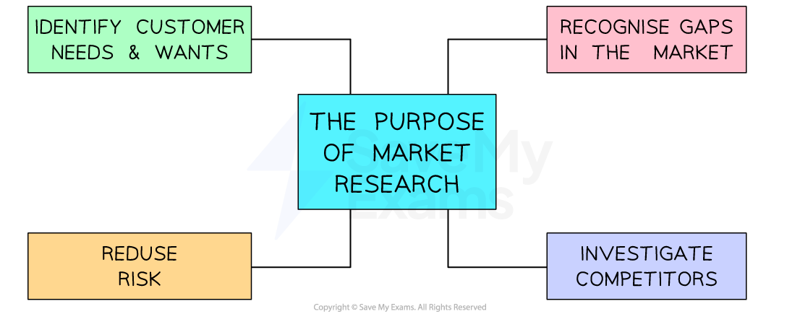

# The Purpose of Market Research

## Reasons for conducting market research

> **Spec point** — `spcpt_rFHhPvMfmsRtPWfP` · The purpose of market research:
• to identify and understand customer needs
• to identify gaps in the market
• to reduce risk
• to inform business decisions.

## Reasons for conducting market research

- **Market research **is the process of **systematically gathering data** from consumers, which can be used to influence business decisions

  - It** **helps businesses identify products and services they can develop in response to the **needs and wants** of their customers.
  - It enables the firm to develop the correct ***marketing mix***
  
    - **On-going market research** is especially important in **dynamic markets** where there is **significant competition** and frequent **changes in customer preferences**

#### The purpose of market research

*Market research helps businesses identify customer needs and wants, recognise gaps in the market, reduce risk and investigate competitors*

#### 1. Identify and understand the future needs and wants of customers

- Market research can identify customer needs before competitors do so, allowing a business to benefit from ***first mover advantage***
- As **customer needs can** **change rapidly**, market research can help a business avoid stocking goods that are no longer in demand

#### 2. Recognise potential gaps in the market

- Detailed market research can identify areas of the market in which **customers' needs are not yet being fully met**
- Appropriate products can then be developed which precisely meet these needs, for which customers may be willing to pay a ***premium price***

#### 3. Reduce risk when launching new products or entering new markets

- Careful market research can clarify the features of products customers desire, the price they are willing to pay, how they respond to ***promotion*** activity and appropriate ways to distribute products
- This is likely to **limit marketing mistakes, **improve** budget decisions **and improve the chances of a successful product launch or entry into a new market

#### 4. Investigate the potential strengths and weaknesses of competitors

- Understanding the product range, promotional methods and pricing strategies used by rivals, as well as the ways in which they interact with customers, can help a business **make their own products stand out**

> **Exam Hint**
> In the exam you could be asked to outline a reason why a given business might conduct market research. 'Outline' questions require the answer to be in context, so give a clear reason and relate it to the business in the question.
> 
> **Example**
> 
> Denhams Ltd should carry out market research to find out about the specific needs of its target market [1] so that the new product it is currently developing [1] has a greater chance of success.
