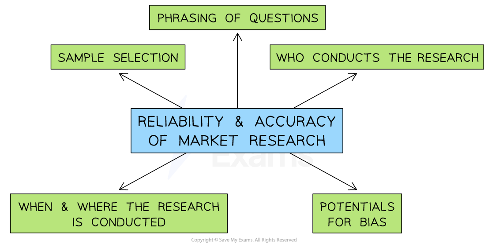

# The Use of Data in Market Research

## Quantitative and qualitative market research

> **Spec point** — `spcpt_j8rgHd4SXJhHdSJn` · The use of data in market research: 
• qualitative and quantitative data

## Quantitative and qualitative market research

- **Market research data **can be quantitative or qualitative

  - Both forms are useful and any data analysis should ideally include a combination of the two

- **Quantitative data **is based on numbers and could include financial reports (e.g. sales, costs), market data (e.g. markets share) or summaries of data gained from primary research (e.g. on a scale of 1-10 rate our customer service)
- **Qualitative data **gathers descriptions or explanations based on conversations, discussions, impressions, and emotional feelings and is usually gathered through primary research

#### Limitations of quantitative and qualitative research data

| **Limitations of quantitative data** | **Limitations of qualitative data** |
|---|---|
| - Numerical data **may be out-of-date**, especially in dynamic markets - **Data analysis and interpretation** is a complex skill that is likely to be lacking in smaller businesses - Looking at a small amount of data and then ***extrapolating*** results can provide wrong assumptions on which to base decisions - Numerical data does not provide reasons for outcomes e.g. data may reveal sales volumes are falling, but **not the reason for the decline** | - ***Bias*** may mean that analysts can **interpret responses in a particular way** - Respondents may **lack awareness or language skills **to explain preferences accurately - Respondents in **focus groups** may be influenced by the responses of others, or not provide accurate information - Qualitative data** **is **difficult to present in graphs and charts** so may not be easily understood |

> **Exam Hint**
> Make sure that you can define both of these key terms and identify examples of quantitative and qualitative research data.

## Social media and market research

> **Spec point** — `spcpt_p2n7dM5RhTtHKpwh` · The use of data in market research:
- the role of social media in collecting market research data

## Social media and market research

- Traditionally, primary research has been relatively difficult and expensive for businesses to gather
- The **rise of social media platforms** such as Facebook, Twitter, Instagram and TikTok has provided businesses with incredible market research opportunities (and some threats too!)

**Benefits of using social media to collect market research data**

| **Benefit** | **Explanation** |
|---|---|
| **Speed** | - The **speed of communication** between businesses and customers can be almost instantaneous, e.g. by using online polls, thousands of responses can potentially be received in several hours |
| **Cost** | - The **cost of gathering this information **can be very low e.g. Online polls take a few minutes to set up and software automatically gathers and analyses the results |
| **Relationships** | - Social media helps businesses to generate an **interactive relationship** with their customers which helps to strengthen brand loyalty |
| **Feedback** | - Customers are also able to **feedback quickly** on products - or to express innovative ideas about how they want the products to be changed - This feedback may help the firm to develop ***extension strategies*** in their ***product life cycle*** |

## The reliability of market research data

> **Spec point** — `spcpt_Cb3wyNVVQKyGCntR` · The use of data in market research: 
• the importance of the reliability of market research data.

## The reliability of market research data

- **Gathering and analysing** **reliable data **is critical to a business

  - It **supports decision-making** and **reduces risk**
  - It helps businesses to **set realistic objectives** and **manage performance **

- The **reliability and accuracy of market research depend upon a range of factors**

#### Factors affecting the reliability of market research data

*The reliability and accuracy of market research data depend on factors including the time and place of research, who carries out and take part in the research, the potential for bias and how questions are phrased*

- How **questions are phrased **in** questionnaires **or other tools used to conduct surveys

  - E.g. Market researchers should avoid **leading questions **
- How **carefully the sample is selected**

  - Including its **size**,** types of respondent** chosen and how closely these reflect the intended ***target market***
- **Who conducts the research?**

  - Do researchers have the **experience**, research **skills** to conduct research effectively?
  - Is the **source** primary or secondary?
- Potential for ***Bias*** when conducting research or analysing results

  - Presenting results in a **particularly positive or negative way** can impact decisions made
  - Personal preferences should be avoided
- **When and where **the research is conducted

  - Customer tastes, fashions, economic conditions and technology change, giving data a relatively **short period of usefulness **
  - Customers in different geographic areas can have very different opinions
