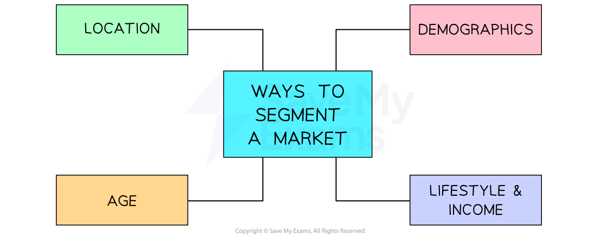

# Market Segmentation

## How businesses use market segmentation

> **Spec point** — `spcpt_ZfFVpDxJs39dqTK5` · How businesses use market segmentation to target customers

## How businesses use market segmentation

- **Market segmentation** is the process in which a single market is **divided into groups**, each of which has distinct customer preferences

  - Each segment represents a slightly different set of **consumer characteristics**
- Market segmentation allows businesses to **target their marketing efforts** at customers who are most likely to be interested in their products

  - This is an efficient use of the marketing ***budget***
  - Customer **needs are likely to be closely met**, so they should be **satisfied** with their purchase
  - Satisfied customers are likely to be **loyal **and **recommend the brand** to other, like-minded customers
- Once appropriate market segment(s) have been identified, a business can choose an appropriate **targeting strategy**

  - Often, businesses aim their products a **particular market segment**
  
    - E.g. **Ecover** targets environmentally-conscious customers with its range of chemical-free housing cleaning products
  - Sometimes different products are aimed at **several different market segments**
  
    - E.g. Supermarket **Tesco** targets customers with different incomes with its own-brand ranges, such as *Stockwell* and *Finest*
  - In some instances, a business aims its product range at the ***mass market***
  
    - E.g. **Coca-Cola** offers a range of products that, given their large volume of sales, could be considered to be aimed at the mass market
- Businesses often use more that one way to segment the market

  - E.g. the UK crisp market is divided up into many **market segments **such as
  
    - **Dinner party snacks** (Walkers Sensations, Pringles, Burts) are targeted at middle to upper earners/professionals with a premium price
    - **Health conscious crisps** (Walkers lite, Walkers baked, Revita lite) are targeted at the health conscious market
    - **Lunch box value snacks** (multipacks, hoola hoops etc) are targeted at families and the mass market

## Ways to segment the market

> **Spec point** — `spcpt_XNnTcyFh5KDH4jZD` · identifying market segments: 
• location 
• demographics 
• lifestyle 
• income 
• age.

## Ways to segment the market

- Markets can be segmented in several ways

  - The main ways include **location, demographics, lifestyle, income and age**

*Businesses can choose to segment markets in a variety of ways*

#### 1. Location

- Urban and rural customers' needs relate to their surroundings

  - E.g. **City-dwellers** are likely to purchase **small, electric vehicles**, while those who live in the **countryside** tend to prefer **larger, all-terrain vehicles**
- Customers in warmer countries make different purchasing decisions to those living in cooler climates

  - E.g. Sales of **air-conditioning units** in **Italy** and **Turkey** are significantly higher than in **Germany** and the **UK**
- Within a country, customers living in different regions have varied preferences

  - E.g. **France** is well-known for its regional **food specialties,** with residents of southern départements generally preferring a Mediterranean diet, whilst those in more northern regions consume more dairy products and red meat

#### 2. Demographics

- **Men and women** often have different purchasing preferences

  - Men tend to spend more than women when shopping
  - Women are more price-conscious shoppers than men, buying more reduced-price items and using coupons more frequently
- As **populations age**, spending patterns are changing

  - Spending on **specialist services** such as personal care and single-person travel has increased significantly
- Many countries have increasingly **ethnically-diverse** populations

  - Markets for **clothing, food** and **celebration items** can be targeted at specific ethic or religious groups

#### 3. Lifestyle and income

- Customers make different lifestyle choices

  - E.g. **Travel companies** target different packages at families, thrill-seekers and those looking to pursue a specialist interest such as cuisine or art
- Some products are aimed at those on high incomes, whilst others target customers with limited budgets

  - E.g. Luxury brand **Mulberry** targets very high-income customers with its iconic handbags whilst budget-conscious customers are served by brands such as **H&M** and **Primark**

#### 4. Age

- Many products are aimed at different age groups, who are likely to have different interests, influences and ***spending power***

  - E.g. In 2022, consumers in the United States spent an average of \$1,945 on clothing, with most being spent by the generation born between 1965 and 1980, known as **Generation X**

#### Advantages and disadvantages of market segmentation

| **Advantages** | **Disadvantages** |
|---|---|
| - Recognises that **consumers **are **not all identical;** consumer groups do not all share the same tastes and preferences | - Not everyone within a segment will behave in the same way |
| - **Products** and marketing activities can be altered to **meet different needs of different groups of consumers** and targeted more precisely | - It may be** difficult to identify a segment **and** **consumers can belong to multiple segments at the same time |
| - **Less expensive and wasteful** than marketing products at wide market segments | - Segmentation requires **more detailed  market research,** which can prove costly but beneficial to the business |
| - It may increase** loyalty **if the consumer feels that their **needs are being met, **which** can lead to repeat purchases ** | - **A segment may be **identified but it may be too **small and unprofitable** to cater for |

> **Exam Hint**
> You could be asked to outline the way a business segments the market at which it aims its products. You will find clues in the case study which you should refer to in your answer as 'outline' questions require application.

## Recommending a method of segmentation

> **Spec point** — `spcpt_s8kttCCXJK5c6f8j` · identifying market segments: 
• location 
• demographics 
• lifestyle 
• income 
• age.

## Recommending a method of segmentation

- The type of market segmentation used will **depend upon the nature of the business itself**
- Examples of industry-specific segmentation include

  - **The cosmetic industry **often aim their products at a specific gender. In recent years, there has been a growth in specific make-up products aimed entirely at men, such as 'Guyliner'- eye liner for men
  - **A bespoke watchmaker** may base their segmentation on income levels, aiming at high income customers who can afford their handmade, niche market pieces
  - **A business that runs boot camp style exercise classes **may base their segmentation on lifestyle choices E.g. those people who want to improve their fitness levels
- Before* ***recommending an appropriate method of market segmentation **the business must also consider a number of factors

#### Factors affecting the choice of market segmentation

| **Factor** | **Explanation** |
|---|---|
| **Brand image** | - The business must consider whether appealing to the chosen segment** aligns with the existing brand image of the product/company**    - E.g. A luxury fashion retailer may harm their image if they try to appeal to a budget market |
| **Cost of entry into the market segment** | - How **much advertising will be needed t**o attract the attention of the segment?    - E.g. The fitness fashion industry is very competitive with brands such as *Gymshark* and *Puregym* and a new entrant may therefore require a large promotional campaign ***budget ***to catch the attention of potential customers |
| **Market analysis data** | - The business will need to **examine market research data **to find out **how big the potential market segment **is in terms of number of customers and potential future sales |
