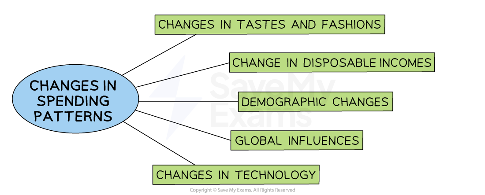

# Responding to Changing Market Conditions

## The impact of changing customer needs and spending patterns

> **Spec point** — `spcpt_QQc4Zt4JsgxMJwrS` · Responding to changes in the market:
• changing customer needs
• changing customer/consumer spending patterns

## The impact of changing customer needs and spending patterns

- **Markets and marketing strategies are constantly changing **as a direct result of the changing wants/needs of customers, which affect their ***spending patterns***

  - There are many different reasons for changes in customer spending habits and patterns
- Businesses that **conduct ongoing** ***market research*** are able to **identify and interpret **the changes that are happening in markets

#### Reasons for changes in spending patterns

*If businesses fail to respond to changing customer needs, then they are likely to fail*

### Changes in tastes and fashions

- Trends in some markets can change very quickly

  - E.g. Wide-leg jeans are now more fashionable with ***Gen-Z*** customers than 'skinny' jeans worn by ***Millennials***

### Change in disposable incomes

- High ***unemployment*** or ***inflation*** may lead to customers to buy cheaper products, e.g own brand breakfast cereal

### Demographic changes

- Populations in most developed countries are **becoming older**
- Demand for products that meet their needs has driven many market changes

  - E.g. Sales of specialist travel insurance for mature holidaymakers has increased

### Global influences

- The arrival of well-known international brands can change demand and purchasing patterns in a market
- Increased travel, support from celebrities and extensive promotional activity drive demand

  - E.g. American fast food chains now dominate the market for fast food across Europe

### Changes in technology

- New technology makes old technology less desirable or obsolete

  - E.g. Products such as smart speakers are replacing sales of radios

## The impact of increased competition

> **Spec point** — `spcpt_6Nh3QbZNSxmpWY5H` · Responding to changes in the market:
• increased competition.

## The impact of increased competition

- Competition** **occurs when **at least two businesses** are providing goods/services to the same ***target market***

  - The more businesses in the market, the more intense the competition
- Competition results in **many benefits for the customer**, such as

  - Lower prices
  - Better-quality products
  - Better customer service

- However, the **absence of competition **reduces incentives for businesses to innovate, be efficient or offer consumers lower prices
- Some** markets have become more competitive in recent years** as a result of

  - ***Globalisation*** of markets has meant that products are increasingly sold all over the world
  - Transportation improvements have meant that it is easier and cheaper to transport products from one part of the world to another
  - Internet and e-commerce have meant that consumers can search for products and buy from overseas markets
  - Increased consumer information about products and the different international businesses that produce them makes the market much more competitive

### Responding to changing spending patterns and increased competition

- Whenever there are** changes to spending patterns **or** competition,** a business will need to take action to **maintain** **its market position**

**Steps a business can take to remain competitive**

| **Step** | **Explanation** |
|---|---|
| **New product development** | - The **development of new and innovative products** encourages customer loyalty and also attracts new customers    - E.g. Apple identified changing trends in the way people consumed music and switched their focus from iPods to digital downloads via the Apple Music App |
| **Customer focus** | - Provide **outstanding customer service** ensures customer loyalty for longer periods of time |
| **Improve products** | - Customers will **compare products and services to competitors** so improving the product allows the firm to maintain market share and stay competitive    - E.g. Google software developments (e.g. Google Meet) differentiate Google from other search engine software |
| **Minimise costs** | - **Lower costs can sometimes be passed onto the consumer** in the form of lower prices - Increased ***retained profit*** can be used to fund ***promotion*** to raise awareness of a brand/its products or expansion which allows a business to operate on a larger scale |

> **Exam Hint**
> In the exam you may be asked to evaluate how changes in consumer spending patterns and competition may affect a particular business. You might want to consider factors such as
> 
> - Whether the products the business sells are luxuries or necessities
> - The strength of the businesses brand and how effectively it is differentiated
> - How long-lived changes are expected to be
