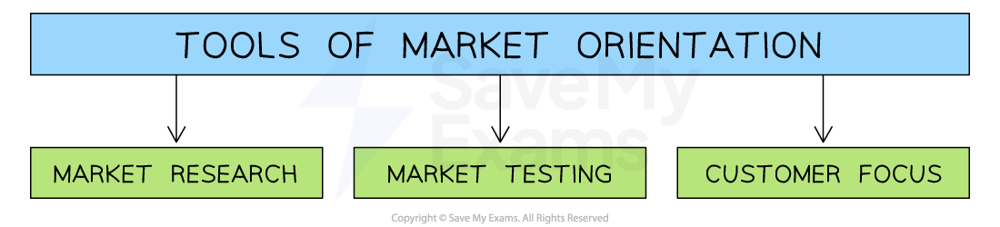
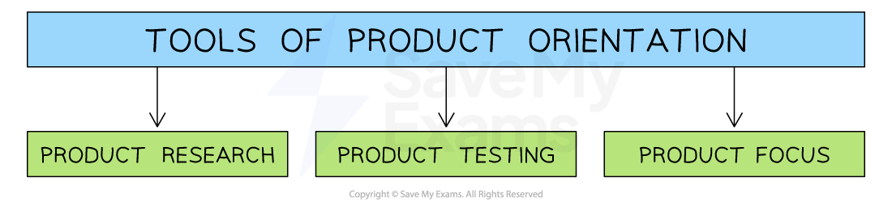

# The Importance of Marketing

## An introduction to marketing

> **Spec point** — `spcpt_CsftMdf7ZqCTTsn9` · Importance of marketing

## An introduction to marketing

- A market is any place where **buyers and sellers can meet to conclude a transaction, **e.g. [amazon.co.uk](http://amazon.co.uk) or a shopping mall
- **The aim **of** marketing is to help identify, anticipate and satisfy consumer needs and wants profitably**

  - Needs are considered to be **essential,** e.g. shelter or food
  - Wants are desires which are **non-essential**, even if consumers consider them to be essential e.g Nike trainers

## Why marketing is important

> **Spec point** — `spcpt_SNN2k522D9T2PzFP` · Importance of marketing: 
• satisfying customer needs 
• building customer relationships 
• keeping customer loyalty

## Why marketing is important

### Identifying and understanding customer needs

- **Marketing **helps a business** identify and understand** the needs and wants of its customers

  - It involves finding out about the
  
    - **Variety** and **quality **of goods and services that customers want
    - **Prices** they are willing to pay
    - **Promotional** techniques that may persuade them to make repeated purchases
    - **Convenience factors,** including **where** and **how** they want to purchase products
    - **After-sales services** they anticipate

- Businesses that successfully identify and then satisfy customer needs

  - Compete more effectively than rival businesses
  - Keep up to date with **changing tastes and preferences**
  - Attract positive **word-of-mouth **recommendations and build the brand

#### Benefits of identifying and understanding customer needs

| **Need** | **Explanation** | **Benefits to the Business** |
|---|---|---|
| **Price** | - The amount of money a customer is **willing to pay** for a product - Customers often have a **budget** and want to find the best value for their money | - Understanding this helps the business **set competitive prices** and offer **appealing promotions **to their target market |
| **Quality** | - Quality refers to the **standard of excellence** that a customer expects from a product - Customers want reliable, durable products that **meet their expectations **and** **good **quality after-sales service** | - Understanding this helps businesses create products that meet the desired standards, which can lead to** customer loyalty** and **positive word-of-mouth advertising** |
| **Choice** | - Customers have a wide range of preferences and want the choice of a **variety** of products - Varied **features,** such as sizes, colours and styles, are required by different customers | - Understanding this helps businesses offer a **range of product options** that cater to different preferences - This increases **customer satisfaction** as customers purchase **products that meet their specific needs** |
| **Convenience** | - Customers value convenience because they want products that are **easy to access** and use - This includes factors such as location, online ordering, **fast delivery **and** **a variety of **ways to pay **for products | - Understanding this helps businesses to **create a customer experience** that is both efficient and enjoyable - Providing a convenient shopping experience **builds customer loyalty** and increases repeat sales |

### Keeping customer loyalty

- **Customer loyalty** is when **existing customers buy products** from the same business **over and over again**
- Customer loyalty leads to repeat purchases and a rise in ***market share***.
- It is much **cheaper for a business to try to keep existing customers **(for example, with loyalty cards) than trying to gain new customers, as this can involve expensive **advertising campaigns**

### Building customer relationships

- Building** customer relationships** involves communicating with customers to encourage them to become loyal to the business and its products
- Good relationships are maintained by

  - Developing close ties with customers and** finding out if products/services are continuing to meet their needs **
  
    - E.g. Using surveys to discover if preferences are changing
  - Using **technology **to gather important information about customers

- Having strong relationships with customers means **a business can respond appropriately** when
expectations of what they want from a good or service change

## Market orientation versus product orientation

> **Spec point** — `spcpt_hdprXJfMNyY3MXhF` · Importance of marketing:
• market orientation and product orientation"

## Market orientation versus product orientation

- **Market orientation **focuses on the **needs of consumers **and uses this information to design products that meet customer needs

  - **Consumers** are **at the centre of marketing decisions**
  - **Products **which **respond to consumer needs **are developed
  - The result of market orientation is that the firm will benefit from increased demand, increased profits, and **a valued brand image** as its products become more desirable
  
    - E.g. Universities often develop new courses based on the feedback they receive from students and employers

#### Tools of market orientation

*Market orientation aims to develop products to meet consumer needs identified during the market research process*

- **Product orientation** focuses on the **characteristics of the product **rather than the needs of the consumer

  - The **emphasis** is on** creating a product first **and **then finding a market**
  - The business has a belief that the product is superior i.e. it will sell itself
  
    - E.g. Gillette's razors can be classed as a **product oriented business** as the business focuses on the quality of its products and regular innovations aim to increase sales
  - One problem with being **too product orientated** is that over time a business moves further and further away from w**hat the market is looking for**, thus increasing the risk of business failure

#### Tools of product orientation

*A product orientation is used by inventors who research, test and produce a product well before market research has taken place  *

## Niche markets and mass markets

> **Spec point** — `spcpt_bdJcJMMF2NPqCcNX` · Importance of marketing:
• niche and mass marketing.

## Niche markets and mass markets

### Niche markets

- In **niche markets, **products are aimed at a subset of the larger market e.g. gluten free bread and cakes

  - **Niche marketing **occurs when businesses identify and satisfy the demands of a **small group of consumers** within the wider market
  - Production usually happens on a **small scale**
- Profitable niche markets **rarely remain small for long**; their potential attracts competition, which increases sales volumes

  - The market for energy drinks is a good example of this - originally targeted at sports-enthusiasts, it is now one of the largest soft drinks segments in the world

### Mass markets

- In** mass markets, **products are aimed at broad  ***market segments*** e.g Kellogg's Corn Flakes is an example of a breakfast cereal aimed at the mass market

  - Market segments are groups of consumers who share similar characteristics e.g. age, lifestyle, etc.
  - **Mass marketing** occurs when businesses sell their products to most of the available market
  - Production usually happens on a **large scale**

#### Characteristics of  niche and mass markets

| **Niche markets** | **Mass markets** |
|---|---|
| - Products are **specialised** and unique as they are aimed at narrow market segments - **High average costs** due to small scale production    - They do not benefit from ***economies of scale*** - High prices make products less affordable and lead to **lower sales volumes** - High prices can allow businesses to earn higher ***profit margin*** - **Louis Vuitton** is an example of a fashion company that aims its products at a **niche market** | - Products are **less unique** as they are aimed at broad market segments - **Low average costs** due large scale production  ***economies of scale*** - Low prices lead to **greater affordability** and higher sales volumes - Low prices lead to** lower profit margins** - **Primark **is an example of a clothing company that focuses its product on the mass market |

## Market Share & Market Growth

> **Spec point** — `spcpt_5j2tpQm83dB4vKb4` · Importance of marketing:
• market share and analysis

## Market share and market growth

### Market share

- Market share is the percentage of the total market revenue that a single business or brand has

  - e.g. Tesco had a 27% share of the UK grocery market in 2022
- **Market share** can be calculated using the formula

`fraction numerator Sales space of space straight a space business space open parentheses volume space or space value close parentheses over denominator Market space size space space stretchy left parenthesis volume space or space value stretchy right parenthesis end fraction space cross times space 100`

- An **increase in market share** can indicate that a business has made **effective use of marketing strategies** to increase sales and **gain customers from competitors**

> **Worked Example**
> In 2022 the UK coffee shop/cafe market was worth £4.6bn. Sales of Starbucks Coffee were £328m in 2022.
> 
> Using the data calculate, to 2 decimal places, the market share of Starbucks Coffee in the coffee shop/café market. You are advised to show your workings.
> 
> [2]
> 
> **Step 1: Divide Starbucks' sales by the market size**
> 
> **              **`equals fraction numerator space £ 328 straight m over denominator £ 4.6 bn end fraction space
> 
> equals space 0.0713`**          ****[1 mark]**** **
> 
> **Step 2: Multiply the outcome by 100 and express as a percentage**
> 
> `equals space 0.0713 space cross times space 100
> 
> equals space 7.13 percent sign`**          ****[1 mark]**** **

> **Exam Hint**
> By showing your working-out, even if you do not get the right answer you will still be able to gain some marks.

### Market growth

- Market growth is the **increase in the overall size, value or volume of a market** over a period of time, usually expressed as a percentage
- Market growth provides an incentive** for businesses** looking to expand, increase sales and generate higher revenue

  - Businesses are often attracted to the potential of growing markets - and they can **become increasingly competitive** quite rapidly
- Market growth is calculated using the formula

$\mathrm{Market} \mathrm{growth}=\frac{\mathrm{This} \mathrm{year}'s\mathrm{market} \mathrm{sales}-\mathrm{Last} \mathrm{year}'s\mathrm{market} \mathrm{sales}}{\mathrm{Last} \mathrm{year}'s\mathrm{market} \mathrm{sales}}x100$

- If the growth rate is **positive,** the market is **getting bigger** (expanding)
- If the growth rate is **negative,** the market is **getting smaller** (contracting)

> **Worked Example**
> In 2021 worldwide sales of plug-in hybrid vehicles was 1.94 million units. By 2022 sales had increased to 2.84 million units.
> 
> Calculate the rate of market growth in the plug-in hybrid vehicles market.
> 
> [2]
> 
> **Step 1 - Deduct 2021's sales from 2022's sales**
> 
> $=2.84\mathrm{million}-1.94\mathrm{million}\,\,=0.90\mathrm{million}$
> 
> **Step 2 - Divide the outcome by 2021's sales**
> 
> $\frac{0.90\mathrm{million}}{1.94\mathrm{million}}=0.4639$       **[1 mark]**
> ** **
> 
> **Step 3 - Multiply the outcome by 100 to find the percentage growth rate**
> 
> `begin mathsize 16px style 0.4639 space cross times space 100 space equals space 46.39 percent sign end style`       **[1 mark]**

> **Exam Hint**
> Unless otherwise stated, always give your answer to two decimal places.
