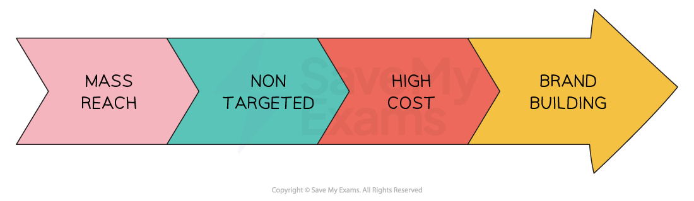

# Above & Below the line Promotion

## Above-the-line promotion

> **Spec point** — `spcpt_Gt9v54txywTgF3mt` · above the line techniques

## Above-the-line promotion

- Above-the-Line Promotion promotion refers to **advertising **activities that are aimed at **reaching a wide audience** through traditional **mass media** channels to **create awareness **about a product, service, or brand.

  - These channels typically include **television, radio, newspapers, magazines** and** outdoor advertising** such as billboards

#### Characteristics of above-the-line promotion

*Above-the-line promotion aims to reach the masses and build brand awareness*

1. **Mass reach**: Above-the-line promotion aims to **reach a large number of people** often through broadcasting media and is designed to **create brand awareness** and **generate interest **among a wide audience
2. **Non-targeted**: It is generally** not tailored to a specific customer segment **and aims to capture the attention of **as many people as possible**
3. **High cost**: Traditional above-the-line promotion methods require **significant budgets** due to the costs associated with advertising on television, radio or print media
4. **Brand building**: Above-the-line promotion plays a crucial role in brand building by establishing brand **recognition **and** familiarity** among consumers

### Types of above-the-line promotion

- Above-the-line promotion can be classified as being informative, persuasive or reassuring
- Examples include **advertising **on TV, in cinemas, in the print media or online

#### Types of above-the-line promotion

| **Classification** | **Explanation** | **Examples** |
|---|---|---|
| **Informative** | - Informative advertising focuses on providing **factual information** about a product, service or brand - It **educates **and **informs** consumers about the features, benefits and value of a product, enabling them to make **well-informed purchasing decisions** | - When releasing a new drug, pharmaceutical companies such as **Bayer **may decide to make a television advert that provides information on the medication's proven benefits |
| **Persuasive** | - Persuasive advertising is designed to **influence consumers' attitudes and behaviours** towards products or services - It aims to convince customers that a particular product or service is **desirable, necessary or superior to alternatives** in the market | - Package holiday companies such as **Eurocamp **which aim their services at families,* *emphasise excellent weather and use images of children having fun in posters displayed on billboards |
| **Reassuring** | - Reassuring advertising aims to **remind existing customers** that they made the right decision when choosing a particular product over those of rivals - It encourages customers to **remain loyal **and **continue to purchase** the product and others within the range | - **Coca Cola **reassures its customers through the use of television advertising that promote a 'feel-good' response |

### Advantages of above-the-line promotion

- **Wide reach**

  - Businesses can reach large audiences because mass media channels (e.g. TV, radio, newspapers) provide high visibility.
- **Brand building**

  - Effective for creating a strong brand image, enhancing brand recognition, and establishing credibility and trust with consumers.
- **Impactful messaging**

  - Marketing messages can be communicated in an engaging way using sound, images, and graphics, making them more memorable and persuasive.

### Disadvantages of above-the-line promotion

- **High cost**

  - Can be expensive to run, particularly for small businesses with limited marketing budgets.
- **Lack of targeting**

  - Aimed at wide audiences, so may not effectively reach specific market segments or the intended customer base.
- **Declining effectiveness**

  - Traditional media consumption is decreasing due to the rise of digital platforms, and consumers can easily ignore or filter out advertisements.

## Below-the-line Promotion

> **Spec point** — `spcpt_sNQKY6T5M6fJwSYY` · below the line promotion techniques

## Below-the-line promotion

- Below-the-line promotion includes marketing communications over which **a business has direct control **and which d**o not make use of mass media**

#### Evaluation of below-the-line promotion

| **Method** | **Explanation** | **Advantages** | **Disadvantages** |
|---|---|---|---|
| **Direct** **marketing** | - This involves **communicating directly with customers** through email, text message, social media or post    - E.g. Takeaway restaurants distribute menus to households in the local community | - Businesses can **target specific audiences** and personalise the message to individual customers - Direct marketing is **measurable,** which enables businesses to track their results and adjust strategy accordingly | - It can be intrusive, as customers may perceive it as **spam** - It can also be costly, especially if businesses **do not have an established customer database** or need to purchase leads |
| **Sales** **promotions** | - Techniques that encourage the purchase of a product or service by offering **temporary incentives or discounts** - Examples include free samples, buy one get one free (bogof), discount coupons, loyalty cards, point of sale materials and rebates (customers have to mail in to receive money back) | - Sales can receive a **quick** boost - Sales promotions help** clear out stock** or promote a new product - They can encourage** impulse purchases** - They can be **targeted **to specific segments of customers | - It can be **expensive** especially if promotions include heavy discounting - They are likely to attract **deal-seeking customers** who may not be loyal to the brand - Demand for full-priced products may fall |
| **Personal** **selling** | - Where a salesperson interacts with **customers one-on-one**, either in person or through digital communication channels    - E.g. Luxury skincare products are often sold by brand representatives at concession stands in department stores | - Businesses **build relationships** with their customers and understand their specific needs - It enables businesses to provide **personalised advice and guidance** to customers | - It can be expensive due to the cost of **hiring and training sales staff** - It may have limited impact as it is **difficult to scale** to large audiences |
| **Merchandising** | - The use of ***point-of-sale*** materials, product displays and store layout | - Merchandising is particularly effective in encouraging ***impulse purchases*** | - It can be **'lost' **amongst other visual promotions such as special offers |
| **Exhibitions and trade fairs** | - Attending specialist exhibitions or trade fairs allows businesses to meet customers face-to-face at a stand or exhibit - Detailed discussions can be held and products demonstrated | - High-profile events can **attract media attention** which could provide positive brand exposure - **Specific target markets** attend particular exhibitions    - E.g. The annual London Toy Fair attracts toy and game enthusiasts and retailers | - Stands at popular events can be very **expensive **and require representatives with **excellent interpersonal skills** |

> **Exam Hint**
> In the exam you may be asked to justify a suitable method of promotion. Look carefully at the question:
> 
> - What is the promotional activity expected to achieve?
> 
>   - Increase market share?
>   - Higher sales?
>   - Improve brand recognition?
> 
> Make sure you refer back to this aim throughout your answer.
