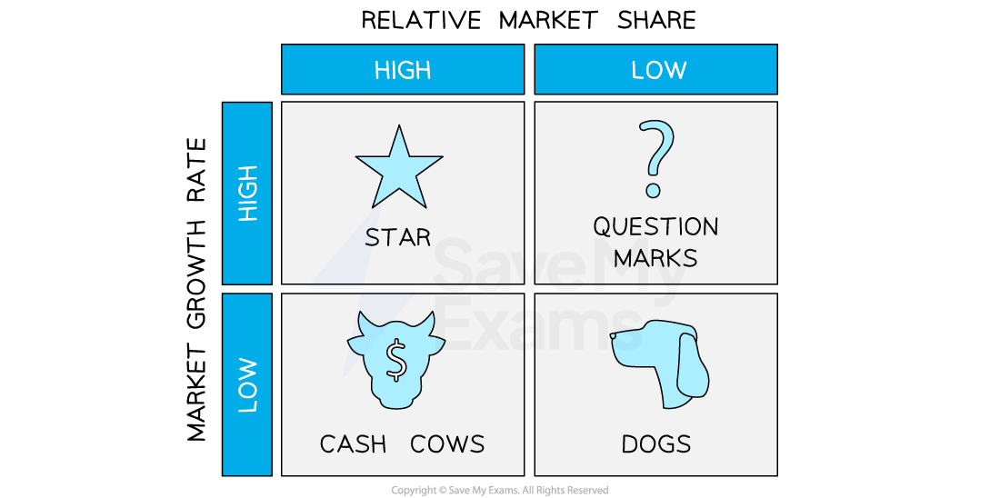

# Portfolio Analysis

## Boston matrix

> **Spec point** — `spcpt_DJpT8ZcvQp3PdYhp` · managing and reviewing the product portfolio (Boston matrix).

## Boston matrix

- The Boston Matrix is a tool used by businesses to **analyse their *****product portfolio*** and make **strategic decisions** about each product
- The matrix **classifies products into four categories** based on their ***market share*** and the ***market growth rate***

  - Cash Cow
  - Problem Child/Question Mark
  - Star
  - Dog

- The Boston Matrix helps businesses have a **balanced product portfolio**

  - Profitable **cash cows** fund the development of problem children and ensure stars receive the investment they require to maintain their ***market leader*** position
  - Unprofitable **dogs** are ***divested*** to increase focus and funding on products with more potential

#### The Boston matrix

*The classification of products in the Boston Matrix according to their market share and the growth rate in the market as a whole  *

- By categorising products into these categories, businesses can **allocate resources more effectively,** improve their ***cash flow*** and develop marketing strategies that align with the product's potential

#### The four types of product in the Boston matrix

| **Product type** | **Explanation** | **Implications** |
|---|---|---|
| **Cash cow** | - Cash cows are products with a **high market share in a mature market** (the entire market is no longer growing) | - They generate **significant positive cash flow** but have low growth potential - They need minimal investment as they are seen as stable sources of income - Marketing efforts focus on **maintaining their *****market share*** and profitability - Cash cows are valuable assets and can be used to fund the development of new products |
| **Problem child/Question mark** | - Problem child or question mark products have a **low market share in a high-growth** market - These products **have the potential to become stars** if the company invests in their development | - There is often a **negative cash flow** as businesses usually invest in problem child products to increase their market share and **turn them into stars** - Marketing efforts focus on **increasing their market share** and ***brand*** recognition |
| **Star** | - Star products have a **high market share in a high-growth market** - The company typically invests in stars to **maintain or increase their market share** | - They generate **significant positive cash flow** and have the potential for continued growth - Marketing efforts focus on building **brand recognition **and increasing market share - Stars are valuable assets and the business **should focus on maximising their potential** |
| **Dog** | - Dog products have a **low market share in a low-growth market** | - They generate** little revenue** for the company and have no growth potential - Businesses often **move away (divest)** from these to focus on more profitable products - Marketing efforts for dog products are minimal or zero |

> **Exam Hint**
> You need to know the purpose of the Boston Matrix and the characteristics of the four different types of product
> 
> In the exam you may be asked to identify elements or their characteristics
