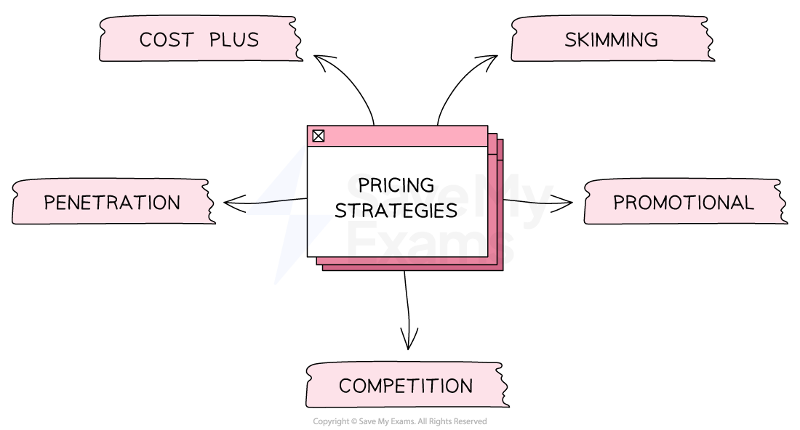

# Pricing Strategies

## Common pricing strategies

> **Spec point** — `spcpt_9f8bqxsYmmYmWYzz` · the main pricing strategies and when they might be applied: 
• cost plus 
• penetration 
• competition 
• skimming 
• promotional.

## Common pricing strategies

- A **pricing strategy** is the approach businesses use to determine what prices they should charge customers for their products
- Choosing the right **pricing strategy **is essential for a business to be profitable, competitive and successful in the long run

  - Price can play a significant role in the ***market positioning***** **of the brand and help a firm **compete with rivals**

#### The main pricing strategies

*Businesses can choose from a range of pricing strategies to suit the products they sell and the customers at which they are aimed*

#### Different types of pricing strategies

| **Pricing strategy** | ** Explanation** | **Advantages** | **Disadvantages** |
|---|---|---|---|
| **Cost plus** | - The business calculates the **cost of production** and then adds a markup to determine the final price - The markup covers the cost of production **plus the business's desired *****profit margin*** - This pricing strategy is commonly **used by manufacturers** that produce standardised goods e.g. washing machines | - A **simple **and **quick** methods of calculating a price for a product - It ensures that a **profit** is made on each item sold | - It does not consider the **needs of the market ** - The **pricing approach of competitors** is ignored |
| **Skimming** | - The business sets a **high price** for a new product when it is **first introduced to the market** - The business will then gradually lower the price to **ensure sales continue** - Skimming should not be confused with **premium pricing**, where a permanently high price gives customers an impression of high quality and luxury | - This is effective when an *established brand* is introducing a new product and there is a high demand for it e.g successive models of **Apple's Macbook Air** - The high price helps the business to recover its **development and marketing costs** quickly | - Less useful for new brands as it requires significant customer trust - Loyal customers may become **tired of paying high prices **for new product versions and look to see what competitors offer |
| **Penetration** | - The business sets a** low price for a new product/service** when it is first introduced - This helps to quickly **capture market share** and attract price-sensitive customers e.g. many new perfumes launch using penetration pricing - Once they have enough customers, the business will start to **raise the price** | - Customers are **attracted to buy** the product at a low price leading to high sales volume and market share - **Competitors unable to match or beat the low price** are forced out the market leading to less competition | - Customers may perceive that the product is of **low quality **if the product is sold at a low price - Selling at a low price limits the **amount of profit **made |
| **Competition** | - The business sets its prices **based on its competitors' prices** | - This is effective when a business is in a highly competitive market and wants to **maintain its market share** | - The business must continually monitor its competitors' prices and adjust its prices accordingly to remain competitive |
| **Promotional pricing** | - This pricing strategy takes into account the **customer's emotions, and compulsive behaviours in responding to price promotions** - E.g. a business may have a **Bogof offer** - buy one get one free | - Generates high volumes of sales for a limited period - Can be a useful tool to catch the **attention** of customers | - Profit margins are likely to be lower during price promotions - Customers may be unwilling to pay a higher price once a price promotion comes to an end |

> **Exam Hint**
> In the exam, you could be asked to choose between two pricing strategies for a business and justify which would be most appropriate. You should consider factors such as
> 
> - The nature of the product - E.g. Is it a necessity or a luxury?
> - Competitors' prices - especially if competition is fierce
> - Stage in the product life cycle - E.g. Newly-launched products may be suited to promotional pricing to attract customers
> - What is hoped to be achieved - E.g. High profits may be achieved through price skimming, whilst penetration pricing is more appropriate to gain market share
