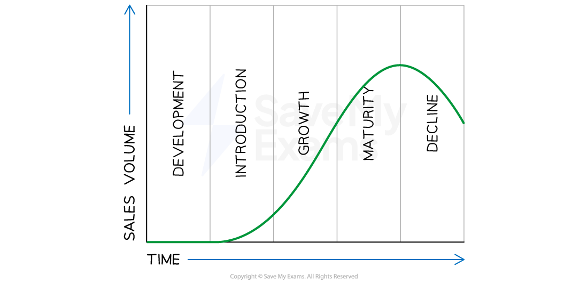

# Product Life Cycle

## Stages in the product life cycle

> **Spec point** — `spcpt_47SgMBQVV6365HjC` · product life cycle – main phases

## Stages in the product life cycle

- The product life cycle describes the **different stages a product goes through** from its conception to its eventual decline in sales
- There are typically **five stages in the product life cycle:** development, introduction, growth, maturity, and decline

#### The product life cycle

*The five stages a product goes through over its life span - from initial development to eventual decline *

- The implications for **marketing actions** vary at each stage of the product life cycle
- Companies should **tailor their marketing strategies** to each stage to ensure long-term success

#### Marketing strategies and the product life cycle

| **Stage** | **Explanation** | **Marketing strategy** |
|---|---|---|
| **Development** | - The focus is on designing and developing the product - The business **usually incurs high costs** for research and development, market research, and product testing | - Marketing strategy during this stage is focused on **creating awareness and generating interest** in the product |
| **Introduction** | - The stage begins when the product is launched - Characterised by **slow sales growth** as the product is still new and unknown to most consumers | - Marketing efforts are focused on **creating awareness **and** generating interest** in the product |
| **Growth** | - The product enters this stage when sales begin to increase rapidly - The business focus shifts to **building *****market share*** and **increasing production** to meet this growing demand | - The marketing strategy is to ***differentiate***** the product** from its competitors and build brand loyalty |
| **Maturity** | - Characterised by high sales but **slowing sales growth** - ***Market saturation*** is likely | - The marketing strategy aims to **maintain market share and increase profitability** by cutting costs and finding new markets |
| **Decline** | - Starts when sales begin to decline as the product **becomes obsolete** or is replaced by newer products - The business focus shifts to managing the product's decline and reducing costs | - The marketing strategy may involve discontinuing the product, **reducing prices to clear stock** or finding new uses for the product |

> **Exam Hint**
> You do not need to consider cash flow or profitability over the product life cycle.

## Extension strategies

> **Spec point** — `spcpt_4rcXNcMb4mXC7nk2` · product life cycle – extension strategies

## Extension strategies

- Extension strategies refer to the techniques used by businesses to **extend the life of a product beyond its natural life cycle**
- These strategies are **designed to boost sales **and maintain profitability for a product that has** **reached the** late maturity or decline stage** of its life cycle
- There are two types of extension strategies which are often **implemented at the same time**

  - Product-related extension strategies
  - Promotion-related extension strategies

#### A comparison of product and promotion-related extension strategies

| **Extension strategy** | **Explanation** | **Examples** |
|---|---|---|
| **Product-related** | - **Changing or modifying the product** to make it more appealing to customers - This could involve improving or adding features, increasing capacity or redesigning its appearance | - **Product improvements **e.g. Samsung releases new versions of its Galaxy Smartphone every year with upgraded features and improvements to the previous model - **Line extensions** e.g. Coca-Cola introduced Diet Coke and Coke Zero as line extensions of its original Coca-Cola - **Repositioning** e.g. when IBM's personal computer division started losing market share to other brands, it repositioned its products as high-end business machines and focused on the enterprise market |
| **Promotion-related** | - Changing promotional activity related to the product - This could involve changes to **advertising**, different **pricing** tactics or attractive **sales promotions** | - **Changes to advertising **e.g Kellogg's continues to recreate adverts for its Corn Flakes cereal which has been around since 1906 - **Price promotions** e.g. Cyber Monday occurs on the first Monday after Thanksgiving in the USA and electronic firms discount prices significantly in order to boost sales of their products - **Sales promotions **e.g. many coffee shops offer a **loyalty program** where customers can earn a free drink for every six drinks consumed |
