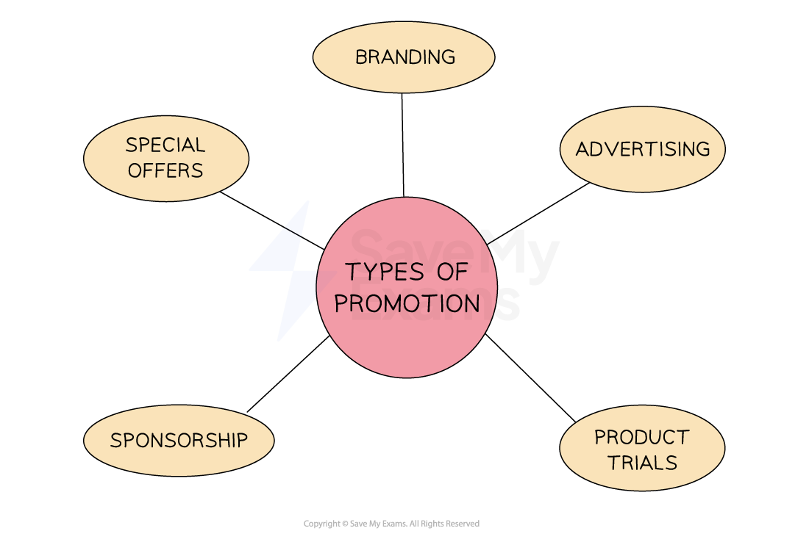
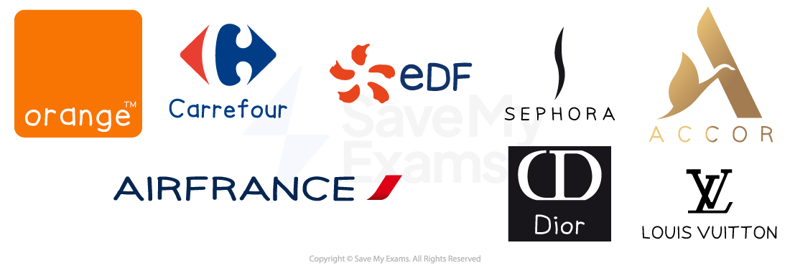
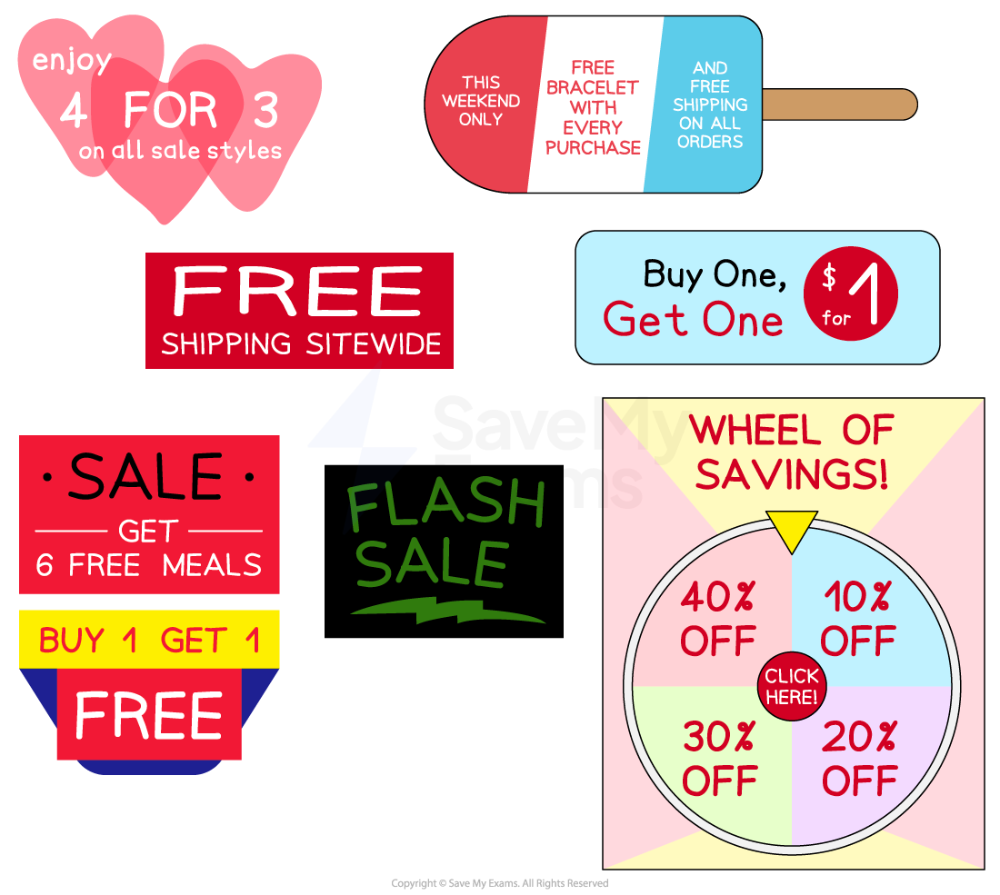

# Promotional Strategies

## An introduction to promotional strategies

> **Spec point** — `spcpt_3PkZsg8KJHtq3p5Z` · promotion strategies for different market segments

## An introduction to promotional strategies

- The promotion element of the marketing mix includes a **variety of promotional strategies**

#### Types of promotion

*The different types of promotional methods available to a business to communicate with their target market*

- Each method has advantages and disadvantages associated with their use
- Businesses must select the **most appropriate methods** for their product/service, target audience and budget

## Advertising

> **Spec point** — `spcpt_PvmdmkmgvJW5YxYg` · promotion strategies for different market segments:
• advertising

## Advertising

- **Advertising** makes use of the media, such as television, newspapers and radio, to promote products or brands

  - It can **reach large audiences** and **increase brand awareness**
  - Advertising can also be used to **create a specific brand image or message**
  
    - E.g. The advertising campaign run by **Compare the Market **(Meerkat) uses **humour **to make shopping for **financial products** more attractive
  - Specialist media can **target specific *****market segments***
  
    - E.g. Upmarket **furniture** brands place advertisements in magazines such as **Homes & Antiques** and **Country Life**
- Advertising is an **expensive** promotional strategy

  - E.g. In the US high viewership for the Super Bowl means that 30-second tv advertisements have been sold for as much as \$6.5 million
  - In most cases, external specialists or **media agencies** create attractive and creative advertisements

## Sponsorship

> **Spec point** — `spcpt_NS23wdhjTbSxq8NN` · promotion strategies for different market segments:
• sponsorship

## Sponsorship

- Sponsorship is a form of ***public relations*** where a business **provides financial or other support** to an event, team, or organization in exchange for marketing exposure
- Sponsorship can take many forms, such as **logo placement **or naming rights

  - E.g. Through its sponsorship Emirates gives its name to Arsenal Football Clubs' stadium
- Major sporting events often attract numerous sponsors keen to **align their brand with success**

  - Their logos will appear on official merchandise, within sports venues and on promotional materials

**Sponsors of the 2024 Paris Olympics**

*Sponsors of the 2024 Paris Olympics include some of France's leading brands*

- However, sponsoring high-profile events can be **very expensive a**nd it may be difficult to determine the **impact it has on** **driving sales**

## Product trials

> **Spec point** — `spcpt_MFdTqs5d4wPwHNPJ` · promotion strategies for different market
segments:
• product trials

## Product trials

- Prior to a full product launch, **product trials** involves introducing a product to some customers to assess the market

  - The product may be released to customers in different geographic areas or to specific demographics, such as customers between the ages of 18 and 35
- Product trials can also be offered to encourage customers to **try out a product for a lower price for a limited period of time**

  - E.g. Some magazines offer half-price trial subscriptions for a certain number of issues
- Product trials help **gauge demand** and **collect feedback** on the product prior to launching on a large scale

  - It can help businesses **forecast product sales, plan advertising campaigns **and** determine effective distribution strategies**
  - For example, a retail clothing store planning to expand its products with a new range of fashion accessories could choose a small group of loyal customers to try the products and offer their opinions.
  - After receiving feedback from these customers, products could undergo design changes, appropriate promotional strategies could be developed and appropriate quantities of stock could be organised
- However, product trials may not be suitable for all types of products

  - E.g. Products that are **durable **or purchased infrequently are less likely to see repeat sales following a trial
- It takes **time and money** to run effective product trials

  - A business may lose its ***first-mover advantage*** as rivals may be able to launch products more quickly

## Sales promotions

> **Spec point** — `spcpt_knNjJpkCKbZynKvF` · promotion strategies for different market segments:
• special offers

## Sales promotions

- **Sales promotions** are incentives or discounts that encourage customers to buy products

  - They are often **temporary **and are designed to **attract new customers** to try a product for the first time and become loyal to the brand
  - Examples of sales promotions include free samples, buy one get one free (bogof), discount coupons, loyalty cards, and competitions

#### Examples of sales promotions

*Sales promotions can include price reductions and encouragements to purchase a greater volume of products*

- Sales promotions can **quickly boost sales** though ***impulse purchases*** or customer engagement
- They are also an effective tool to **clear out excess stock**, **promote a new product** or **raise cash quickly**
- However, for a limited period, revenue per item is reduced

  - This is likely to increase the ***break-even point***
  - Customers may be **unwilling to pay a higher price** once the sales promotion has come to an end

> **Exam Hint**
> You could be asked to state an example of a sales promotion used by a business. As 'state' questions require application, you need to select a strategy that the business in the context is actually using. It may be one of the examples above, though it may be a different form of sales promotion.

## Branding

> **Spec point** — `spcpt_GBnCDh3HcBKP7PVz` · promotion strategies for different market segments:
• branding

## Branding

- Branding is the process of creating a **unique and identifiable name, design, symbol**, or other feature that ***differentiates*** a product/service or company from its competitors
- Strong brands are often **well-known** within their markets, highly **trusted** and add **credibility** to the products a business sells

  - Businesses often align their brands with celebrities that demonstrate the qualities with which they wish their brand to be recognised
  
    - E.g. Sports stars including Maria Sharapova, Derek Jeter and Rory McIlroy have multi-million dollar endorsement arrangements with **Nike **
  - Customers may be willing to pay more for a product that is associated with a well-established brand as they perceive products with strong branding to be of higher quality and therefore worth the extra cost
- However, building a brand can **take a long time** and will require **significant investment in promotional activities** to become well-known
- Businesses may be **subject to negative publicity** if those associated with a brand are involved in a scandal or controversy

  - E.g. In 2022 Kanye West was dropped by sports brand Adidas after his anti-Semitic outbursts
