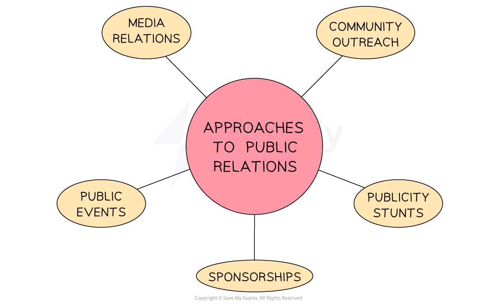

# Public Relations

## The value of positive public relations

> **Spec point** — `spcpt_yQRtZk7cfm3xPxRS` · public relations – improving company image/brand

## The value of positive public relations

- **Public relations** (PR) involves a business **building relationships** with the public, promoting a **positive image** for the business or brand as a whole and managing their **reputation in the media**

#### Public relations approaches

*PR activities include sponsorship, media relations, public events community outreach activities and publicity stunts *

#### 1. Sponsorship

- Aligning a businesses brand with an **event, group or cause** that reflects its values is a common form of public relations

  - E.g Financial providers including **Cinch, IG **and** Metro Bank** sponsor **England's international cricket team** as the sport reflects values of **fairness and exemplary conduct**
- High-profile sponsorship increases visibility of a businesses logo and other branding elements, and can enhance the business's **reputation** and **credibility**

#### 2. Media relations

- **Press conferences** involve inviting media representatives to attend and ask questions at a dedicated event where a key business announcement is made, such as a new product launch

  - E.g. Apple invites high-profile international journalists to its regular new product launches
- **Press releases **are announcements of key business decisions or developments that are sent to media outlets such as newspapers, industry journals and broadcasters

  - Businesses expect journalists to make use of press releases to write favourable news reports

#### 3. Community outreach

- Supporting organisations in the local community with donations or other resources can improve the reputation of a business within the area in which it operates

  - E.g. **McDonalds**'s Ronald McDonald House Charity provides short-term accommodation for families with children undergoing medical procedures in hospitals across the UK

#### 4. Publicity stunts

- These are eye-catching events or activities designed to attract media coverage that draws attention to a brand

  - E.g. In 2018 Elon Musk's SpaceX programme launched a Tesla Roadster car into space

#### 5. Public events

- Some businesses hold **open days** where visitors, such as key customers or suppliers, can find out about a business by speaking to key personnel and **experiencing facilities first-hand**
- It is an opportunity for businesses to **showcase** the aspects in which it takes pride

  - E.g. Universities and private schools hold regular open days where visitors receive campus tours and have the opportunity to speak to teaching and pastoral staff

#### Benefits and drawbacks of public relations

| **Benefits** | **Drawbacks** |
|---|---|
| - Can enhance a business's **reputation** and **credibility** - Often **cost-effective** when compared to advertising or personal selling - May achieve a **wide reach** as imaginative PR activity is frequently shared on social media | - PR can be **time-consuming** and is difficult to measure the direct impact of PR activities on profits - Specialist - and **expensive -** PR companies can often achieve the best results |

> **Exam Hint**
> In the exam you could be asked to explain how PR could help to improve a business's reputation. Focus on an example of a reputational issue a business may be trying to solve to structure your response.
> 
> **Example**
> 
> PR may help a business that has behaved in an environmentally irresponsible way [1] make amends with stakeholders by issuing press releases or holding a press conference [1] where a senior executive sincerely apologises and explains how the problem will be solved [1].
