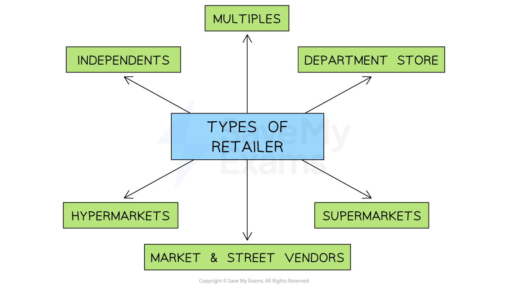

# Retailing & E-tailing

## Retailing

> **Spec point** — `spcpt_FKyftw6p3HgT3bwj` · methods of distribution
• retailers

## Retailing

- A **retailer** is a business that purchases goods directly from a manufacturer or from a wholesaler and **sells them in small quantities** to end consumers
- Retailers ***add value*** by providing **convenience** and services such as **delivery, packing** and ***after-sales service***
- Retail businesses can be **located almost anywhere**, though they are often concentrated in **high streets, shopping malls **and** retail parks**

#### Types of retailers

*Retailers can exist in a variety of forms, from small independents and market traders to large multiples, departments stores or hypermarkets*

#### Features of retail businesses

| **Type** | **Features** | **Example** |
|---|---|---|
| **Multiples** | - A **chain** of stores sell the same range of specialised products - Often located on high streets or in shopping malls | - **Zara** and **Sephora** operate multiple fashion and beauty stores across Europe |
| **Department stores** | - A large store which has **separate sections** that sell different product ranges - Often take **prime spots** in high streets or within shopping malls | - **Galeria Karstadt Kaufhof **is Germany's leading department store operator |
| **Supermarkets** | - Large stores, traditionally focused on selling **groceries**, though most now sell a wider range of products - Often located conveniently on the **outskirts of towns **where free parking is provided | - **Mercadona** is Spain's leading supermarket chain with a market share of more than 27% |
| **Hypermarkets** | - Very large **warehouse-style stores** that sell a wide range of products, sometimes in bulk - Often located on the outskirts of larger towns and cities, with **access to major road networks** | - **Walmart** and **Kroger **are the largest 'big box' stores in the US |
| **Independents** | - Small outlets that usually sell a specialised product range on a modest scale - Usually located on high streets, meeting the needs of local residents | - **Chocolatier Dumon** is a small confectioner based in Brugge, Belgium |
| **Markets, kiosks and street vendors** | - Small independent vendors that sell a limited range of products at particular times - These vendors may move to different places or pay to locate permanently in a premium location | - Marrakesh's **Souk el Attarine** is the home of hundreds of copper and brass vendors |

## E-tailing

> **Spec point** — `spcpt_T3dbYRSmXM5jcXmV` · methods of distribution
• e-tailers (e-commerce).

## E-tailing

- **E-tailing **is the trade of goods and services over the internet

  - Businesses can trade through their **own websites**
  - Alternatively, platforms such as Amazon, Ebay and Etsy offer the chance for small businesses to sell their products online
- The rise of e-tailing means customers **increasingly pay online using credit/debit cards** with the result that contactless payment systems (such as Apple Pay and Paypal) are growing in popularity
- E-tailing can make life **more convenient for customers** and is a source of ***competitive advantage***

  - It also provides the **potential **for small businesses to **reach large audiences**
- However, **setting up an e-store can be costly** and some consumers may be concerned about **security risks** of purchasing online

#### Advantages and disadvantages of e-tailing for businesses and consumers

|   | **Advantages** | **Disadvantages** |
|---|---|---|
| **Businesses** | - Websites offer a **direct and cheap promotional method** - Businesses can easily make online purchases of supplies and materials from other businesses - An easy-to-use and well-thought-out website can **encourage customers to buy more**    - E.g. Automation suggests complimentary products often purchased at the same time - ***Dynamic pricing*** techniques can easily be implemented so **profit can be maximised during periods of high demand** | - **Competition** comes from many businesses around the world, allowing customers to easily switch brands - Large **warehouses **and efficient **stock control systems** are needed to fulfil online orders - E-tailing is **not suitable for businesses selling personal services** such as beauty services or home improvements - The **lack of face-to-face contact** with consumers means businesses miss out on instant and useful market research feedback |
| **Consumers** | - Competition drives prices down and allows customers to easily **'shop around'** and compare prices - **Electronic payment **using credit and debit cards is relatively easy    - E.g. Using 'one-click' platforms such as Apple Pay - E-tailing is **convenient **as it allows customers to shop from anywhere in the world    - E.g. when travelling, 24 hours, on many different devices - Customers can **buy from worldwide retailers** so have increased choice    - E.g. Chinese etailers Shein and Temu are increasingly popular in the UK | - Poor connections or **technical difficulties** can sometimes deter or stop customers from using the website to make purchases - Customers in low-income countries may not be able to access the products due to **poor infrastructure,** limiting potential market size - Many consumers are concerned about **identity theft **or** fraudulent use of credit cards** if they buy goods online - Products **cannot be handled or tried out **before purchase, which means customers frequently return them because they are unsuitable |

> **Exam Hint**
> Although other distribution channels exist, in this specification you only need to learn about retailing and e-tailing.
