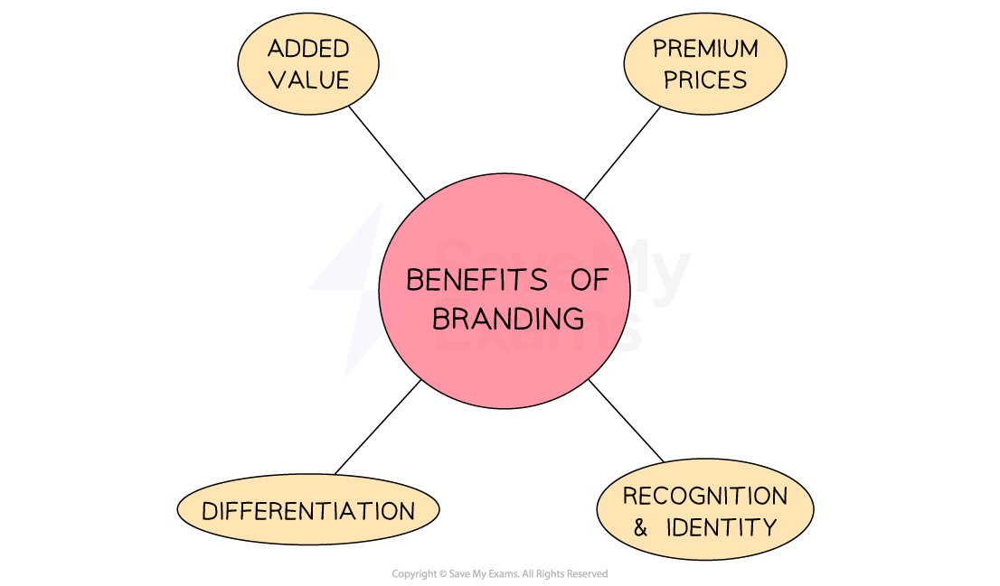

# The Importance of Building a Brand

## Reasons for building a successful brand

> **Spec point** — `spcpt_dmWrzxccZD4WTWcG` · the importance of a brand.

## Reasons for building a successful brand

- Branding is the process of **creating a unique and identifiable** name, design, symbol, or other feature that **differentiates a product** or company from its competitors

- Strong branding provides **four key benefits** to a business

#### Benefits of branding

*Strong branding adds value, allows premium prices to be applied, improves product recognition and identity and differentiates products from those of rival businesses*

### 1. Added value

- Strong branding can ***add value*** to a product by creating a perception of quality, reliability and reputation

### 2. Ability to charge premium prices

- Customers may be willing to pay more for a product that is associated with a well-established brand, as they perceive products with strong branding to be of higher quality and therefore worth the extra cost

### 3. Branding establishes recognition and identity

- This helps to build trust and credibility and creates an emotional connection with customers, which helps to generate repeat purchases

### 4. Business differentiation

- Branding differentiates a business from its competitors and supports marketing and advertising efforts, which can use key elements to build memorable promotional materials and campaigns
- Strong brands also strengthen a businesses ***balance sheet***.
- Brands are considered ***intangible assets*** on a company's balance sheet
- A strong brand adds to the overall value of these intangible assets, which may be an important part of a company's **net worth **and** make it more attractive to investors**.

- Brands can be built using **any one or a combination** of the following methods:

  - By developing unique selling points (USPs)
  - Through advertising
  - Through sponsorship
  - Through the use of social media

#### Examples of the way brands have been built

| **Method** | **Explanation** | **Example** |
|---|---|---|
| **Unique selling points (USPs)** | - USPs are the features that make a product/service **stand out **from its competitors - Brands can build their reputation by **emphasising these unique qualities** in their marketing efforts | - *Apple* is known for its innovative and **sleek design and use of quality materials**, which sets its products apart from its competitors - The company has built its brand around this USP and is recognised worldwide for its **premium design** |
| **Advertising** | - Brands can **create compelling ads** that resonate with their target audience, raise brand awareness, and communicate their value proposition With the** right advertising strategy**, brands create a strong emotional connection with their audience and inspire brand loyalty | - *Coca-Cola* has successfully built its brand through advertising - Iconic ads over the years have become synonymous with the brand - E.g. The **"Share a Coke"** campaign  encouraged people to buy *Coca-Cola* bottles with their friends' names on them and was a massive success |
| **Sponsorship** | - Partnering with events, organisations, or individuals can **help brands gain exposure and build their reputation** by aligning themselves with positive associations or values | - *Nike* has **sponsored many high-profile athletes** and sports events, such as the Olympics and the World Cup - The business has built a reputation for being a brand that **champions excellence and inspires people** to be their best |
| **Social media** | - With the right social media strategy, brands can build a loyal following and **create a community around their brand** | - *Glossier* has a strong presence on platforms like Instagram and it engages with its audience and shares user-generated content - *Glossier*'s social media strategy has helped the brand **build a loyal following** |
| **Emotional branding** | - A strategy where companies **build strong emotional connections** with their customers by appealing to their values, beliefs, and emotions | - Brands like *Patagonia* and *TOMS* have built their entire brand identities around their commitments to environmental and social causes, which** resonates with customers** who prioritise these values |

> **Exam Hint**
> You could be asked to state an element of a business brand. Make sure you choose an element that is specific to the given business, as state questions are testing application skills.
