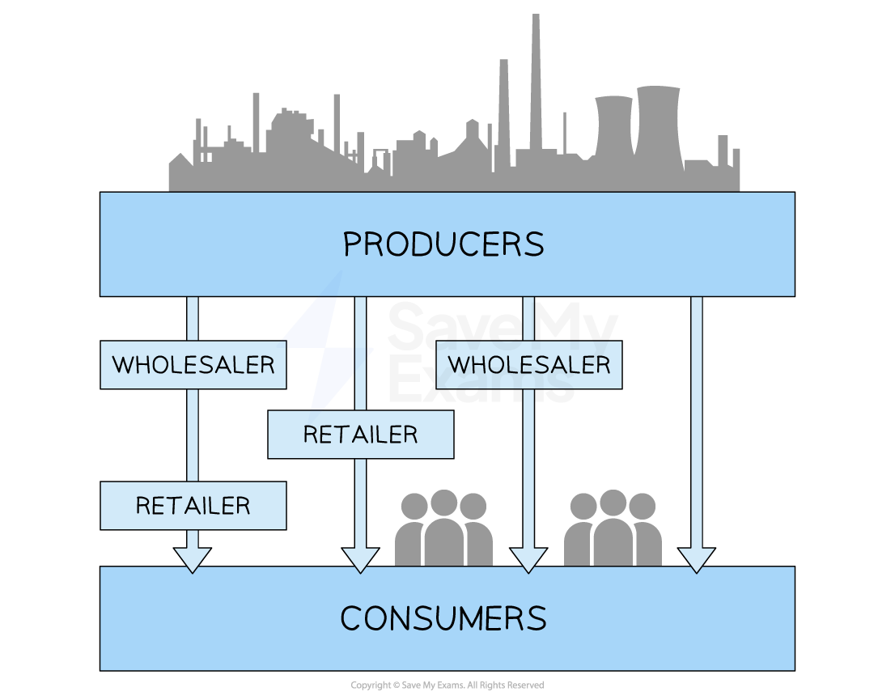

# The Marketing Mix: Place

## The importance of place

> **Spec point** — `spcpt_CGVjwsCsz9sPGDSC` · Place – distribution channels

## The importance of place

- **Place** in the marketing mix refers to **where customers purchase** a businesses products and the ***distribution channels*** used to move the product from producer to consumer
- In a competitive environment, location and distribution decisions can give a company a **competitive advantage**

  - Businesses could locate themselves in areas with** high foot traffic** to achieve high sales volumes
  - They may use **innovative online channels** to reach customers who prefer to shop online
- **Changing consumer needs can impact the way businesses distribute their products**

  - **E-commerce** makes it easier for consumers to **shop online** and have products delivered to their doorstep
  
    - Many businesses have therefore invested in their online presence, offering **convenience and fast delivery **to meet customer needs

## Types of distribution channels

> **Spec point** — `spcpt_XDh4kBTGJfzmh7Fn`

## Types of distribution channels

- Distribution channels refer to the **various intermediaries** through which goods/services move **from the business to the end customer **

#### Distribution channels

*The two different types of distribution channels businesses can use to move products to the end customer    *

### Three-stage distribution channel

- The three-stage distribution channel moves the product directly **from the producer to the retailer, **who then sells it to the final customer
- This channel is often used for products with high ***profit margins***, where the manufacturer can afford to sell directly to the retailer and still make a profit

  - Eg Toshiba produces laptops and sells them directly to retailers like Currys, who then sells them to the end customer

### Two-stage distribution channel

- The two-stage distribution channel **moves the product directly from the manufacturer to the end customer**
- This channel is commonly used for **products that are sold online** or through direct sales channels and is referred to as **e-tailing**

  - E.g. RyanAir sells its service (passenger tickets) directly to the end customer on their website

> **Exam Hint**
> Do not confuse the place element of the marketing mix with business location. Place relates specifically to the stages a product passes before it reaches the customer.
