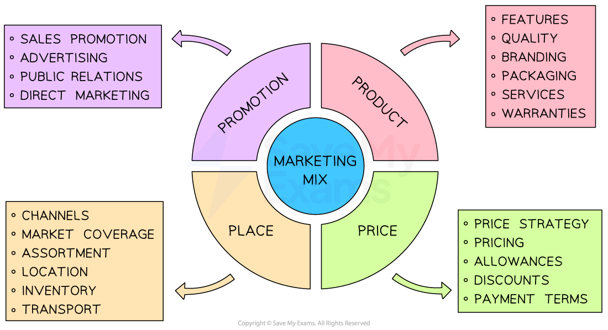
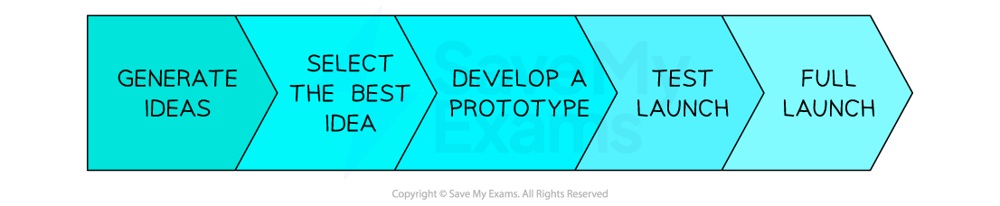

# The Marketing Mix: Product

## An introduction to the marketing mix

> **Spec point** — `spcpt_9qR6PHdRSWJdrVhD` · The marketing mix

## An introduction to the marketing mix

- The **marketing mix **provides a framework for businesses to create and implement** successful marketing strategies**

  - Sometimes known as the '**Four P's',** it represents the key elements of a marketing strategy: **product, price, place, and promotion**
  - These four components work together to satisfy the **needs and wants of a target market **while achieving the company's objectives
- By understanding and manipulating the marketing mix, businesses can **differentiate **themselves from competitors, maximise **marketing impact **and achieve **long-term success**

#### The four P's of the marketing mix

*Businesses combine the 4 P's of the marketing mix in appropriate and unique ways to maximise their chances of success*

## Goods and services

> **Spec point** — `spcpt_C7gYcpXCcn2VjfZ4` · the difference between goods and services

## Goods and services

- **Goods** are ***tangible*** objects that can be **handled, used and stored**

  - **Consumer goods** are used by an end consumer
  
    - Durable goods can be used over and over again without wearing out, such as mobile phones, vehicles and beds
    - Non-durable goods are consumed soon after they are purchased, such as chocolate bars, deodorant and milk
  - **Producer goods** are used by businesses to produce other goods, such as tools and office equipment
- Services are intangible actions that cannot be touched, seen or stored

  - **Personal services** are provided for individuals, such as tutoring, hairdressing or travel insurance
  - **Commercial services** are provided to businesses, such as commercial cleaning or specialist recruitment services
- In some cases, goods are sold with **accompanying** services

  - E.g. Electrical goods such as televisions or computers are sold with product guarantees, or customers can purchase additional insurance

## Developing a new product

> **Spec point** — `spcpt_MjrMbKWVGDnsqcqB` · development of a new product/service

## Developing a new product

- One way to stay ahead of the competition is by **developing new products** and** innovating existing ones**
- The **process of new product development** involves a number of important stages

#### The process of new product development

*New product development is a lengthy process that typically involves generating ideas, developing prototypes and test launches prior to the full launch  *

1. **Generate ideas**

  - New product concepts are discussed and brainstormed using customer suggestions, ideas from competitors’ products, employees’ ideas and information collected through market and technical research
2. **Select the best idea**

  - Ideas are weighed up with some dropped and others chosen for further research
  - This decision relates closely to costs and likely ***demand***
  - Research includes looking into forecast sales, size of market share, and cost-benefit analysis for each product idea
3. **Develop a *****prototype***

  - This allows the operations department to see how the product can be manufactured, any problems or difficulties arising from its production and how to fix them
  - Computer simulations are often used to produce 3D prototypes on screen
4. **Test launch**

  - The developed product is sold to on a small scale to a limited market to see how well it sells before its full launch
  - Changes may be needed prior to an expensive, large scale launch
  - Digital products like apps and software run beta versions, which is a method of test-launching
5. **Full launch of the product**

  - The finalised version of the product is launched to the entire target market

#### Costs and benefits of new product development

| **Costs** | **Benefits** |
|---|---|
| - Market research collection and analysis regarding the new product is** time-consuming** | - **Sell more products/services to existing customers**    - Making the most of existing relationships is cheaper than finding new customers |
| - **Investment in Research and Development **and design can be very expensive | - Developing new products **spreads *****fixed costs***** **like premises or salaries across a wider range of products |
| - The** costs of producing trial products,** including the costs of wasted materials, can be significant especially if innovative materials/components are used | - Diversifying the products it offers means a business is less reliant on certain customers or markets |
| - **Low sales** if the target market is wrong or if market or technical research leads to the development of an inappropriate product or service for the market | - Can create a ***unique selling point*** by developing a new innovative product for the first time in the market    - This USP can be used to charge a high price for the product as well as be used in advertising |
| - **Damage to the brand **if the new product fails to meet customer needs | - **Charge higher prices **for new products    - Pricing strategies such as ***price skimming*** can be used for innovative new products |

> **Exam Hint**
> In the exam you may be asked to explain why a business might consider introducing new products. Explanation questions do not require you to use the business context in your answer. Give a reason and then make two points of development for that reason.

## The importance of packaging

> **Spec point** — `spcpt_fZ37b5PszyGChhnJ` · packaging and its importance

## The importance of packaging

- **Packaging **is the physical container or wrapping for a product. It is also used for promotion and selling appeal
- Packaging is normally **designed to**

  - **Present **products in the most practical yet attractive way
  - **Communicate** the quality of the product
  - **Catch the customer's eye** when they shop
  - Provide** key information to customers**
  - **Establish the business brand image**
  - **Protect** a product from damage
- To stand out from the competition and establish a long-lasting relationship with consumers, brands are investing more money than ever before in **creative and environmentally friendly packaging designs**

  - This is becoming increasingly important for businesses as they place a **greater emphasis on sustainability** and their ***CSR*** policies

#### Examples of memorable packaging

| **Apple iPhone** | **Ferrero Rocher** |
|---|---|
|  |  |
| - Apple’s IPhone packaging is designed to open slowly - First customers lift the box top and a moment passes before gravity overcomes a slight vacuum and the bottom slowly descends - One by one, layers within the box are revealed with elements such as cables wrapped like origami | - Each chocolate is wrapped in luxurious gold foil, placed in a fluted paper cup and topped off with a gold-fonted label - Chocolates are arranged and stacked in a clear carrying case with rounded edges ensuring they can be viewed from any angle |
| **Tiffany** | **Pringles** |
|  |  |
| - Tiffany’s packaging - including its iconic Blue Box represents the entire retail enterprise - The colour shade, tissue paper and satin ribbon are protected by trademark and empty boxes and bags are often posted on sites like Etsy or eBay - A small silver and enamel Tiffany Blue Box is now even sold as a wearable charm | - Pringles resealable paperboard tube with a metal base and plastic cap is designed to stand up as well as ensure freshness and prevent damage - Upon his death in 1998 the packaging creator insisted he be buried in a Pringles can as he loved his design so much |
