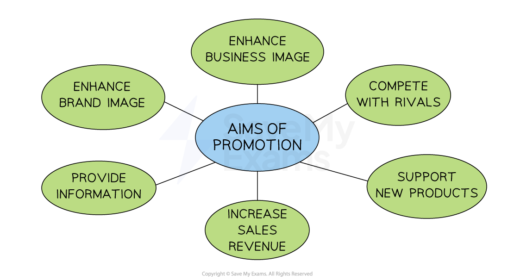

# The Marketing Mix: Promotion

## The importance of promotion

> **Spec point** — `spcpt_Y4SNkwrPDsZW5QYQ` · Promotion

## The importance of promotion

- Promotion plays a crucial role in **generating customer awareness**, interest and desire for a product

  - It communicates a businesses** *****value proposition*** to potential customers and helps to differentiate the product or business from competitors
  - Promotion also helps to **build brand awareness and loyalty** which can lead to repeat purchases and referrals

#### Aims of promotion

*Promotion aims to support sales of new and existing products, inform customers and improve brand and business image  *

- **Above-the-line promotion** refers to **advertising**  aimed at reaching a wide audience through traditional mass media channels

  - Advertising may use media such as **television, radio, newspapers, magazines** and** outdoor sites** such as billboards
- **Below-the-line promotion **includes marketing communications over which **a business has direct control **and which d**o not make use of mass media**

  - These channels include direct marketing, sales promotions, personal selling and public relations (PR)

> **Exam Hint**
> Revise these key terms because, in the exam, you could be asked to define above-the-line or below-the-line promotion. Examiners report that students rarely provide clear definitions for these.
