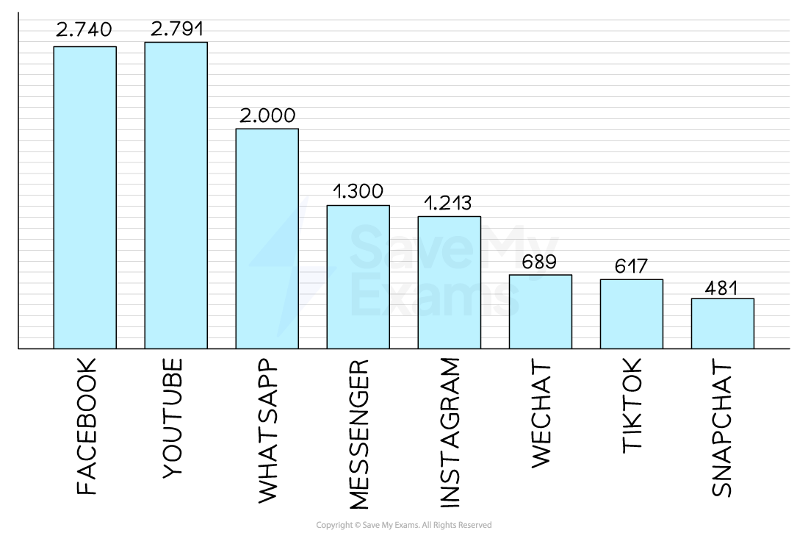

# The Use of Technology in Promotion

## How technology has impacted promotion

> **Spec point** — `spcpt_jwJgbp3B7bZ782zM` · Targeting online advertising, viral advertising via social media, e-newsletters

## How technology has impacted promotion

- The increased use of mobile technology, social media and online commerce have increased promotional opportunities for businesses

  - Businesses which respond quickly to **changing technological trends** are able to better meet the needs of their customers
- **Current technological trends** to which business are adapting include targeted **online advertising, viral marketing, **the use of **social media, **and** e-newsletters**

### Targeted online advertising

- Advertisements are **directed at specific customers** whose **online activity **indicates that they may be interested in purchasing a product

  - E.g. Online stores such as **Amazon** include recommendations for products based on previous purchases

### Viral advertising

- Organisations use online platforms, including social media, to promote their products by **creating eye-catching, shareable content, **which often includes humour or interactive media

  - E.g. The ALS Ice Bucket Challenge was a viral campaign which encouraged the sharing of videos via platforms such as Facebook and YouTube to raise awareness of motor neurone disease

### Social media

- With many millions of users, social media platforms such as Facebook, Instagram and TikTok allow business to target promotions at specific market segments whose social media interaction allows very **detailed analysis of their behaviour, preferences and interests **

  - E.g.** Instagram** has been a popular platform for fashion businesses to promote their products through influencer partnerships

#### Users of social media platforms 2023

*Facebook and YouTube are the most popular social media platforms, whilst newer platforms such as Tiktok and Snapchat are enjoying rapid growth*

- Businesses use social media platforms to maintain an **online presence**, **share content** such as short promotional videos and swiftly **distribute press releases **
- The **advantages** of using social media for promotional purposes include

  - Billions of regular users provide a **wide reach** for advertisements
  - **Inexpensive** compared to other advertising media such as television
  - Advertisements can be **targeted very accurately** at customers with specific characteristics
  - **Hyperlinks **quickly** **direct customers to company websites

### E-newsletters

- Businesses **build an email mailing list,** which is used to direct promotional materials towards those who have **expressed an interest** in their products
- The business may need to **offer an incentive** for potential customers to give up their email address

  - E.g. Fashion brand Uniqlo offers customer 10% off their first order if they sign up for email newsletters
- Once the business has a list, they can use it repeatedly to **promote products** and build a **deep, ongoing connection** with potential customers

  - However, the business must avoid sending too many emails, as this may annoy potential customers or be ignored

> **Exam Hint**
> In the exam you could be asked to analyse the implications for a business of using technology in promotional activity. Analysis questions require you to develop short chains of argument that are related to the business context. You do not need to make a recommendation in these responses.
