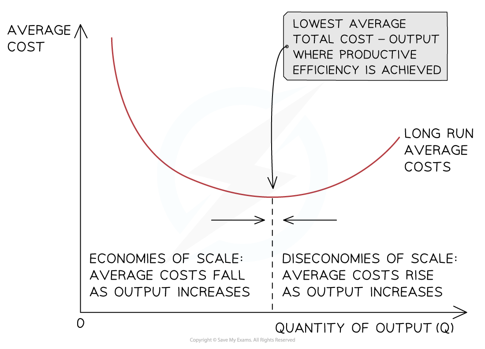

# Diseconomies of Scale

## Diseconomies of scale

> **Spec point** — `spcpt_ykVG8sbwqtHjYyKK` · Diseconomies of scale: 
• limits of growth.

## Diseconomies of scale

- As a firm continues increasing its **scale of output**, it will reach a point where its **average costs (AC)** will start to **increase**

  - The reasons for the increase in the average costs are called ***diseconomies of scale***

#### Diseconomies of scale and average costs

*  Diseconomies of scale occur when average costs increase with increasing output*

- At some level of output, a firm will **not be able to reduce costs** any further. This point is called **productive efficiency**
- Beyond this level of output, the average cost will begin to rise as a result of **diseconomies of scale**
- This indicates that there is an optimal level of output that exists when the state of technology and capital (machinery) is fixed

### Types of diseconomies of scale

- Diseconomies of scale highlight that it is possible for a business to become so **large that it becomes less and less efficient**
- A business experiencing diseconomies of scale may **reconsider its organisational structure** to improve communication and coordination problems

  - Many very large businesses often **break themselves up into *****autonomous*** **smaller units, **which can communicate more effectively

#### Explanation of diseconomies of scale

| **Type** | **Explanation** |
|---|---|
| **Poor communication and coordination** | - As a business increases in size, **more managers and employees will join the business** and the ***chain of command*** is likely to lengthen, limiting** interaction with employees** - **Communication** **becomes slower** and mistakes may be made, leading to** worsening efficiency** - **Time-consuming decision-making **may make it harder to coordinate workers and physical resources |
| **Increased bureaucracy** | - Larger businesses are more **complicated to run and organise** than small businesses - Coordinating the **many resources required** will require extensive **administration **for which staff and physical resources will be required |
| **Lack of commitment from employees** | - As the business grows **workers may feel less valued** as their interaction with management is limited - Workers may **become demotivated** leading to a fall in output which can increase average costs |

> **Exam Hint**
> Candidates frequently confuse economies and diseconomies of scale in exams. Make sure that you can define both terms and give examples of why each could arise.
