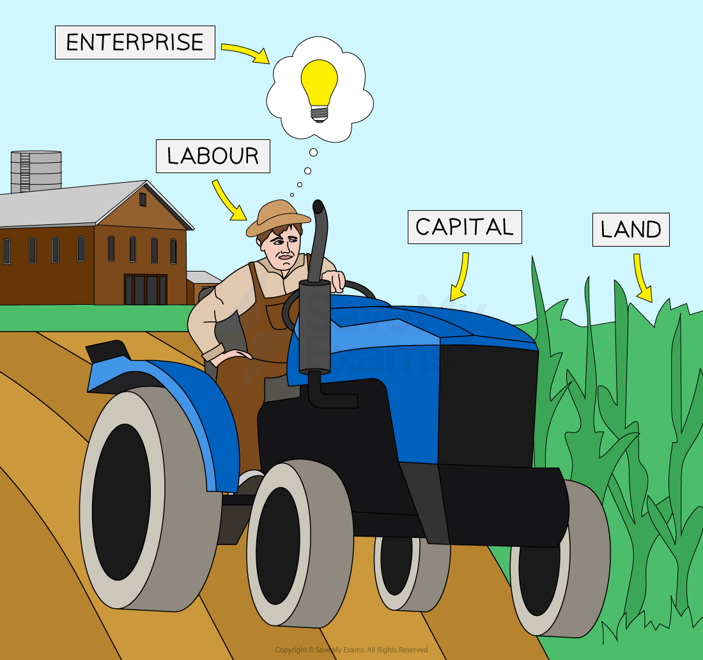

# The Four Factors of Production

## Capital, enterprise, land and labour

> **Spec point** — `spcpt_K5ybDqccF9sdrfWt` · Changing relationships between enterprise, capital, land, and labour:

## Capital, enterprise, land and labour

- **Factors of production** are the resources used to produce goods & services

#### The factors of production

*The four factors of production are land, capital, labour and enterprise*

- The production of any good/service requires the use of **a combination of all four factors of production**

  - Goods are physical objects that can be touched **(tangible)** e.g. mobile phone
  - Services are actions or activities that one person performs for another **(intangible)** e.g manicure, car wash

#### Explanation of the four factors of production

| **Land** | **Capital** |
|---|---|
| - **Non man-made natural resources** available for production - Some countries have a vast amount of a particular natural resource & so are able to specialise in its production    - E.g.** Kuwait** specialises in the product of oil which accounts for 95% of its ***exports*** | - Capital is any **man-made** **resource **that is used to produce goods/services - Examples include tools, buildings, machines & computers |
| **Labour** | **Enterprise** |
| - The **human input** into the production process, labour involves mental or physical effort - Not all labour is of the same quality    - It can be **skilled or unskilled**   - Some workers are more productive than others because of their education, training and experience | - Enterprise involves **taking risks** in setting up or running a firm - An entrepreneur decides on the combination of the **factors of production** necessary to produce goods/services with the aim of generating profit |

## Factors of production in capital-intensive and labour-intensive activities

> **Spec point** — `spcpt_d6R98gXjGNYk5pnw` · Changing relationships between enterprise, capital, land, and labour: 
• difference between capital-intensive and labour-intensive activities.

## Factors of production in capital-intensive and labour-intensive activities

### Capital-intensive processes and factors of production

- In capital-intensive processes there is an **emphasis on the use of machinery** and technology in production
- Labour is used to complete processes that require specialist skills such as design or to oversee the operation of machinery

#### Factors of production to produce a car

| **Land** | **Labour** | **Capital** | **Enterprise** |
|---|---|---|---|
| factory site testing facilities storage facilities | car designer production director production line supervisors supply chain staff | robotic arms conveyor belt rolled steel computers seats dashboards mirrors leather | CEO & Directors |

- **Increased labour costs** may encourage businesses to become more capital intensive over time
- **High-output** manufacturing businesses are well-suited to employ capital-intensive methods
- Rapid **advances in technology** have made more capital-intensive processes **more affordable** for smaller businesses

  - E.g. Developments in 3D printing has brought down the cost of computer-aided design

#### Drawbacks of capital-intensive production

- High costs to set up and maintain machinery
- Breakdowns can cause significant disruption to production
- Job losses may result when equipment is introduced
- Limited flexibility as machinery is specialised for particular tasks

### Labour-intensive processes and factors of production

- In labour-intensive processes there is an **emphasis on the use of workers** in production
- Machinery is used to complete processes that are hazardous or continuous e.g. fermentation

#### Factors of production in viticulture (winemaking)

| **Land** | **Labour** | **Capital** | **Enterprise** |
|---|---|---|---|
| vineyards production facilities storage facilities | head winemaker viticulturist crop maintenance workers seasonal crop pickers bottling/packaging staff quality controller distribution drivers | tractors crop sprayers fermentation vats bottling line | cooperative members |

- Labour-intensive production is more suited to the production of specialised output where quality and variation are key ***unique selling points*** or where the **volume of output is small**
- When **labour costs are low**, there is little incentive to employ more machinery in the production process

  - E.g. Labour costs are relatively low in countries such as **Thailand **and** Vietnam** where clothing is mass-produced using highly labour-intensive processes

#### Drawbacks of labour-intensive production

- Humans cannot work for as long or as intensely as production machinery
- Employee costs can increase with the introduction of minimum wage legislation or safety rules
- Workers require training and may need incentives to motivate them

> **Exam Hint**
> A good way to remember the four factors of production is the acronym CELL: **C**apital, **E**nterprise, **L**and and** L**abour.
