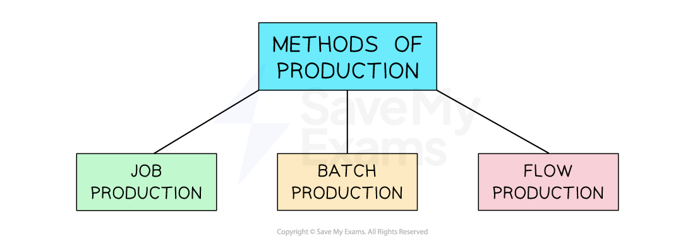

# Methods of Production

## An introduction to production methods

> **Spec point** — `spcpt_bxzHTDx22GgrsQdP` · Production processes: 
• different types

## An introduction to production methods

- Businesses can **organise their production** processes in a variety of ways

#### Methods of production

*The three main methods of production are job, batch and flow*

- The method of production used by a business will depend upon a number of factors

  - The **level of output **required to be produced
  - The **nature** of the product
  - Whether the product is **standardised or customised**
  - The level of ***automation**** *used in production

## Job production

> **Spec point** — `spcpt_wTPxCH73C4dftpGX` · Production processes:
different types:
• job
Definition, examples, +'s & -'s
the impact of different types of production

## Job production

- Job production is where products are made to meet the **specific requirements** **of individual customers**

  - Each item is **produced separately (a job)** and the production process is **tailored** to the unique specifications of the customer's order
- The key **characteristics** of job production include

  - **Customisation**
  
    - Each product is customised according to the customer's specific requirements allowing for personalised goods or services to be created
  - **Low volume**
  
    - Job production is typically used for unique or specialised products that are not produced in large quantities
  - **Variability**
  
    - Since each product is made to order there can be significant variation in the production process and materials used
  - **Skilled labour**
  
    - Job production often requires skilled labour such as craftsmen or technicians as the manufacturing process may involve intricate tasks or specialised techniques
  - **Longer lead time**
  
    - Due to the customisation and individual production approach job production usually has longer lead times compared to other production methods and the time required to fulfil each order can vary depending on its complexity and the availability of resources

#### Advantages and disadvantages of job production

| **Advantages** | **Disadvantages** |
|---|---|
| - Allows for high levels of **customisation**    - This enables businesses to cater to customers' unique needs - It provides the **flexibility to adapt **to changes in customer demands and market trends - Job production allows for greater **attention to detail **and quality control    - This often means products can be sold at a premium price - A **personalised customer experience** can be offered as customers may be involved in the design and creation process    - This is likely to lead to **customer loyalty** | - Tends to be more **expensive **than other production methods due to the customisation involved - Customisation often leads to **long lead times **which may not be suitable for customers requiring products quickly - Job production can be **complex and challenging to manage **compared to other production methods    - Close coordination and communication between the production team and the customer to ensure the final product meets desired specifications - Low-volume production is unlikely to allow a business to achieve **economies of scale** |

### Examples of job production

- **Furniture made to order**, where customers can choose the design, dimensions, materials and finishes
- **Tailored clothing** such as suits or wedding dresses, where each garment is made to fit the specific measurements and preferences of the individual customer
- **High-end jewellery** pieces, especially those with unique designs or personalised engravings

## Batch production

> **Spec point** — `spcpt_2bqY4DwpjBgsXpCJ` · Production processes:
different types:
• batch
Definition, examples, +'s & -'s
the impact of different types of production

## Batch production

- Batch production occurs when products are **produced in groups** or batches

  - A certain quantity of products is produced together before moving on to the next batch
  - Each batch goes through the **entire production process**, from raw materials to the finished product, before the next batch begins
  - Batches are usually of a **standardised size** **and composition** and follow a certain sequence of operations

#### Products made with batch production

*Batch production is a common approach used in industries including pharmaceuticals, beauty products and food processing  *

- Batch production strikes a **balance between customisation and cost-effectiveness**, making it a suitable production method for industries that deal with **diverse product range**s and **varying customer needs**

#### Advantages and disadvantages of batch production

| **Advantages** | **Disadvantages** |
|---|---|
| - Production can **switch between groups of products** that cater for different customer needs - It can be more** cost-effective** than flow production    - Especially when producing in smaller quantities - It achieves some benefits from ***purchasing economies*** of scale    - Larger quantities of stock may be purchased than with job production - **Quality issues and defects** are identified and rectified within a specific batch    - This minimises the impact on the entire production line and reduces waste - Each batch is** tailored **to meet specific customer requirements | - **Setting up and configuring equipment** for each batch takes time    - This may result in ***down time*** between batches - Often leads to the **accumulation of stock **    - This requires storage and careful management to avoid wastage - It is **not as adaptable as other production methods,** such as flow production    - Rapid changes in product demand or product variations may be difficult to manage - Frequent start-up and shutdown of machinery can put **extra stress on equipment**    - It may require regular maintenance and repair to ensure smooth operations |

## Mass (flow) production

> **Spec point** — `spcpt_9Q9CvM97nQTnWMMr`

## Mass (flow) production

- Flow production occurs when a product is produced in a **continuous sequence of operations on a production line**
- It involves the movement of materials or components through a series of workstations or machines, with each workstation performing a specific task or operation until a product is finished
- This method is commonly used in industries that produce **high volumes of standardised products** such as automobiles and consumer electronics

### Characteristics of flow production

- **Division of labour**

  - Different tasks are allocated to different workstations or machines, allowing workers to specialise in a specific task
- **Standardisation**

  - The manufacture of identical products helps to ensure consistency and the smooth flow of production
- **Continuous movement**

  - The product moves continuously from one workstation to another, minimising idle time and maximising productivity
- **High volume**

  - Flow production is suitable for high-volume manufacturing as it enables the efficient production of large quantities of identical or similar products
- **Automation**

  - Flow production often involves the use of machinery and automated equipment to perform repetitive tasks quickly and accurately

#### Advantages and disadvantages of flow production

| **Advantages** | **Disadvantages** |
|---|---|
| - Flow production **minimises setup and idle time**, leading to improved efficiency - Avoids frequent** equipment start-ups and shutdowns**    - This reduces energy consumption and minimises material waste - Automated processes use **fewer skilled workers**, reducing labour costs - **Consistent quality** because all output should be identical - Faster production results in **shorter lead times**    - This helps businesses respond quickly to market demands | - Implementation often requires significant ***capital investment***    - Manufacturing equipment and automation technologies can be expensive to install and maintain - It relies on the **reliability and efficiency** of machinery    - If any part of the production line breaks down, it can disrupt the entire process, leading to ***down time*** - It does not generally allow for product ***customisation*** - Requires a** steady supply** of raw materials and components    - Any disruption in the ***supply chain*** can have a severe impact on production |

> **Exam Hint**
> Carefully consider the needs of the customers to which a business sells when recommending a suitable method of production. Where the selling price is a key driver of consumer demand, flow production (where ***unit costs*** are minimised) is likely to be very suitable. Where demand is driven by quality or where customisation is required, job or batch production are likely to be better choices.
