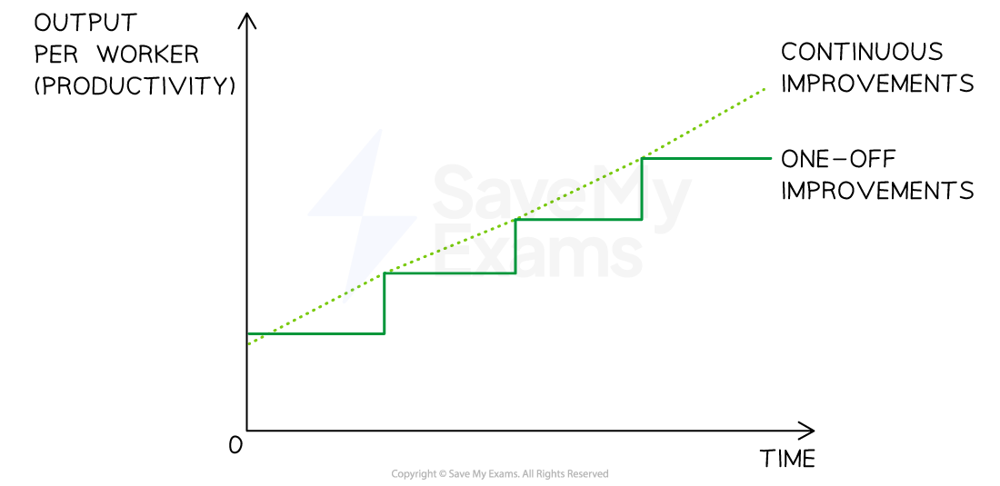
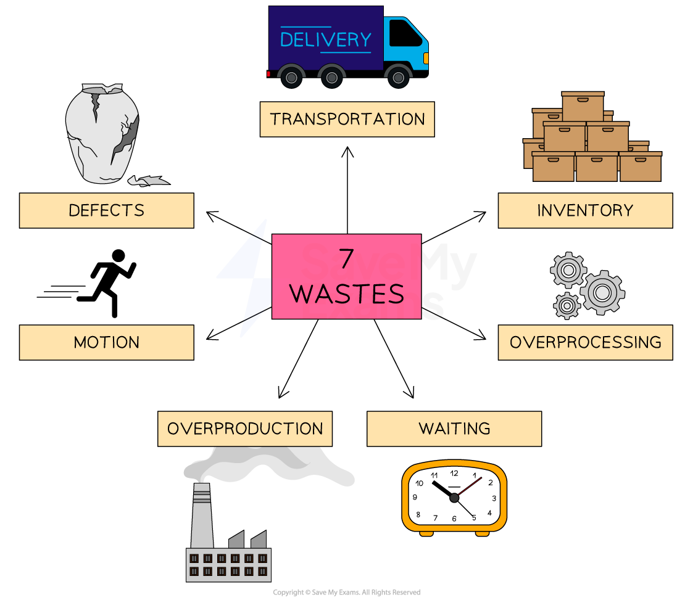

# Principles of Lean Production

## Introduction to lean production

> **Spec point** — `spcpt_YXG2gMCgPpwMBytg` · Principles of lean production

## Introduction to lean production

- Lean production involves the **minimisation of the resources** used in production

  - **Less time** is required as the production process is organised in the most efficient way
  - **Fewer materials** are used as there is a focus on waste reduction
  - **Less labour** is used as lean production is typically capital intensive
  - The **space required for production is reduced **as a result of just in time stock management
  - A **small number of trusted suppliers** work closely with the business
- The use of lean production is likely to lead to a competitive advantage

  - Lower **unit costs** ** **are achieved due to minimal wastage so **prices may be lower **than those offered by competitors
  - **High quality output** is likely as a result of supplier reliability and carefully managed production processes
  - The result should be **increased profit margins**

- Lean production uses strategies such as **Just in Time stock control and Kaizen **

## Just-in-time (JIT) stock management

> **Spec point** — `spcpt_7TXShbXVy7f3rPbG` · Principles of lean production:
• just-in-time (JIT)
definition, +'s & -'s"

## Just-in-time (JIT) stock management

- **Just-in-time (JIT) stock management** is a process in which raw materials are **not stored onsite** but ordered as required and delivered by suppliers 'just in time' for production
- Careful coordination is required to ensure that raw materials and ***components*** are delivered by suppliers** at the moment that they are to be used**

  - **Close** relationships with suppliers need to be developed
  - Suppliers may need to be in** close proximity **
- **Just-in-time** is particularly useful for businesses that operate in **dynamic markets**

  - Products may need **frequent design changes** that require different components
  
    - Holding large amounts of stock risks wastage through ***obsolescence***
  - Where **significant competition** exists lean production can ensure a high level of **quality** to achieve a ***competitive advantage***

#### Advantages and disadvantages of just-in-time stock management

| **Advantages** | **Disadvantages** |
|---|---|
| - **Stockholding costs** including storage costs are minimised - Close working relationships are developed with a **small number of trusted suppliers** - ***Cash flow***** is improved **as money is not tied up in stock - **Unused storage space** is available for productive use | - Bulk buying ***economies of scale****  *are not generally possible - The ability to respond to **unexpected increases in demand** is reduced - **Administrative costs** related to frequent ordering are increased - **Unreliable suppliers** (e.g. late or poor quality deliveries) can quickly halt production |

## Kaizen

> **Spec point** — `spcpt_MZ3sJNCGgFt2xHTF` · Principles of lean production:
• Kaizen
definition, +'s & -'s"

## Kaizen

- **Kaizen** involves taking **continuous steps to improve productivity** through the **elimination of all types of waste** in the production process

  - **Changes are small and ongoing** rather than significant one-off’s
  - They are **constantly reviewed** to ensure that they achieve the desired positive impact on productivity and always **focused on meeting customers' needs**
- Kaizen requires a **long-term cultural and management commitment **to change

  - **All workers must be actively involved** in making improvements, not just management
  - Ongoing **training and development** is vital

#### The impact of Kaizen on productivity over time

*Kaizen versus one-off improvements*

- Elements of Kaizen commonly include

  - **Zero defects**  in manufacturing
  - High levels of **automation**
  - High levels of **cooperation** between workers and management
  
    - Employees are likely to **work in teams** and be ***empowered*** to work creatively

- Staff training and **computer inventory management systems** may also reduce wastage as fewer errors are likely to be made

> **Exam Hint**
> In the exam, you could be asked to justify whether a business should improve efficiency by adopting just-in-time or kaizen. A great evaluation point is that, in most cases, the two elements of lean production are adopted together.

## The importance of using resources effectively

> **Spec point** — `spcpt_DbsqNrdghVrkDRst` · Principles of lean production:
• the importance of using resources effectively.
definition, +'s & -'s"

## The importance of using resources effectively

- Lean production is focused on the effective use of resources and, in particular, the **elimination of waste** throughout the business

  - Waste refers to anything that prevents a business from being **efficient**
  - **Seven key types of waste** are minimised in lean production

#### The seven wastes

*Lean production involves the reduction of all types of waste*

1. **Transportation: **Unnecessary movement of materials or products
2. **Inventory: **Excess raw materials, ***work-in-progress***, or finished goods
3. **Motion: **Unnecessary movement of people or equipment
4. **Waiting: **Delays or idle time in the production process
5. **Overproduction: **Producing more than what is required by the customer
6. **Overprocessing: **Using more resources than necessary to produce a product
7. **Defects: **Products or services that do not meet customer requirements

#### Benefits of reducing waste

| **Benefit** | **Explanation** |
|---|---|
| **Competiveness** | - Minimal levels of waste reduces costs, allowing a business to lower prices to gain market share from more expensive rivals |
| **Lower costs** | - Lower spending on reworking defective products, storage space and moving stock or finished goods can lead to greater profits - This can be retained for future use or distributed to shareholders as ***dividends*** |
| **Better customer service** | - Customers are likely to be satisfied with higher quality and short lead times associated with lean production, leading to increased customer loyalty |
| **Environmental benefits** | - Business reputation may improve as a result of using fewer resources such as energy and making better use of others, for example recycling |
