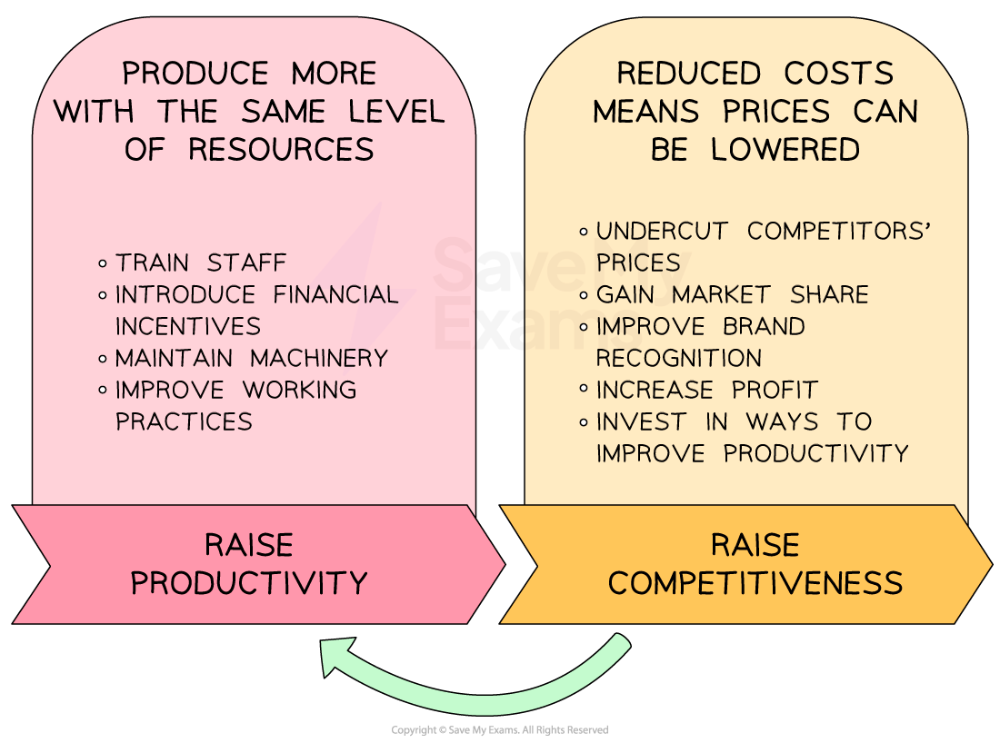

# Productivity

## Calculating productivity

> **Spec point** — `spcpt_Q2ncMK2zvZhRsVRQ` · calculation of productivity

## Calculating productivity

- **Productivity** is the output per person during a given time period

  - E.g. an IKEA worker is able to produce 2 Poāng chairs per hour

- **Productivity** is expressed as a number of units and is calculated using the formula

$\frac{\mathrm{Total} \mathrm{output}}{\mathrm{Number} \mathrm{of} \mathrm{workers}}$

> **Worked Example**
> The table shows the number of pairs of luxury wool socks produced by *Sokkemani Ltd* in 2021 and 2022.
> 
> | **Year** | **Units Produced** |
> |---|---|
> | 2021 | 46,000 |
> | 2022 | 69,000 |
> 
> In 2021 *Sokkemani Ltd *employed 50 staff. In 2022 the number of staff employed by the business increased by 20%.
> 
> Calculate the percentage change in productivity between 2021 and 2022.
> 
> [4]
> 
> **Step 1 - Calculate productivity for 2021**
> 
> $=\frac{46,000\mathrm{units}}{50\mathrm{workers}}\,\,=920\mathrm{units} \mathrm{per} \mathrm{worker}$**         **** (1 mark)**
> 
> **Step 2 - Calculate productivity for 2022**
> 
> $\frac{=69,000\mathrm{units}}{60\mathrm{workers}}\,\,=1,150\mathrm{units} \mathrm{per} \mathrm{worker}$**         **** (1 mark)**
> 
> **Step 3 - Calculate the percentage difference between the two years ((new-old) / old)**
> 
> `equals space fraction numerator space 1 comma 150 space minus space 920 space units over denominator 920 space units end fraction space space space cross times space space space space space 100 space space space
> 
> equals space 25 space percent sign space space space space`**         **** (1 mark)**
> 
> **Step 4 - Identify whether the percentage difference is an increase or decrease**
> 
> - Labour productivity has increased from 920 to 1,150 units so it is a 25% percentage** increase         **** (1 mark)**

> **Exam Hint**
> You should always include your full working in calculation questions. You may be awarded marks for substituting correct numbers into a formula, even if your final answer is incorrect.

### Ways to increase productivity

- The higher the level of productivity, the lower the average total costs

  - With lower average costs a business could choose to reduce selling prices to attract customers or make higher levels of profit

#### Methods of increasing productivity

| **Method** | **Explanation** |
|---|---|
| **Employee motivation** | - Motivated workers tend to be more productive    - ***Financial incentives***** linked to output** may increase worker productivity   - Non-financial incentives may** include workers in decision-making, **increase their commitment and productivity |
| **Skills, education and training staff** | - Well-trained and educated workers are likely to be **able to make useful contributions** to decisions that improve productivity    - Workers are more ***autonomous**** *so the need for supervision is reduced   - Contributions from knowledgeable staff are likely to lead to **improvements in productivity** |
| **Business organisation and working practices** | - Flexible and adaptable workplaces can **improve the commitment of workers** and allow a business to **respond to changes in demand**    - **Hours and location of work** can be adapted to better meet the needs of workers and demand   - **Workstations may be used for various purposes** with careful planning and training |
| **Investment in capital equipment** | - Increased automation can **improve levels of output and quality**    - Well-chosen machinery is l**ess likely to make mistakes** than humans   - Machinery and technology can **operate for long periods without a break **as long as it is properly maintained |

## The Impact of productivity improvements

> **Spec point** — `spcpt_RKK6bNszd53JP8RJ` · the impact of productivity improvements.

## The Impact of productivity improvements

- Businesses that increase their level of productivity are likely to be** more competitive**

  - Competitiveness refers to the ability of a business to maintain or grow its sales and market share **given the presence and actions of rivals**

#### Productivity and competitiveness

*There is a strong link between productivity & competitiveness   *

- Businesses that are competitive are likely to have the **financial resources** required to continue investing in improvements to their productivity such as

  - Purchasing more **technology** and upgrading manufacturing equipment
  - Improving staff **training** and recruiting skilled workers
  - **Moving** to larger premises
- **Customers **benefit if reduced costs resulting from **higher productivity lead to lower prices**

  - Product **quality** and **customer service** may also be improved if the production process is more efficient, leading to an improved reputation and greater** customer loyalty**
- Higher levels of productivity can **motivate workers** if they are rewarded for higher levels of output

  - E.g. workers may receive a **bonus** linked to their output
- However, higher levels of productivity may create **difficulties for workers**

  - If increases in productivity are achieved through the use of new machinery, some may** lose their jobs**
  - Employees may feel pressurised to increase their output and could **feel overworked**
