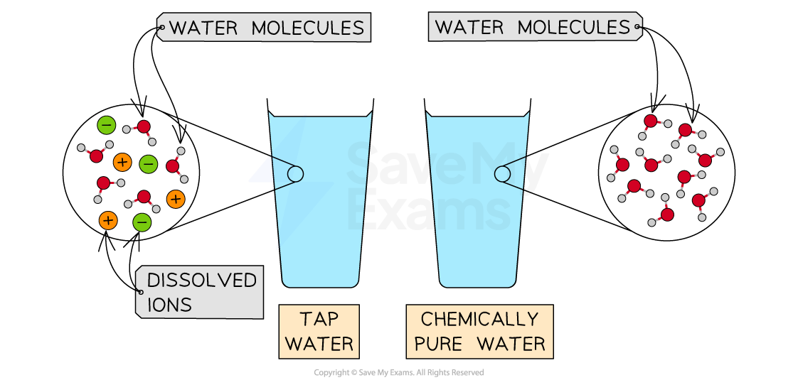

# Pure Substance vs Mixture

## Pure Substance vs Mixture

> **Spec point** — `spcpt_Kbt5nNhMpGyvZxR2` · understand that a pure substance has a fixed melting and boiling point, but that a mixture may melt or boil over a range of temperatures

## Pure Substance vs mixture

- In everyday language, we use the word pure to describe when something is **natural** or **clean** and to which nothing else has been added
- In chemistry, a pure substance may consist of a **single element** or **compound** which contains no other substances
- For example, pure water contains** only** H2O molecules and nothing else
- Drinking water would  be classed as a mixture and not a pure substance because it contains H2O molecules and additional substances like dissolved ions and chlorine

#### Pure substance v mixture

***Pure water consists of only H******2******O molecules whereas tap water is a mixture ***

### How can purity be distinguished?

- Pure substances melt and boil at** specific** and** sharp** temperatures

  - E.g. pure water has a boiling point of 100 °C and a melting point of 0 °C
- Impure substances have a** range** of melting and boiling points as they consist of **different** substances
- Generally, impure substances have** lower** melting points and** higher** boiling points than the pure substance
- Melting and boiling point data can therefore be used to distinguish pure substances from mixtures
- Melting point analysis is routinely used to assess the **purity of drugs**
- This is done using a melting point apparatus which allows you to** **slowly heat a small amount of the sample, making it easier to observe the **exact** melting point
- This is then compared to data tables
- The closer the measured value is to the actual melting or boiling point then the purer the sample is
- Measuring purity is also important in **foodstuffs**

> **Worked Example**
> Sulfur has a melting point of 114 oC.
> 
> A student tests the melting point of a sample of sulfur. It begins to melt at 100 oC and finishes melting at 113 oC.
> 
> Explain whether the substance is pure or impure.
> 
> **Answer:**
> 
> - The substance is impure because its melts over a range of temperatures.
